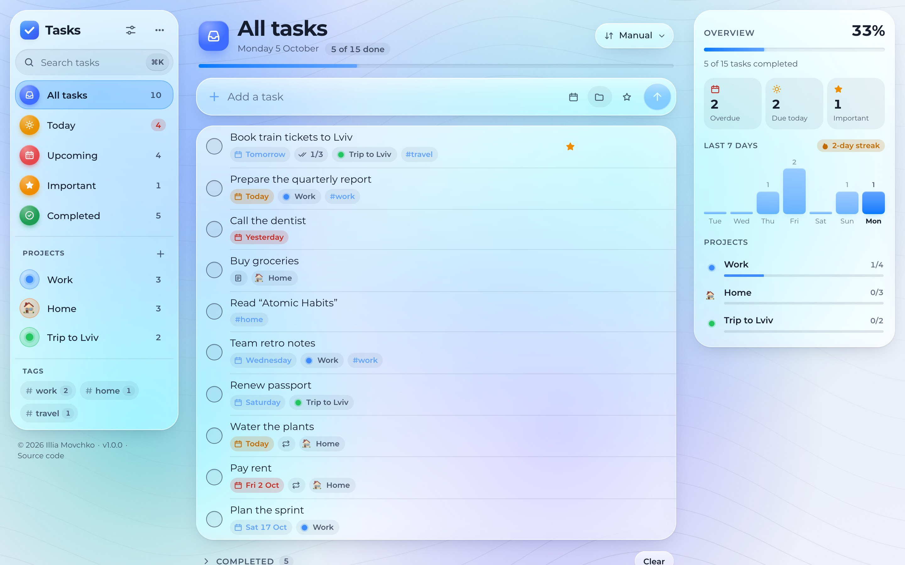
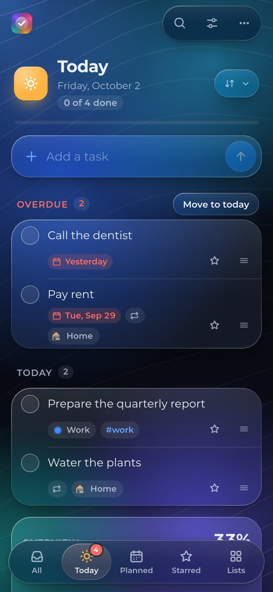
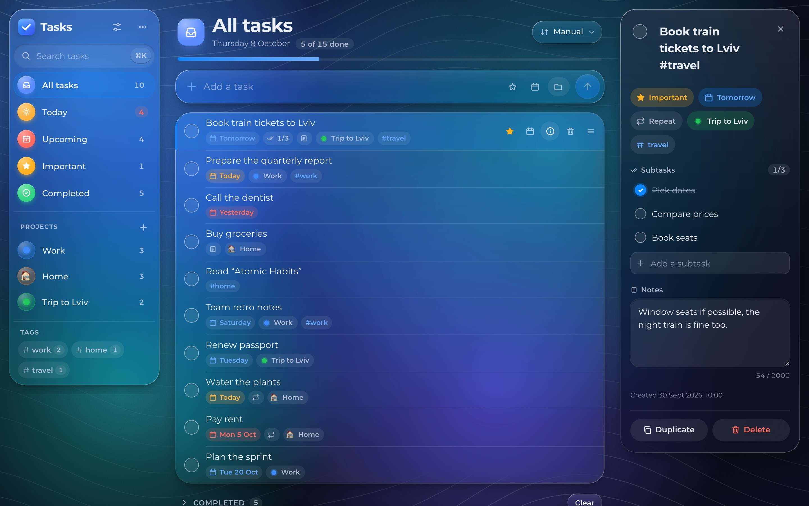

# 📝 Todo App

[](https://github.com/sacrificed666/react-todo-app/actions/workflows/ci.yml)
[](https://github.com/sacrificed666/react-todo-app/actions/workflows/codeql.yml)

A private to-do list that lives in your browser: plan the day with smart lists, group tasks into projects, repeat them on a schedule and find anything with one search, on a computer or a phone, online or offline. Built with React 19, Redux Toolkit, TypeScript 7 and Vite 8 as a static, local-first web app, in ten languages, accessible, light or dark. Your tasks stay on your device: no account, no server and no analytics.

**[🌐 Live demo](https://sacrificed666.github.io/react-todo-app/)**

<picture>
  <source media="(prefers-color-scheme: dark)" srcset="./docs/images/desktop-dark.jpg" />
  
</picture>

## ✨ Highlights

- 📚 **Smart lists**: All tasks, Today, Upcoming, Important and Completed, each with a counter; Today moves overdue tasks to today in one step, and the installed app shows the Today count on its icon
- 📁 **Projects**: Work, 🏠 Home or a trip, each with one of ten colours, an optional emoji icon and its own page with progress; deleting one can be undone together with its tasks
- ✍️ **Quick add**: `Call mom tomorrow @home !`, `Teammeeting am Freitag` or `Zavolat mámě zítra` fill in the date, repeat, project and importance, in all ten languages
- 🔁 **Repeats** every day, weekday, week, month or year; monthly tasks keep their day after a short month
- 📝 **Details**: notes, `- [ ]` checklists with a progress chip and `#tags` with a tag cloud
- 🗓️ **Calendar and dates**: dots on busy days, the week starting on the day your region expects, dates in the format of your language
- ✋ **Drag and drop** to reorder tasks or drop them on a list or project, and a context menu on right-click or long press
- ↩️ **Undo and redo** for the last 50 changes to tasks and projects, each with a description
- 🔎 **Search and commands**: one search across every list and a <kbd>⌘</kbd>/<kbd>Ctrl</kbd>+<kbd>K</kbd> palette for navigation, actions, sorting, appearance and language
- 🎨 **Your way**: light, dark or automatic theme, ten accents, six backgrounds, clear or tinted glass and full or reduced effects
- 📱 **Phones**: a floating tab bar, swipes to complete or delete, haptics and a Back button that closes sheets instead of leaving the app
- 💾 **Your data**: autosave, sync between tabs, validated JSON import and export, offline mode, app shortcuts, a share target and update prompts
- 🌍 **Ten languages**: English, Ukrainian, Czech, German, Spanish, French, Italian, Dutch, Polish and Portuguese, with correct plurals, dates and typography, loaded on demand
- ♿ **Accessible**: WCAG AA contrast, full keyboard control, landmarks, live regions, page titles for screen readers, forced colours, reduced motion and reduced transparency, checked with axe and Lighthouse
- ⚡ **Fast**: lists with thousands of tasks stay instant, the app works offline as a PWA, and a Lighthouse budget runs in CI
- 🛡️ **Safe**: a strict Content Security Policy with Trusted Types, validated imports and no requests to other sites

<p align="center">
  
  
</p>



## ⚛️ Front-end


## 🧰 Tooling


TypeScript 7 · Oxlint · Oxfmt · Vitest 5 · Testing Library · Playwright · axe · Lighthouse · React Compiler · dnd-kit · Workbox · CodeQL

## 🚀 Quick start

Requires **Node.js 24.15** or newer.

```bash
npm ci
npm run dev          # http://localhost:5173/react-todo-app/
```

```bash
npm run check        # lint, format check, type check and unit tests in one go
npm run test:e2e     # browsers, offline mode, accessibility and Lighthouse on the production build
npm run build        # production build in dist/
```

## 📚 Documentation

| Guide                                           | Topics                                                |
| ----------------------------------------------- | ----------------------------------------------------- |
| 🏁 [Getting started](./docs/getting-started.md) | Requirements, scripts and project layout              |
| ✨ [Features](./docs/features.md)               | Everything the app can do, shortcuts and gestures     |
| 🏗️ [Architecture](./docs/architecture.md)       | Layers, state, undo and redo, persistence and startup |
| 🎨 [Design system](./docs/design.md)            | Glass surfaces, refraction, backgrounds and motion    |
| 🌍 [Localization](./docs/i18n.md)               | Messages, plurals, dates and adding a language        |
| ♿ [Accessibility](./docs/accessibility.md)     | Keyboard, screen readers, contrast modes and checks   |
| 🛡️ [Security](./docs/security.md)               | CSP, Trusted Types, validation and supply chain       |
| 🧪 [Testing](./docs/testing.md)                 | Unit and browser tests, axe, Lighthouse and coverage  |
| 🚀 [Deployment](./docs/deployment.md)           | CI/CD, CodeQL, GitHub Pages and PWA updates           |
| 🏷️ [Releases](./docs/releases.md)               | Versions, branches, the changelog and environments    |
| 🤝 [Contributing](./docs/contributing.md)       | Workflow, code style and commit conventions           |
| ❓ [FAQ](./docs/faq.md)                         | Common questions                                      |

## 📌 Good to know

- 💾 **Tabs sync, devices do not.** Changes appear in every open tab of the same browser right away.
- 🐢 **Slow computer?** Pick **Reduced** effects or the **Plain** background in the settings.
- 🔍 **Edge refraction is Chromium only.** Other browsers get the same glass without the lens effect.

> [!WARNING]
> **Tasks stay in this browser** and clearing its site data deletes them. Use **⋯** → **Export tasks** to back them up or move them to another device.

## ✍️ Author

**[Illia Movchko](https://github.com/sacrificed666)**

## ✨ Credits

- **[dnd-kit](https://dndkit.com)**: dragging tasks to reorder them or drop them on a list or project
- **[country-flag-icons](https://gitlab.com/catamphetamine/country-flag-icons)**: language flags, served by the app itself
- **[Montserrat](https://github.com/JulietaUla/Montserrat)**: the typeface, under the SIL Open Font License

## 📝 License

Licensed under the **[MIT License](https://choosealicense.com/licenses/mit/)**.
