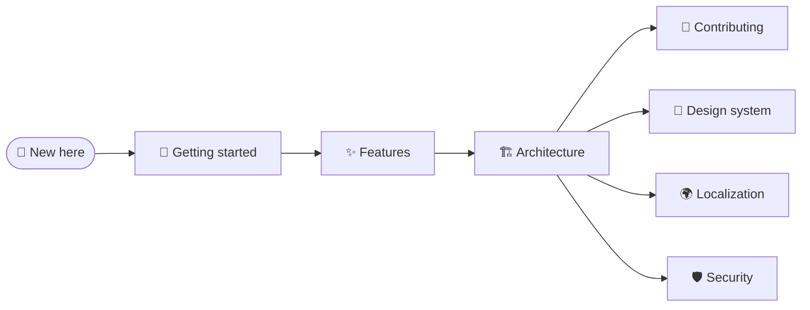

# 📚 Documentation

Everything you need to understand, run and extend **ToDo App** — a Liquid Glass task manager built with React 19, Redux Toolkit and Vite 8.

| Guide                                      | What's inside                                                                  |
| ------------------------------------------ | ------------------------------------------------------------------------------ |
| 🏁 [Getting started](./getting-started.md) | Requirements, installation, npm scripts and the project layout                 |
| ✨ [Features](./features.md)               | Everything the app can do: quick add, palette, details, shortcuts and gestures |
| 🏗️ [Architecture](./architecture.md)       | Layers, state, data model, undo and redo, persistence and startup              |
| 🎨 [Design system](./design.md)            | Liquid Glass materials, refraction, the backdrop, motion and accessibility     |
| 🌍 [Localization](./i18n.md)               | Typed messages, plurals, dates and adding a language                           |
| 🛡️ [Security](./security.md)               | Trust boundaries, CSP and Trusted Types, input validation and the supply chain |
| 🧪 [Testing](./testing.md)                 | Test stack, environment shims, helpers, conventions and coverage               |
| 🚀 [Deployment](./deployment.md)           | CI/CD pipeline, CodeQL, GitHub Pages, PWA updates and Dependabot               |
| 🤝 [Contributing](./contributing.md)       | Workflow, where code goes, code style and commit conventions                   |
| 🧭 [Decisions](./decisions.md)             | Architecture decision records                                                  |
| ❓ [FAQ](./faq.md)                         | Data, backups, browsers, updates and other common questions                    |

📜 Release notes live in [CHANGELOG.md](../CHANGELOG.md).
