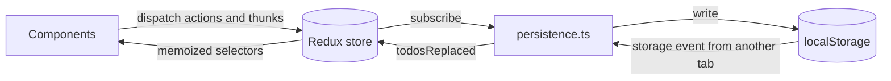
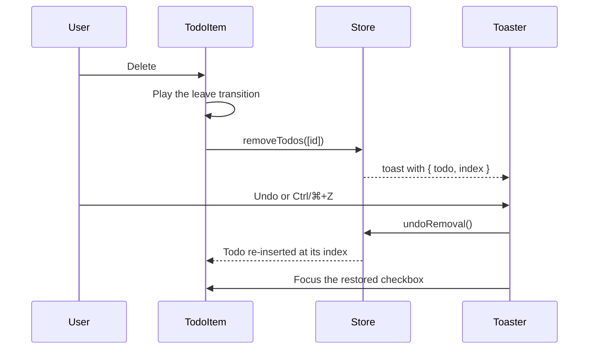

# 🏗️ Architecture

## 🧱 Technology stack

| Area             | Choice                                                                                    |
| ---------------- | ----------------------------------------------------------------------------------------- |
| ⚛️ UI            | React 19.3 with the React Compiler (automatic memoization)                                |
| 🗃️ State         | Redux Toolkit 2.13 and React Redux 9.3                                                    |
| 🖐️ Drag and drop | dnd-kit (core, sortable, modifiers) with keyboard support and screen reader announcements |
| 🎨 Styling       | Sass modules, CSS custom properties, `@property`, `@starting-style`, anchor positioning   |
| ⚡ Build         | Vite 8 (Rolldown), `@vitejs/plugin-react` 6, `vite-plugin-pwa`                            |
| 🔷 Language      | TypeScript 7 (native compiler) in strict mode with `noUncheckedIndexedAccess`             |
| ✅ Quality       | Oxlint (type-aware, React Compiler and a11y rules), Oxfmt, Vitest 5, Testing Library      |

## 🔀 Data flow



Reducers are pure: they never touch `localStorage`, timers or `Date.now()`. Timestamps and identifiers are created in `prepare` callbacks, side effects live in thunks and in the persistence subscriber.

## 🗂️ State shape

```ts
interface RootState {
  todos: EntityState<Todo, string>;
  view: { filter: "all" | "active" | "completed"; query: string };
  toast: { current: Toast | null };
}
```

- 🗂️ `todos` is normalized with `createEntityAdapter`. The order of `ids` is the order the user sees, so drag and drop only rearranges `ids`.
- 👁️ `view` holds the status filter (persisted) and the search query (session only).
- 🔔 `toast` holds the current notification. When the notification can be undone it also carries the removed todos together with their original positions.

```ts
interface Todo {
  id: string;
  title: string;
  completed: boolean;
  createdAt: number;
  updatedAt: number;
  completedAt: number | null;
}
```

## 🍰 Slices and actions

Action names follow the Redux style guide and describe events in the past tense.

| Slice   | Action           | Effect                                                      |
| ------- | ---------------- | ----------------------------------------------------------- |
| `todos` | `todoAdded`      | Prepends a new todo created from a normalized title         |
|         | `todoToggled`    | Flips `completed` and updates `completedAt` and `updatedAt` |
|         | `todoRenamed`    | Renames a todo, ignoring empty or unchanged titles          |
|         | `todoMoved`      | Moves one id to the position of another (drag and drop)     |
|         | `allTodosMarked` | Marks every todo as completed or active                     |
|         | `todosRemoved`   | Removes several todos                                       |
|         | `todosRestored`  | Re-inserts removed todos at their original indices          |
|         | `todosImported`  | Appends todos whose ids are not known yet                   |
|         | `todosReplaced`  | Replaces the collection, used by cross-tab sync             |
| `view`  | `filterChanged`  | Selects the status filter                                   |
|         | `queryChanged`   | Updates the search query                                    |
| `toast` | `toastShown`     | Shows a notification, optionally with undo data             |
|         | `toastDismissed` | Hides the notification if its id still matches              |

## ⚙️ Thunks

Thunks in `store/thunks.ts` coordinate several slices:

- ➕ `addTodo(title)` adds a todo and resets the filter or query when they would hide it. It returns `false` for blank titles so the composer keeps its text.
- 🗑️ `removeTodos(ids)` captures each todo with its index, removes them and shows an undoable notification.
- 🧹 `clearCompleted()` removes every completed todo through `removeTodos`.
- ↩️ `undoRemoval()` restores the todos stored in the current notification and dismisses it.
- 📥 `importTodos(text)` parses a file, merges new todos and reports the result.



## 🎯 Selectors

`store/selectors.ts` exposes memoized selectors built with `createSelector`:

- `selectTodos`, `selectTodoById` from the entity adapter;
- `selectCounts` — total, active and completed counters;
- `selectCompletedIds` — ids for bulk clearing;
- `selectVisibleTodos` — `{ active, completed }` after applying the filter and the search query.

## 💾 Persistence

`store/persistence.ts` is wired up once in `main.tsx`, which keeps the store itself free of browser APIs and easy to test.

| Key                          | Content                                                          |
| ---------------------------- | ---------------------------------------------------------------- |
| `react-todo-app/todos`       | `{ "version": 2, "todos": Todo[] }`                              |
| `react-todo-app/preferences` | `{ "filter": "all" \| "active" \| "completed" }`                 |
| `toDoList`                   | Legacy data from version 1, migrated and removed on first launch |

- 📂 **Loading** — `loadPersistedState()` reads both keys and falls back to safe defaults when data is missing or corrupted.
- 🛡️ **Validation** — everything read from storage, other tabs or imported files goes through `parseTodos()` in `lib/todo.ts`. It accepts the current format, exports and legacy objects, drops invalid entries, repairs duplicate ids and normalizes timestamps.
- 💾 **Saving** — a store subscriber writes only when the `todos` slice or the filter actually changed, and skips writes that would not change the stored value.
- 🔄 **Cross-tab sync** — a `storage` event from another tab dispatches `todosReplaced`. Because identical values are never rewritten, tabs do not ping-pong updates.
- 🚫 **Unavailable storage** — private modes or blocked storage simply disable persistence; the app keeps working in memory.

## 🗺️ Component map

```text
App
├── Backdrop                 Aurora orbs, flow lines and grain
├── Header
│   ├── TodoProgress         ProgressRing with completed / total
│   └── TodoMenu             Bulk actions, import and export in a popover
├── Main
│   ├── TodoComposer         New task field, N shortcut
│   ├── TodoToolbar          SegmentedControl filter and search toggle, / shortcut
│   │   └── TodoSearch
│   └── TodoList             DndContext and empty states
│       └── TodoSection      SortableContext per section
│           └── TodoItem     Checkbox, inline editor, actions, drag handle
├── Footer
└── Toaster                  Undoable notifications, Ctrl/⌘+Z shortcut
```

Reusable, store-agnostic primitives live in `components/ui`. Everything that talks to the store lives in `components/todo`, `components/layout` or `components/feedback`.

## 🖱️ Interaction details

- 🌊 **Leave transitions** — when a task is completed or deleted, `TodoItem` first marks itself as leaving, waits for its CSS transitions with `waitForTransitions()`, and only then dispatches the action inside `flushSync`. The surrounding rows glide into place because the leaving row collapses its grid track.
- ⏳ **Deferred completion** — completing a task waits about 0.4 s so the check mark can be seen. A second click during that window cancels the change.
- 🎯 **Focus management** — after a task moves, disappears or is restored, focus goes to the same task, a neighbour or the composer, so keyboard users never lose their place.
- ⌨️ **Shortcuts** — `useShortcut()` registers global key handlers with `useEffectEvent`, ignores events coming from text fields and never fires on key repeat.
- 🐢 **Reduced motion** — `prefersReducedMotion()` skips the delays and transitions entirely.

## 🛠️ Tooling decisions

- ⚛️ **React Compiler** runs through `@rolldown/plugin-babel` with `reactCompilerPreset()`, so components are written without manual `useMemo` or `useCallback`. Oxlint enables the matching React Compiler rules (`purity`, `refs`, `immutability`, `set-state-in-effect` and others).
- 🔷 **TypeScript 7** type-checks the project with the native compiler. Oxlint's type-aware rules use `oxlint-tsgolint`, so the project does not depend on the JavaScript TypeScript API.
- 🧭 **Path alias** — `@/` points to `src/` in TypeScript, Vite, Sass and Vitest.
