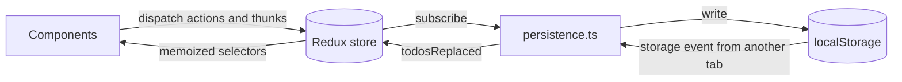
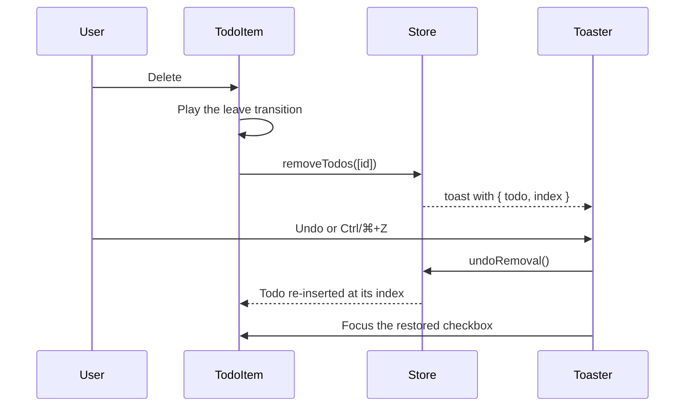

# 🏗️ Architecture

## 🧱 Technology stack

| Area             | Choice                                                                                    |
| ---------------- | ----------------------------------------------------------------------------------------- |
| ⚛️ UI            | React 19.3 with the React Compiler (automatic memoization)                                |
| 🗃️ State         | Redux Toolkit 2.13 and React Redux 9.3                                                    |
| 🖐️ Drag and drop | dnd-kit (core, sortable, modifiers) with keyboard support and screen reader announcements |
| 🎨 Styling       | Sass modules, CSS custom properties, `@property`, `@starting-style`, anchor positioning   |
| ⚡ Build         | Vite 8 (Rolldown), `@vitejs/plugin-react` 6, `vite-plugin-pwa`                            |
| 🔷 Language      | TypeScript 7 (native compiler) in strict mode with `noUncheckedIndexedAccess`             |
| ✅ Quality       | Oxlint (type-aware, React Compiler and a11y rules), Oxfmt, Vitest 5, Testing Library      |

## 🔀 Data flow



Reducers are pure: they never touch `localStorage`, timers or `Date.now()`. Timestamps and identifiers are created in `prepare` callbacks, side effects live in thunks and in the persistence subscriber.

## 🗂️ State shape

```ts
interface RootState {
  todos: EntityState<Todo, string>;
  view: { list: ListId; query: string; sort: SortMode; showCompleted: boolean };
  settings: { appearance: "system" | "light" | "dark"; accent: Accent };
  toast: { current: Toast | null };
}
```

- 🗂️ `todos` is normalized with `createEntityAdapter`. The order of `ids` is the manual order, so drag and drop only rearranges `ids`.
- 👁️ `view` holds the selected smart list, the search query (session only), the sort order and whether the completed section is expanded.
- 🎨 `settings` holds the colour scheme and the accent colour.
- 🔔 `toast` holds the current notification. When it can be undone it also carries the removed todos together with their original positions.

```ts
interface Todo {
  id: string;
  title: string;
  completed: boolean;
  important: boolean;
  dueDate: string | null;
  createdAt: number;
  updatedAt: number;
  completedAt: number | null;
}
```

`dueDate` is a local calendar date in the `YYYY-MM-DD` format. Keeping dates as keys instead of timestamps avoids time zone surprises and lets lists compare dates as plain strings.

## 🧩 Domain helpers

Framework-free logic lives in `src/lib` and is covered by unit tests:

| Module     | Responsibility                                                                                         |
| ---------- | ------------------------------------------------------------------------------------------------------ |
| 📅 `date`  | Date keys, adding days, headlines and friendly due labels (`Today`, `Tomorrow`, `Sunday`, `Oct 20`)    |
| 📚 `lists` | The five smart lists (`matchesList`) and overdue detection                                             |
| 🔀 `sort`  | The five sort orders, all stable so equal items keep their manual order                                |
| 📝 `todo`  | The `Todo` model, title normalization, search matching and tolerant parsing of stored or imported data |
| 🎨 `theme` | Appearance and accent validation and applying them to `<html>`                                         |

## 🍰 Slices and actions

Action names follow the Redux style guide and describe events in the past tense.

| Slice      | Action                       | Effect                                                         |
| ---------- | ---------------------------- | -------------------------------------------------------------- |
| `todos`    | `todoAdded`                  | Prepends a todo created from a draft (title, importance, date) |
|            | `todoToggled`                | Flips `completed` and updates `completedAt` and `updatedAt`    |
|            | `todoRenamed`                | Renames a todo, ignoring empty or unchanged titles             |
|            | `todoImportanceToggled`      | Stars or unstars a todo                                        |
|            | `todoScheduled`              | Sets or clears the due date, ignoring invalid dates            |
|            | `todoMoved`                  | Moves one id to the position of another (drag and drop)        |
|            | `allTodosMarked`             | Marks every todo as completed or active                        |
|            | `todosRemoved`               | Removes several todos                                          |
|            | `todosRestored`              | Re-inserts removed todos at their original indices             |
|            | `todosImported`              | Appends todos whose ids are not known yet                      |
|            | `todosReplaced`              | Replaces the collection, used by cross-tab sync                |
| `view`     | `listChanged`                | Selects a smart list                                           |
|            | `queryChanged`               | Updates the search query                                       |
|            | `sortChanged`                | Selects the sort order                                         |
|            | `completedVisibilityToggled` | Expands or collapses the completed section                     |
| `settings` | `appearanceChanged`          | Selects Auto, Light or Dark                                    |
|            | `accentChanged`              | Selects the accent colour                                      |
| `toast`    | `toastShown`                 | Shows a notification, optionally with undo data                |
|            | `toastDismissed`             | Hides the notification if its id still matches                 |

## ⚙️ Thunks

Thunks in `store/thunks.ts` coordinate several slices:

- ➕ `addTodo(draft)` adds a todo and switches to **All tasks** or clears the search when they would hide it. It returns `false` for blank titles so the composer keeps its text.
- 🗑️ `removeTodos(ids)` captures each todo with its index, removes them and shows an undoable notification.
- 🧹 `clearCompleted()` removes every completed todo through `removeTodos`.
- ↩️ `undoRemoval()` restores the todos stored in the current notification and dismisses it.
- 📥 `importTodos(text)` parses a file, merges new todos and reports the result.



## 🎯 Selectors

`store/selectors.ts` exposes memoized selectors built with `createSelector`. Selectors that depend on the calendar take today's date key as a second argument, which keeps them pure; components get it from the `useToday()` hook, which refreshes every minute and therefore rolls over at midnight.

- 🗂️ `selectTodos`, `selectTodoById` from the entity adapter;
- 🔢 `selectListCounts(state, today)` — active counters for every list, plus `overdue` and `total`;
- 📈 `selectListProgress(state, today)` — done and total for the selected list;
- 👁️ `selectVisibleTodos(state, today)` — `{ active, completed }` after applying the list, the search query and the sort order;
- 🧹 `selectCompletedIds`, `selectSettings`, `selectToast` and small field selectors.

## 💾 Persistence

`store/persistence.ts` is wired up once in `main.tsx`, which keeps the store itself free of browser APIs and easy to test.

| Key                          | Content                                                          |
| ---------------------------- | ---------------------------------------------------------------- |
| `react-todo-app/todos`       | `{ "version": 3, "todos": Todo[] }`                              |
| `react-todo-app/preferences` | `{ "list", "sort", "showCompleted", "appearance", "accent" }`    |
| `toDoList`                   | Legacy data from version 1, migrated and removed on first launch |

- 📂 **Loading** — `loadPersistedState()` reads both keys and falls back to safe defaults when data is missing or corrupted. The `filter` preference saved by version 2 is mapped to the matching list.
- 🛡️ **Validation** — everything read from storage, other tabs or imported files goes through `parseTodos()`. It accepts every earlier format, drops invalid entries and dates, repairs duplicate ids and normalizes timestamps.
- 💾 **Saving** — a store subscriber writes only when the `todos` slice or the serialized preferences actually changed, and skips writes that would not change the stored value.
- 🔄 **Cross-tab sync** — a `storage` event from another tab dispatches `todosReplaced`. Because identical values are never rewritten, tabs do not ping-pong updates.
- 🎨 **Theme before paint** — `main.tsx` calls `applyTheme()` with the loaded settings before React renders; `useThemeSync()` keeps `<html data-appearance data-accent>` and the `theme-color` meta tag in sync afterwards.
- 🚫 **Unavailable storage** — private modes or blocked storage simply disable persistence; the app keeps working in memory.

## 🗺️ Component map

```text
App
├── Backdrop                 Aurora orbs in the accent palette, flow lines and grain
├── Header                   Full-width sticky glass bar, / shortcut
│   ├── TodoSearch           Search field (behind a toggle on phones)
│   ├── ThemeMenu            Appearance and accent popover
│   └── TodoMenu             Bulk actions, import and export popover
├── Sidebar
│   ├── ListNav              Smart lists with counters, 1–5 shortcuts
│   └── Overview             Overall progress and quick stats
├── Main
│   ├── ListHeader           Title, date, progress bar and SortMenu
│   ├── TodoComposer         New task field with DuePicker and star, N shortcut
│   └── TodoList             DndContext and empty states
│       └── TodoSection      SortableContext per section, collapsible completed section
│           └── TodoItem     Checkbox, editable title, due label, star, DuePicker, delete, drag handle
├── Footer                   Full-width status bar
└── Toaster                  Undoable notifications, Ctrl/⌘+Z shortcut
```

Reusable, store-agnostic primitives live in `components/ui`: `Icon`, `IconButton`, `Popover` with the `usePopover()` hook, `SegmentedControl`, `ProgressBar` and `EmptyState`. Everything that talks to the store lives in `components/todo`, `components/layout` or `components/feedback`.

## 🖱️ Interaction details

- 🪟 **Popovers** — `Popover` renders a native `<dialog popover>` anchored to its trigger with CSS anchor positioning, falls back to measured coordinates in older browsers and gets light dismiss, <kbd>Esc</kbd> and top-layer rendering from the platform.
- 🌊 **Leave transitions** — when completing, deleting, starring or rescheduling takes a task out of the current list, `TodoItem` first marks itself as leaving, waits for its CSS transitions with `waitForTransitions()`, and only then dispatches the action inside `flushSync`.
- ⏳ **Deferred completion** — completing a task waits about 0.4 s so the check mark can be seen. A second click during that window cancels the change.
- 🎯 **Focus management** — after a task moves, disappears or is restored, focus goes to the same task, a neighbour or the composer, so keyboard users never lose their place.
- 🧠 **List-aware composer** — the composer is keyed by the selected list, so switching lists resets its due date and importance to that list's defaults.
- ⌨️ **Shortcuts** — `useShortcut()` registers global key handlers with `useEffectEvent`, ignores events coming from text fields and never fires on key repeat.
- 🐢 **Reduced motion** — `prefersReducedMotion()` skips the delays and transitions entirely.

## 🛠️ Tooling decisions

- ⚛️ **React Compiler** runs through `@rolldown/plugin-babel` with `reactCompilerPreset()`, so components are written without manual `useMemo` or `useCallback`. Oxlint enables the matching React Compiler rules (`purity`, `refs`, `immutability`, `set-state-in-effect` and others).
- 🔷 **TypeScript 7** type-checks the project with the native compiler. Oxlint's type-aware rules use `oxlint-tsgolint`, so the project does not depend on the JavaScript TypeScript API.
- 🧭 **Path alias** — `@/` points to `src/` in TypeScript, Vite, Sass and Vitest.
