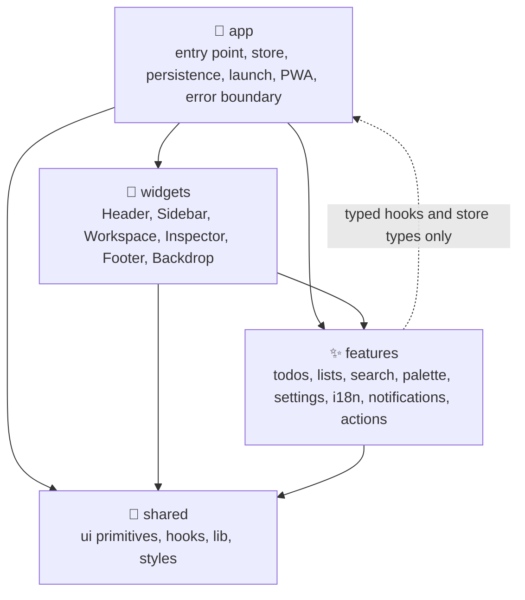
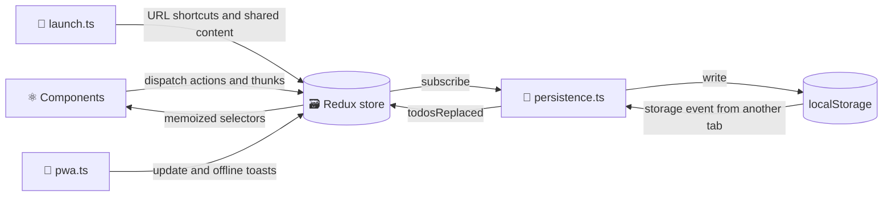
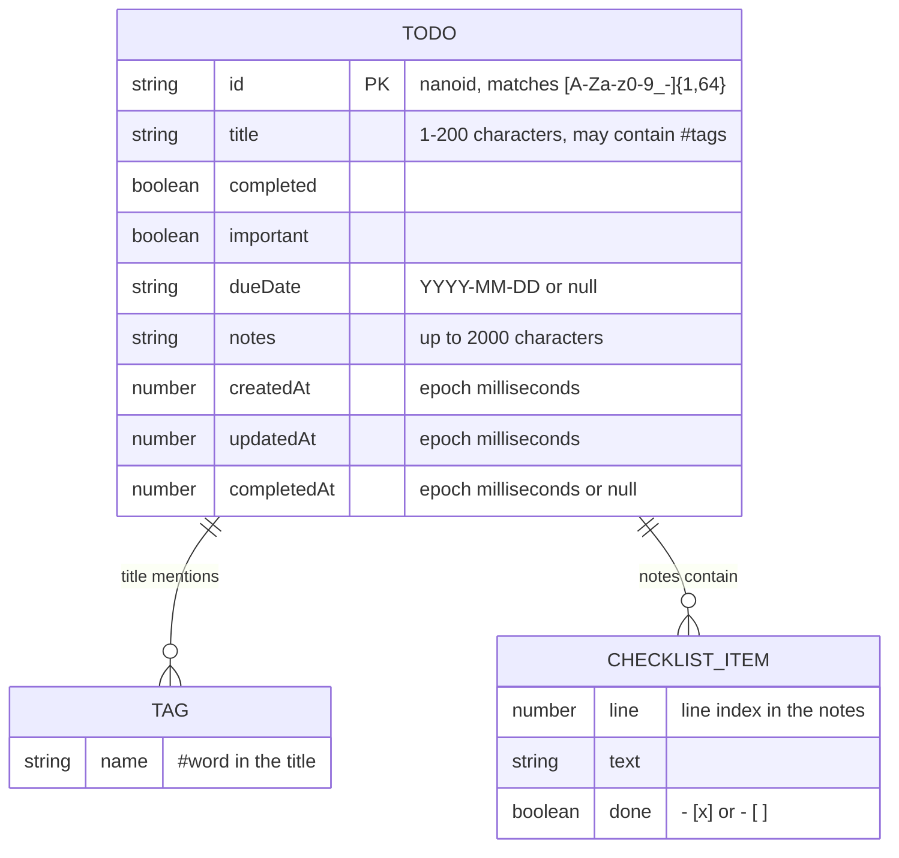
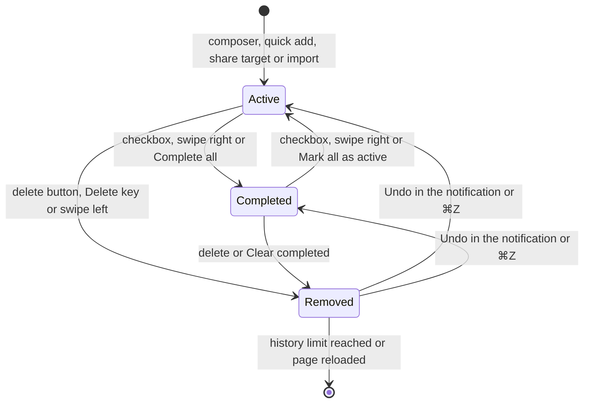
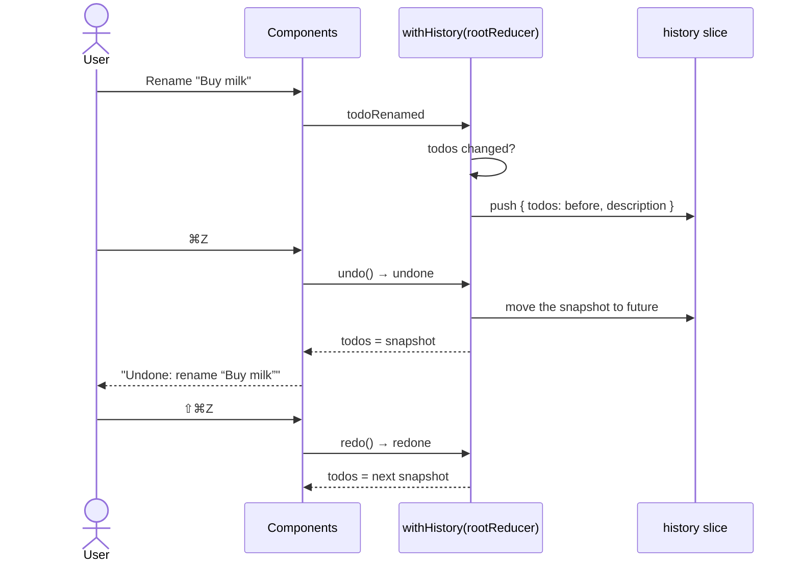
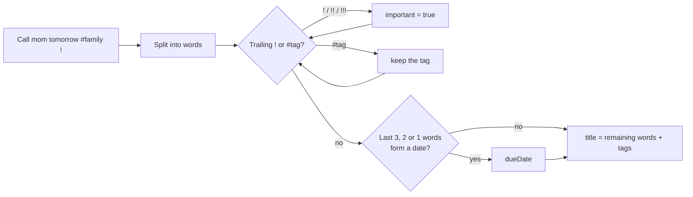
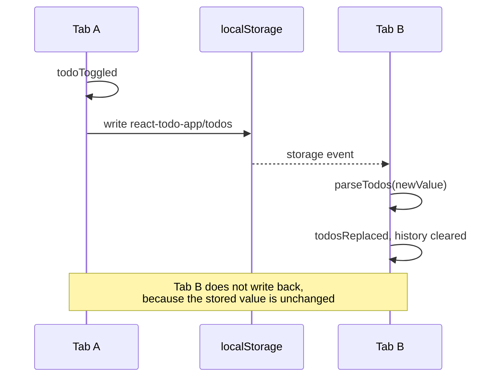
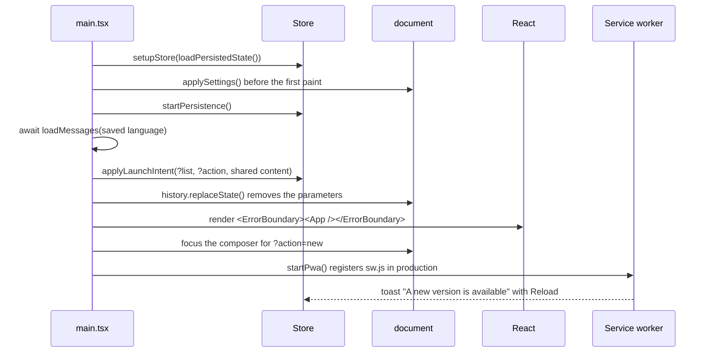

# 🏗️ Architecture

## 🧱 Technology stack

| Area             | Choice                                                                                                                 |
| ---------------- | ---------------------------------------------------------------------------------------------------------------------- |
| ⚛️ UI            | React 19.3 with the React Compiler (automatic memoization)                                                             |
| 🗃️ State         | Redux Toolkit 2.13 and React Redux 9.3, with a custom history reducer for undo and redo                                |
| 🖐️ Drag and drop | dnd-kit (core, sortable, modifiers) with keyboard support and screen reader announcements                              |
| 🌍 i18n          | Eight languages on top of `Intl` (plural rules, dates, relative time), lazy-loaded per language                        |
| 🎨 Styling       | Sass modules, CSS custom properties, `@property`, `@starting-style`, container queries, anchor positioning, Montserrat |
| ⚡ Build         | Vite 8 (Rolldown), `@vitejs/plugin-react` 6, `vite-plugin-pwa`                                                         |
| 🔷 Language      | TypeScript 7 (native compiler) in strict mode with `noUncheckedIndexedAccess`                                          |
| ✅ Quality       | Oxlint (type-aware, React Compiler, a11y and layer rules), Oxfmt, Vitest 5, Testing Library                            |

## 🧭 Layers

The source code is organised by **feature**, in four layers. A layer may only import from the layers below it, and Oxlint's `no-restricted-imports` rule enforces this in `.oxlintrc.json`, so a wrong import fails the build instead of slowly eroding the structure.



| Layer       | Folder         | Contains                                                                                      | May import                                                |
| ----------- | -------------- | --------------------------------------------------------------------------------------------- | --------------------------------------------------------- |
| 🚀 App      | `src/app`      | `main.tsx`, `App.tsx`, the store, persistence, launch intents, PWA registration, error screen | everything                                                |
| 🧩 Widgets  | `src/widgets`  | Page regions that compose several features                                                    | features, shared, `@/app/hooks`, types from `@/app/store` |
| ✨ Features | `src/features` | One folder per capability with a `model/` (state, logic) and a `ui/` (components)             | other features, shared, `@/app/hooks`, store types        |
| 🧰 Shared   | `src/shared`   | Store-agnostic UI primitives, hooks, helpers and styles                                       | shared only                                               |

| Feature            | Model                                                                                                    | UI                                                                                                                                 |
| ------------------ | -------------------------------------------------------------------------------------------------------- | ---------------------------------------------------------------------------------------------------------------------------------- |
| ✅ `todos`         | `Todo` model, slice, selectors (incl. tags), thunks, history, quick add parser, checklists, transfer     | `TodoComposer`, `TodoList`, `TodoSection`, `TodoItem`, `TaskDetails`, `TodoDetails` (dialog), `DetailsPanel` (inline), `DuePicker` |
| 📚 `lists`         | Smart lists, sort orders, view slice, list shortcuts                                                     | `ListNav`, `TagNav`, `TabBar`, `ListHeader`, `SortMenu`, `Overview`                                                                |
| 🔎 `search`        | —                                                                                                        | `TodoSearch`                                                                                                                       |
| ⌘ `palette`        | Command ranking                                                                                          | `CommandPalette`                                                                                                                   |
| 🎨 `settings`      | Appearance, accent, language and effects, `changeLocale()`, document sync                                | `SettingsMenu`                                                                                                                     |
| 🌍 `i18n`          | Typed messages for eight languages, the lazy catalog, native names and flags, `translate()`, `useI18n()` | `LocaleFlag`                                                                                                                       |
| 🔔 `notifications` | Toast slice and message formatting                                                                       | `Toaster`                                                                                                                          |
| 🧰 `actions`       | —                                                                                                        | `ActionsMenu`                                                                                                                      |

## 🔀 Data flow



Reducers are pure: they never touch `localStorage`, timers or `Date.now()`. Timestamps and identifiers are created in `prepare` callbacks; side effects live in thunks, in the persistence subscriber and in a few UI handlers such as haptics and confetti.

## 🗂️ State shape

```ts
interface RootState {
  todos: EntityState<Todo, string>;
  view: {
    list: ListId;
    query: string;
    sort: SortMode;
    showCompleted: boolean;
    detailsId: string | null;
    paletteOpen: boolean;
  };
  settings: { appearance: Appearance; accent: Accent; locale: Locale; effects: "auto" | "full" | "lite" };
  toast: { current: Toast | null };
  history: { past: HistoryEntry[]; future: HistoryEntry[] };
}
```

- 🗂️ `todos` is normalized with `createEntityAdapter`. The order of `ids` is the manual order, so drag and drop only rearranges `ids`.
- 👁️ `view` holds the selected smart list, the search query, the sort order, whether the completed section is expanded, the task shown in the details sheet and whether the command palette is open. Only `list`, `sort` and `showCompleted` are persisted.
- 🎨 `settings` holds the colour scheme, the accent colour, the interface language and the effects level.
- 🔔 `toast` holds the current notification as a **message key with parameters**, so it is translated at render time and switches language together with the rest of the UI.
- ↩️ `history` keeps up to 50 snapshots of the `todos` slice for undo and redo.

## 🧬 Data model



- 📅 `dueDate` is a local calendar date. Keeping dates as keys instead of timestamps avoids time zone surprises and lets lists compare dates as plain strings.
- 🏷️ Tags and checklist items are **derived**, not stored: `extractTags()` reads `#words` from the title and `parseChecklist()` reads Markdown task list lines from the notes. Nothing needs migrating when the rules evolve.

## 🔄 Task lifecycle



Completing the last active task of a smart list triggers the `toast.allDone` notification and a burst of confetti that starts at the checkbox.

## 🍰 Slices and actions

Action names follow the Redux style guide and describe events in the past tense.

| Slice      | Action                       | Effect                                                         |
| ---------- | ---------------------------- | -------------------------------------------------------------- |
| `todos`    | `todoAdded`                  | Prepends a todo created from a draft (title, importance, date) |
|            | `todoToggled`                | Flips `completed` and updates `completedAt` and `updatedAt`    |
|            | `todoRenamed`                | Renames a todo, ignoring empty or unchanged titles             |
|            | `todoImportanceToggled`      | Stars or unstars a todo                                        |
|            | `todoScheduled`              | Sets or clears the due date, ignoring invalid dates            |
|            | `todoNoted`                  | Replaces the notes, normalized and limited to 2000 characters  |
|            | `todoDuplicated`             | Inserts an active copy right after the original                |
|            | `todoMoved`                  | Moves one id to the position of another (drag and drop)        |
|            | `allTodosMarked`             | Marks every todo as completed or active                        |
|            | `todosRemoved`               | Removes several todos                                          |
|            | `todosRestored`              | Re-inserts removed todos at their original indices             |
|            | `todosImported`              | Appends todos whose ids are not known yet                      |
|            | `todosReplaced`              | Replaces the collection, used by cross-tab sync                |
| `view`     | `listChanged`                | Selects a smart list                                           |
|            | `queryChanged`               | Updates the search query                                       |
|            | `sortChanged`                | Selects the sort order                                         |
|            | `completedVisibilityToggled` | Expands or collapses the completed section                     |
|            | `detailsOpened`              | Opens the details sheet of a task                              |
|            | `detailsClosed`              | Closes the details sheet                                       |
|            | `paletteToggled`             | Opens or closes the command palette                            |
| `settings` | `appearanceChanged`          | Selects Auto, Light or Dark                                    |
|            | `accentChanged`              | Selects the accent colour                                      |
|            | `localeChanged`              | Selects English or Ukrainian                                   |
|            | `effectsChanged`             | Selects Auto, Full or Reduced effects                          |
| `toast`    | `toastShown`                 | Shows a notification with a tone and an optional action        |
|            | `toastDismissed`             | Hides the notification if its id still matches                 |
| `history`  | `undone` / `redone`          | Steps back or forward through the snapshots                    |

## ↩️ Undo and redo

`withHistory()` in `features/todos/model/history.ts` wraps the combined root reducer. After every action it compares the `todos` slice before and after; when it changed, the previous slice is pushed to `history.past` together with a translatable description such as `history.renamed { title }`.



- 🧠 Snapshots are cheap: Immer shares every unchanged todo between versions, so only the changed objects are new.
- 🔢 The history keeps the last **50** changes and clears the redo stack whenever a new change is made.
- 🔄 `todosReplaced` (a change from another tab) clears the history, because undoing would overwrite the other tab's work.
- ⌨️ <kbd>⌘</kbd>/<kbd>Ctrl</kbd>+<kbd>Z</kbd> undoes and <kbd>⇧</kbd>+<kbd>⌘</kbd>/<kbd>Ctrl</kbd>+<kbd>Z</kbd> or <kbd>Ctrl</kbd>+<kbd>Y</kbd> redoes, except inside text fields where the browser's own undo applies.

## ⚙️ Thunks

Thunks in `features/todos/model/thunks.ts` coordinate several slices:

| Thunk                     | What it does                                                                                                             |
| ------------------------- | ------------------------------------------------------------------------------------------------------------------------ |
| ➕ `addTodo(draft)`       | Adds a todo and switches to **All tasks** or clears the search when they would hide it. Returns `false` for blank titles |
| ✅ `toggleTodo(id, day)`  | Toggles a todo and returns `true` when it was the last active task of the current list, after showing `toast.allDone`    |
| 📄 `duplicateTodo(id)`    | Duplicates a todo, confirms it in a notification and returns the id of the copy                                          |
| 🗑️ `removeTodos(ids)`     | Captures each todo with its index, removes them, closes their details and shows a notification with a **Restore** action |
| 🧹 `clearCompleted()`     | Removes every completed todo through `removeTodos`                                                                       |
| ↩️ `undoRemoval()`        | Restores the todos stored in the current notification and dismisses it                                                   |
| 📥 `importTodos(text)`    | Validates a file, merges new todos and reports the result                                                                |
| 📤 `exportTodos()`        | Downloads every todo as `todos-YYYY-MM-DD.json`                                                                          |
| ⏪ `undo()` / `redo()`    | Steps through the history and describes the step in a notification                                                       |
| 🌍 `changeLocale(locale)` | Loads the language's messages, then switches; reports a failure in a notification (settings feature)                     |

## 🎯 Selectors

Selectors that depend on the calendar take today's date key as a second argument, which keeps them pure; components get it from `useToday()`, which refreshes every minute and therefore rolls over at midnight.

- 🗂️ `selectTodos`, `selectTodoById` from the entity adapter;
- 🔢 `selectListCounts(state, today)` — active counters for every list, plus `overdue` and `total`;
- 📈 `selectListProgress(state, today)` — done and total for the selected list;
- 👁️ `selectVisibleTodos(state, today)` — `{ active, completed }` after applying the list, the search (title **and** notes) and the sort order;
- 🔥 `selectActivity(state, today)` — completions for each of the last seven days and the current streak;
- 🧹 `selectCompletedIds`, `selectHistory`, `selectSettings`, `selectToast` and small field selectors.

## ✍️ Quick add

`parseQuickAdd(input, today)` turns what the user types into a draft. It reads the title **from the end**, so a date can never be taken from the middle of a sentence.



`parseDatePhrase()` understands English and Ukrainian phrases (`tomorrow`, `завтра`, `in 3 days`, `через 3 дні`, `next friday`, `у п’ятницю`, `2026-10-20`, `20.10`), validates calendar dates and rolls `dd.mm` over to the next year when the date has passed. The full list is in [Features](./features.md#-quick-add).

## 💾 Persistence

`app/persistence.ts` is wired up once in `main.tsx`, which keeps the store itself free of browser APIs and easy to test.

| Key                          | Content                                                                            |
| ---------------------------- | ---------------------------------------------------------------------------------- |
| `react-todo-app/todos`       | `{ "version": 4, "todos": Todo[] }`                                                |
| `react-todo-app/preferences` | `{ "list", "sort", "showCompleted", "appearance", "accent", "locale", "effects" }` |
| `toDoList`                   | Legacy data from version 1, migrated and removed on first launch                   |

- 📂 **Loading** — `loadPersistedState()` reads both keys and falls back to safe defaults when data is missing or corrupted. The `filter` preference saved by version 2 is mapped to the matching list, and the language is detected from `navigator.languages` on the first launch.
- 🛡️ **Validation** — everything read from storage, other tabs or imported files goes through `parseTodos()`. It accepts every earlier format, drops invalid entries and dates, replaces unsafe or duplicate ids and normalizes timestamps.
- 💾 **Saving** — a store subscriber writes only when the `todos` slice or the serialized preferences actually changed, and skips writes that would not change the stored value.
- 🔄 **Cross-tab sync** — a `storage` event from another tab dispatches `todosReplaced`. Because identical values are never rewritten, tabs do not ping-pong updates.
- 🎨 **Theme before paint** — `main.tsx` calls `applySettings()` before React renders; `useDocumentSync()` keeps `<html lang data-appearance data-accent>` and the `theme-color` meta tag in sync afterwards.
- 🚫 **Unavailable storage** — private modes or blocked storage simply disable persistence; the app keeps working in memory.



## 🚀 Startup



- 🧯 `ErrorBoundary` catches rendering errors and shows a recovery screen with **Reload**, **Download a backup** (the raw stored tasks) and **Reset view settings**. It reads the language from `<html lang>`, so it works even when the store is the problem.
- 🔗 `launch.ts` handles the web app manifest shortcuts (`?list=today`, `?action=new`) and the share target (`?title=…&text=…&url=…`), which becomes a new task with the link in its notes.

## ⚡ Effects level

`applySettings()` resolves the **Effects** setting (`auto` becomes `full` on capable Apple devices and `lite` elsewhere), writes it to `<html data-effects>` and hands it to a tiny external store in `shared/lib/effects.ts`. Styles key the aurora animation, blend modes, grain and pointer light off the attribute; `useLiquidGlass()` and `usePointerLight()` read the store with `useSyncExternalStore`, so switching levels attaches or removes refraction without a reload. The trade-offs are described in [Design system](./design.md#-effects-and-performance).

## 🔔 Notifications

A toast is `{ id, message, tone, action }`:

- 💬 `message` is `{ key, params }`; parameters may themselves be messages (for example the undone action), and `formatMessage()` translates them recursively.
- 🎨 `tone` is `neutral`, `success` (with a sparkle) or `error`.
- 🔘 `action` is either `restore` (the removed todos with their positions) or `reload` (a waiting service worker update). Update notifications stay until the user acts on them; the others close after six seconds unless hovered or focused.

## 🗺️ Component map

```text
App
├── Backdrop                 Aurora orbs in the accent palette, flow lines and grain
├── Header                   Full-width sticky glass bar, offline badge, / shortcut
│   ├── TodoSearch           Search field (behind a toggle on phones)
│   ├── SettingsMenu         Appearance, accent, language grid with flags and effects
│   └── ActionsMenu          Undo, redo, bulk actions, import, export and the shortcut sheet
├── Sidebar                  One glass panel, sticky on desktop, below the list on phones
│   ├── ListNav              Smart lists with counters (not on phones)
│   ├── TagNav               Tags of active tasks with counters
│   └── Overview             Progress, stats, 7-day activity chart and streak (not on wide screens)
├── Workspace
│   ├── ListHeader           Title, date, progress bar and SortMenu
│   ├── TodoComposer         Quick add field with DuePicker and star, N shortcut
│   └── TodoList             DndContext, empty states and announcements
│       └── TodoSection      SortableContext and one glass group per section
│           └── TodoItem     Checkbox, title, chips, actions, swipe gestures, keyboard commands
├── Inspector                Wide screens: Overview, or DetailsPanel with TaskDetails
├── Footer                   Full-width status bar
├── TabBar                   Bottom glass tab bar on phones
├── TodoDetails              Dialog with TaskDetails below 1240 px
├── CommandPalette           ⌘K palette with fuzzy search over commands and tasks
└── Toaster                  Notifications with Restore and Reload actions
```

Reusable, store-agnostic primitives live in `shared/ui`: `Icon`, `IconButton`, `Checkbox`, `Popover` with `usePopover()`, `Dialog`, `SegmentedControl`, `ProgressBar` and `EmptyState`.

## 🖱️ Interaction details

- 🪟 **Popovers** — `Popover` renders a native `<dialog popover>` anchored to its trigger with CSS anchor positioning, falls back to measured coordinates in older browsers and gets light dismiss, <kbd>Esc</kbd> and top-layer rendering from the platform.
- 🗔 **Dialogs** — `Dialog` wraps a modal `<dialog>` opened with `showModal()` in a layout effect, closes on <kbd>Esc</kbd> or a backdrop click (`closedby="any"`) and returns focus to the element that opened it. On phones it becomes a bottom sheet.
- 🌊 **Leave transitions** — when completing, deleting, starring or rescheduling takes a task out of the current list, `TodoItem` first marks itself as leaving, waits for its CSS transitions with `waitForTransitions()`, and only then dispatches the action inside `flushSync`.
- ⏳ **Deferred completion** — completing a task waits about 0.4 s so the check mark can be seen. A second click during that window cancels the change.
- 👆 **Swipes** — touch pointers that move horizontally more than 12 px capture the pointer and drag the row; past 88 px a haptic tick arms the action. Vertical movement is left to the browser (`touch-action: pan-y`), so scrolling never triggers a swipe.
- ⌨️ **Row commands** — a native `keydown` listener on each row handles <kbd>↑</kbd>/<kbd>↓</kbd>, <kbd>Alt</kbd>+<kbd>↑</kbd>/<kbd>↓</kbd>, <kbd>S</kbd>, <kbd>D</kbd>, <kbd>E</kbd>, <kbd>I</kbd> and <kbd>Delete</kbd>, but ignores text fields, open popovers and active drags.
- 🎯 **Focus management** — after a task moves, disappears or is restored, focus goes to the same task, a neighbour or the composer, so keyboard users never lose their place.
- 🧠 **List-aware composer** — the composer is keyed by the selected list, so switching lists resets its due date and importance to that list's defaults.
- 🐢 **Reduced motion** — `prefersReducedMotion()` skips the delays, transitions and confetti entirely.

## 🛠️ Tooling decisions

- ⚛️ **React Compiler** runs through `@rolldown/plugin-babel` with `reactCompilerPreset()`, so components are written without manual `useMemo` or `useCallback`. Oxlint enables the matching React Compiler rules (`purity`, `refs`, `immutability`, `set-state-in-effect` and others).
- 🔷 **TypeScript 7** type-checks the project with the native compiler. Oxlint's type-aware rules use `oxlint-tsgolint`, so the project does not depend on the JavaScript TypeScript API.
- 🧭 **Path alias** — `@/` points to `src/` in TypeScript, Vite, Sass and Vitest.
- 📐 More background on these choices is collected in [Decisions](./decisions.md).
