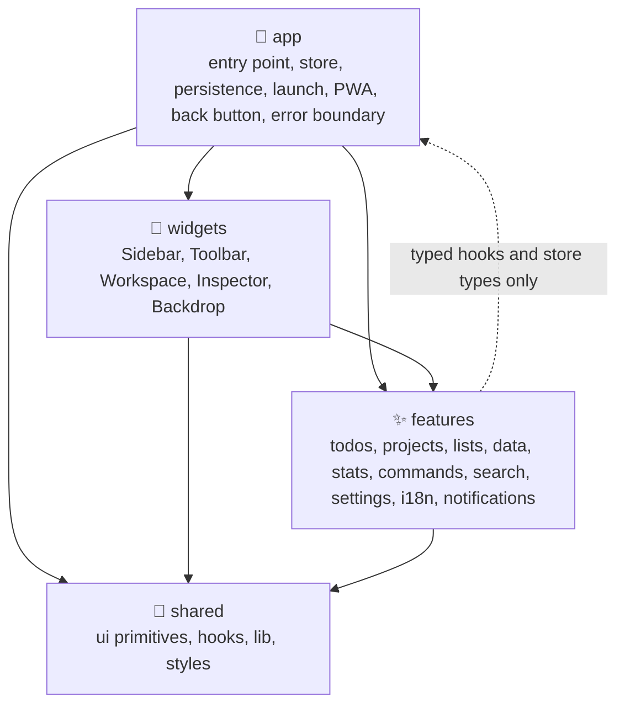
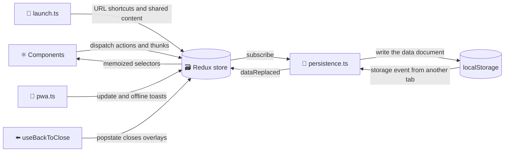
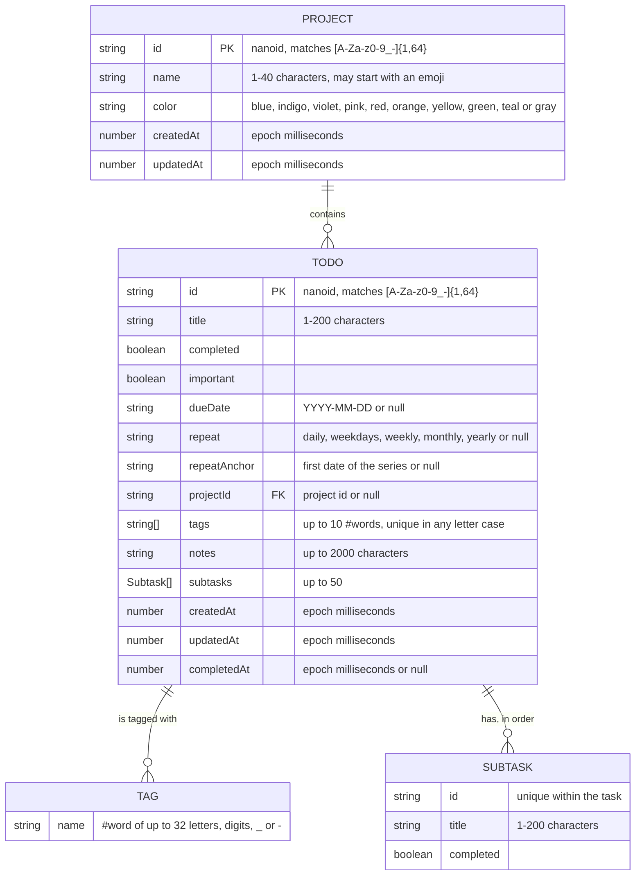
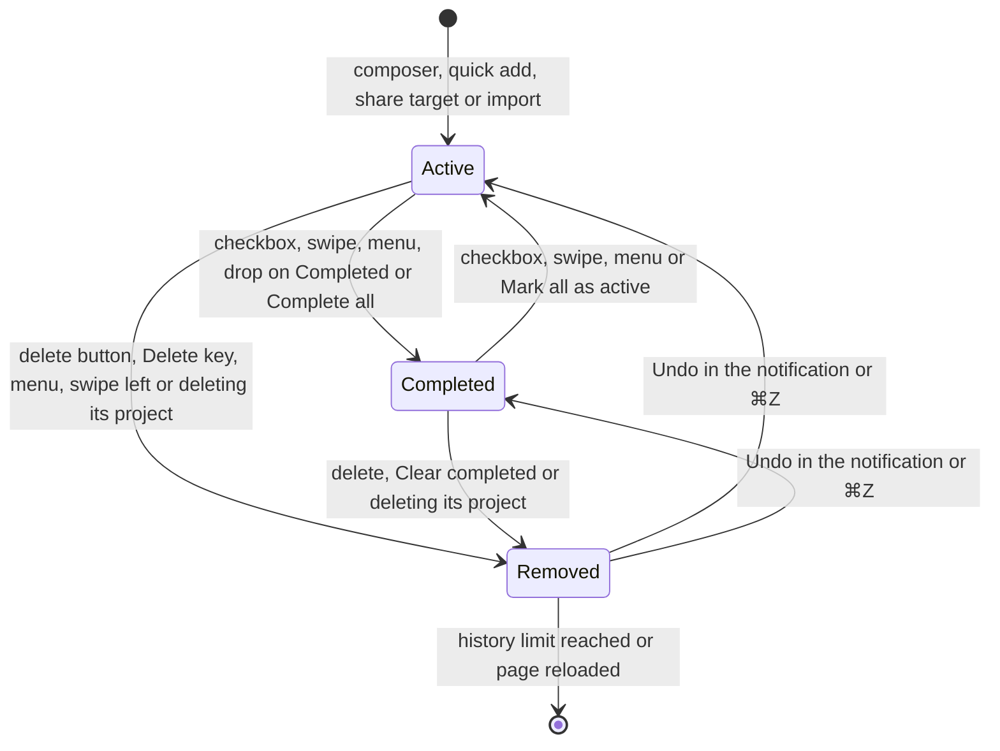
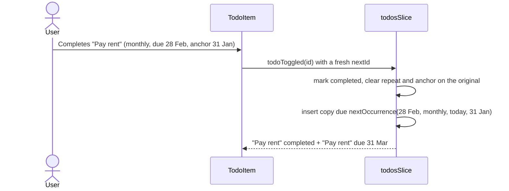
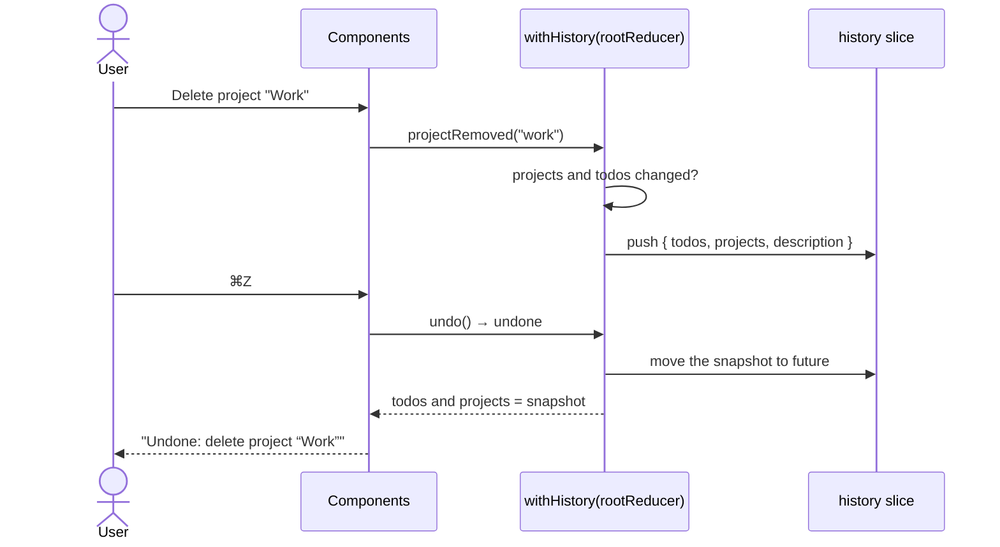
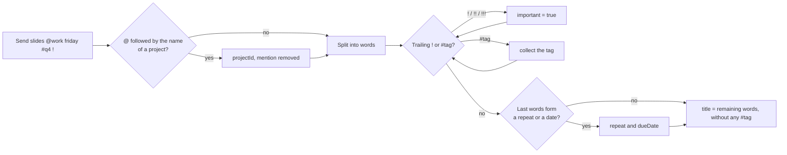
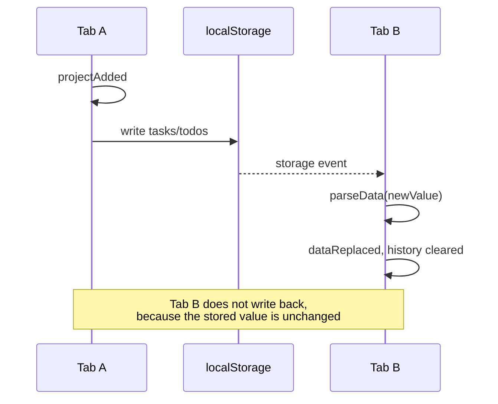
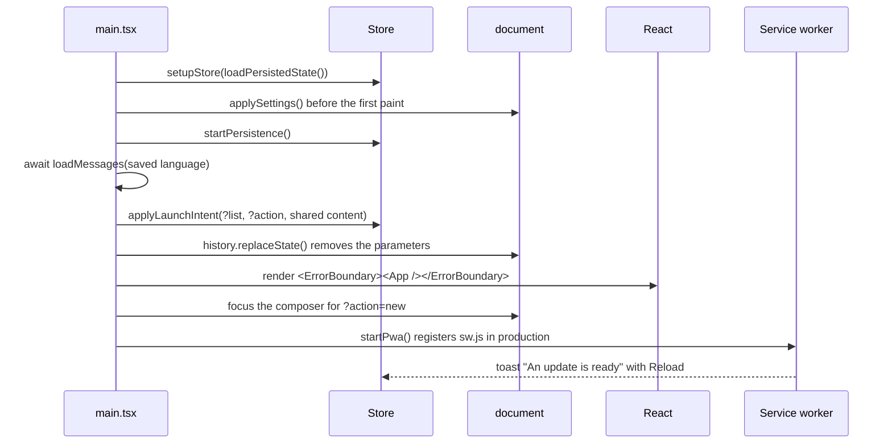
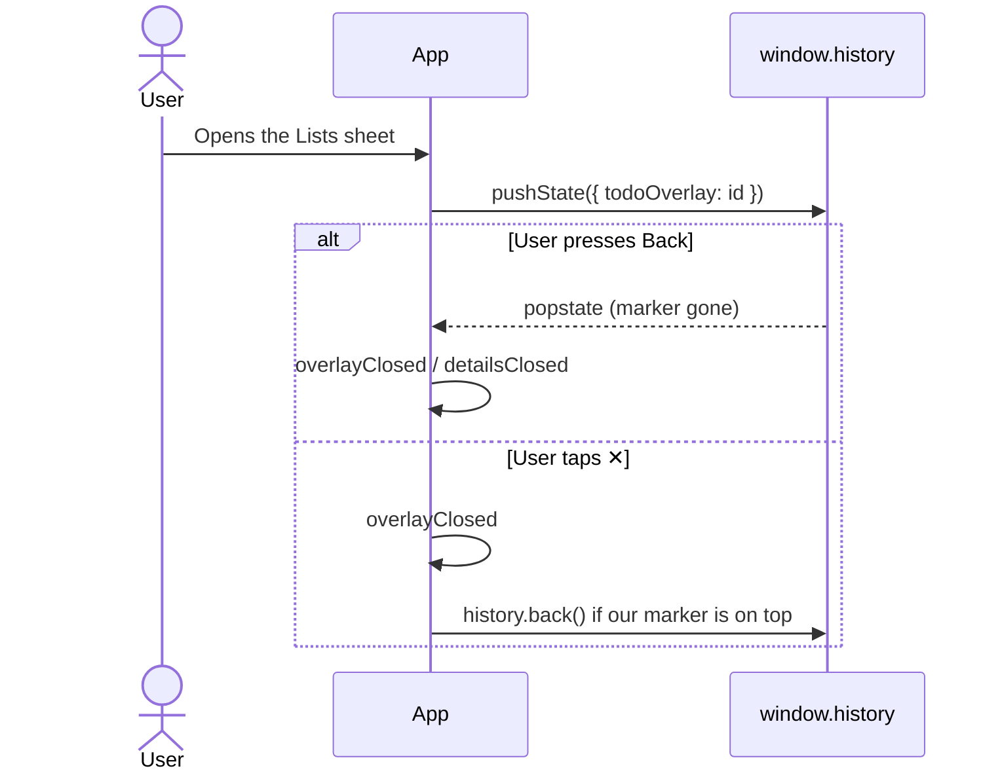

# 🏗️ Architecture

## 🧱 Technology stack

| Area             | Choice                                                                                                                 |
| ---------------- | ---------------------------------------------------------------------------------------------------------------------- |
| ⚛️ UI            | React 19.3 with the React Compiler (automatic memoization)                                                             |
| 🗃️ State         | Redux Toolkit 2.13 and React Redux 9.3, with a custom history reducer for undo and redo                                |
| 🖐️ Drag and drop | dnd-kit (core, sortable) with a drag overlay, sidebar drop targets, keyboard support and screen reader announcements   |
| 🌍 i18n          | Ten languages on top of `Intl` (plural rules, dates, relative time, week info), lazy-loaded per language               |
| 🎨 Styling       | Sass modules, CSS custom properties, `@property`, `@starting-style`, container queries, anchor positioning, Montserrat |
| ⚡ Build         | Vite 8 (Rolldown), `@vitejs/plugin-react` 6, `vite-plugin-pwa`                                                         |
| 🔷 Language      | TypeScript 7 (native compiler) in strict mode with `noUncheckedIndexedAccess`                                          |
| ✅ Quality       | Oxlint (type-aware, React Compiler, a11y and layer rules), Oxfmt, Vitest 5, Testing Library                            |

## 🧭 Layers

The source code is organised by **feature**, in four layers. A layer may only import from the layers below it, and Oxlint's `no-restricted-imports` rule enforces this in `.oxlintrc.json`, so a wrong import fails the build instead of slowly eroding the structure.



| Layer       | Folder         | Contains                                                                                                                | May import                                                |
| ----------- | -------------- | ----------------------------------------------------------------------------------------------------------------------- | --------------------------------------------------------- |
| 🚀 App      | `src/app`      | `main.tsx`, `App.tsx`, the store, persistence, launch intents, PWA registration, back button, page titles, error screen | everything                                                |
| 🧩 Widgets  | `src/widgets`  | Page regions that compose several features                                                                              | features, shared, `@/app/hooks`, types from `@/app/store` |
| ✨ Features | `src/features` | One folder per capability with a `model/` (state, logic) and a `ui/` (components)                                       | other features, shared, `@/app/hooks`, store types        |
| 🧰 Shared   | `src/shared`   | Store-agnostic UI primitives, hooks, helpers and styles                                                                 | shared only                                               |

| Feature            | Model                                                                                                                                                    | UI                                                                                                                                                                             |
| ------------------ | -------------------------------------------------------------------------------------------------------------------------------------------------------- | ------------------------------------------------------------------------------------------------------------------------------------------------------------------------------ |
| ✅ `todos`         | `Todo` model, slice, selectors (tags, due dates, projects), thunks (incl. drops), repeats, quick add parser, subtasks                                    | `TodoComposer`, `TodoList`, `TodoSection`, `TodoItem`, `TaskMenu`, `TaskDnd`, `TaskDetails`, `TaskDetailsDialog`, `TaskDetailsPanel`, `DuePicker`, `RepeatPicker`, `TagPicker` |
| 📁 `projects`      | `Project` model with colours and emoji icons, slice, selectors, `createProject()` and `deleteProject()`                                                  | `ProjectNav`, `ProjectDialog`, `EmojiPicker`, `ProjectPicker`, `ProjectIcon`                                                                                                   |
| 📚 `lists`         | Smart lists and project views (`ViewId`), date groups, sort orders, view slice with overlays, `useViewInfo()`, list shortcuts, page swipes               | `ListNav`, `TagNav`, `TabBar`, `ListsSheet`, `ListHeader`, `SortMenu`                                                                                                          |
| 💾 `data`          | The stored document (`parseData`, `serializeData`), import and export, `dataReplaced` and `dataImported`, undo history                                   | None                                                                                                                                                                           |
| 🔎 `search`        | None                                                                                                                                                     | `TodoSearch`                                                                                                                                                                   |
| 📊 `stats`         | The 7-day activity, streak and project progress selectors                                                                                                | `Overview`                                                                                                                                                                     |
| ⌘ `commands`       | `useTaskCommands()` shared by both menus, command ranking                                                                                                | `ActionsMenu`, `CommandPalette`                                                                                                                                                |
| 🎨 `settings`      | Appearance, accent, background, glass, language and effects, `changeLocale()`, document sync                                                             | `SettingsDialog`, `SettingsButton`                                                                                                                                             |
| 🌍 `i18n`          | Typed messages for ten languages, the lazy catalog, `LOCALE_INFO` with native names, flags and `Intl` tags, `translate()`, `useI18n()`, `useWeekStart()` | `LocaleFlag`                                                                                                                                                                   |
| 🔔 `notifications` | Toast slice and message formatting                                                                                                                       | `Toaster`, `OfflineBadge`                                                                                                                                                      |

## 🔀 Data flow



Reducers are pure: they never touch `localStorage`, timers or `Date.now()`. Timestamps and identifiers are created in `prepare` callbacks; side effects live in thunks, in the persistence subscriber and in a few UI handlers such as haptics and confetti.

## 🗂️ State shape

```ts
interface RootState {
  todos: EntityState<Todo, string>;
  projects: EntityState<Project, string>;
  view: {
    list: ViewId;
    query: string;
    sort: SortMode;
    showCompleted: boolean;
    detailsId: string | null;
    overlay:
      | { kind: "palette" }
      | { kind: "settings" }
      | { kind: "lists" }
      | { kind: "project"; projectId: string | null }
      | null;
  };
  settings: {
    appearance: Appearance;
    accent: Accent;
    backdrop: Backdrop;
    glass: "clear" | "tinted";
    locale: Locale;
    effects: "auto" | "full" | "reduced";
  };
  toast: { current: Toast | null };
  history: { past: HistoryEntry[]; future: HistoryEntry[] };
}
```

- 🗂️ `todos` and `projects` are normalized with `createEntityAdapter`. The order of `ids` is the manual order of tasks and the sidebar order of projects, so drag and drop only rearranges `ids`.
- 🧭 `view.list` is a `ViewId`: a smart list (`"all"`, `"today"`, …) or a project view `` `project:${id}` ``. `selectList()` falls back to `"all"` when the project no longer exists, so undoing a project's creation or deleting it in another tab never leaves an empty screen.
- 🪟 `view.overlay` describes the one open modal surface: the palette, the settings, the phones' Lists sheet or the project dialog. `overlayClosed(kind)` only closes the overlay of that kind, so a late close event from one dialog can never close the next one.
- 👁️ Only `list`, `sort` and `showCompleted` of the view are persisted.
- 🎨 `settings` holds the colour scheme, accent, background, glass style, language and effects level.
- 🔔 `toast` holds the current notification as a **message key with parameters**, so it is translated at render time and switches language together with the rest of the UI.
- ↩️ `history` keeps up to 50 snapshots of the `todos` and `projects` slices for undo and redo.

## 🧬 Data model



- 📅 `dueDate` and `repeatAnchor` are local calendar dates. Keeping dates as keys instead of timestamps avoids time zone surprises and lets lists compare dates as plain strings.
- 🔗 `projectId` is validated twice: `parseTodos()` keeps only well-formed ids, and `parseData()` drops links to projects that are not in the same document.
- 😀 A project's emoji icon is **derived** by `splitProjectName()` with `Intl.Segmenter`, so flags and emoji built from several code points stay whole. The project dialog edits the emoji and the rest of the name separately and joins them with `joinProjectName()`, so the stored name keeps its old format.
- 🏷️ Tags are **stored** on the task. `splitTitleTags()` moves `#words` out of a title when a task is created, renamed or read from an older version that kept them in the title, and `mergeTags()` drops repeats in any letter case and keeps at most ten.
- ☑️ Subtasks are stored in order on the task (`model/subtasks.ts`). Data from versions that wrote `- [ ] item` lines into the notes is converted by `extractChecklist()` the first time it is read, and a repeating task starts its next occurrence with every subtask open again.

## 🔄 Task lifecycle



Completing the last active task of a list or project triggers the `toast.allDone` notification and a burst of confetti that starts at the checkbox.

### 🔁 Repeating tasks



`nextOccurrence()` in `features/todos/model/repeat.ts` advances daily and weekly series from the due date, skips weekends for `weekdays` and counts monthly and yearly series from the **anchor**: the first date of the series. A series that started on the 31st returns to the 31st after a short month. Choosing a new date by hand moves the anchor; **Move to today** keeps it. Because the whole change is one action, one undo removes the copy and reopens the original.

## 🍰 Slices and actions

Action names follow the Redux style guide and describe events in the past tense.

| Slice      | Action                       | Effect                                                                                        |
| ---------- | ---------------------------- | --------------------------------------------------------------------------------------------- |
| `todos`    | `todoAdded`                  | Prepends a todo created from a draft (title, importance, date, repeat, project)               |
|            | `todoToggled`                | Flips `completed`, updates the timestamps and inserts the next occurrence of a repeating todo |
|            | `todoRenamed`                | Renames a todo, ignoring empty or unchanged titles                                            |
|            | `todoImportanceToggled`      | Stars or unstars a todo                                                                       |
|            | `todoScheduled`              | Sets or clears the due date and moves the repeat anchor                                       |
|            | `todosScheduled`             | Moves several todos to one date (Move to today), keeping their anchors                        |
|            | `todoRepeatChanged`          | Sets or clears the repeat rule, giving undated todos a date                                   |
|            | `todoProjectChanged`         | Moves a todo to a project or out of it                                                        |
|            | `todoNoted`                  | Replaces the notes, normalized and limited to 2000 characters                                 |
|            | `todoDuplicated`             | Inserts an active copy right after the original                                               |
|            | `todoMoved`                  | Moves one id to the position of another (drag and drop)                                       |
|            | `allTodosMarked`             | Marks every todo as completed or active                                                       |
|            | `todosRemoved`               | Removes several todos                                                                         |
|            | `todosRestored`              | Re-inserts removed todos at their original indices                                            |
| `projects` | `projectAdded`               | Appends a project created from a name and colour                                              |
|            | `projectUpdated`             | Renames and recolours a project in one step                                                   |
|            | `projectMoved`               | Moves a project in the sidebar order                                                          |
|            | `projectRemoved`             | Removes a project; `todos` removes its tasks and `view` leaves its screen in the same action  |
| `data`     | `dataImported`               | Appends todos and projects whose ids are not known yet                                        |
|            | `dataReplaced`               | Replaces todos and projects, used by cross-tab sync                                           |
| `view`     | `listChanged`                | Opens a smart list or a project and ends the search                                           |
|            | `queryChanged`               | Updates the search query                                                                      |
|            | `sortChanged`                | Selects the sort order                                                                        |
|            | `completedVisibilityToggled` | Expands or collapses the completed section                                                    |
|            | `detailsOpened`              | Opens the details of a task                                                                   |
|            | `detailsClosed`              | Closes the details                                                                            |
|            | `overlayOpened`              | Opens the palette, settings, Lists sheet or project dialog                                    |
|            | `overlayClosed`              | Closes the overlay of the given kind, if it is still open                                     |
| `settings` | `appearanceChanged`          | Selects Auto, Light or Dark                                                                   |
|            | `accentChanged`              | Selects one of ten accents                                                                    |
|            | `backdropChanged`            | Selects one of six backgrounds                                                                |
|            | `glassChanged`               | Selects clear or tinted glass                                                                 |
|            | `localeChanged`              | Selects one of ten languages                                                                  |
|            | `effectsChanged`             | Selects Auto, Full or Reduced effects                                                         |
| `toast`    | `toastShown`                 | Shows a notification with a tone and an optional action                                       |
|            | `toastDismissed`             | Hides the notification if its id still matches                                                |
| `history`  | `undone` / `redone`          | Steps back or forward through the snapshots                                                   |

## ↩️ Undo and redo

`withHistory()` in `features/data/model/history.ts` wraps the combined root reducer. After every action it compares the `todos` and `projects` slices before and after; when either changed, both previous slices are pushed to `history.past` together with a translatable description such as `history.renamed { title }` or `history.projectRemoved { name }`.



- 🧠 Snapshots are cheap: Immer shares every unchanged todo and project between snapshots, so only the changed objects are new.
- 🔢 The history keeps the last **50** changes and clears the redo stack whenever a new change is made.
- 🔄 `dataReplaced` (a change from another tab) clears the history, because undoing would overwrite the other tab's work.
- ⌨️ <kbd>⌘</kbd>/<kbd>Ctrl</kbd>+<kbd>Z</kbd> undoes and <kbd>⇧</kbd>+<kbd>⌘</kbd>/<kbd>Ctrl</kbd>+<kbd>Z</kbd> or <kbd>Ctrl</kbd>+<kbd>Y</kbd> redoes, except inside text fields where the browser's own undo applies.

## ⚙️ Thunks

Thunks coordinate several slices:

| Thunk                            | Feature  | What it does                                                                                                                                                    |
| -------------------------------- | -------- | --------------------------------------------------------------------------------------------------------------------------------------------------------------- |
| ➕ `addTodo(draft)`              | todos    | Adds a todo, clears a search that would hide it and, when it belongs to another list or project, shows a notification with **Show**. Returns `false` for blanks |
| ✅ `toggleTodo(id, day)`         | todos    | Toggles a todo and returns `true` when it was the last active task of the current list or project, after showing `toast.allDone`                                |
| 🎯 `dropTodo(id, target, today)` | todos    | Applies a drop on the sidebar (schedule, star, complete or move to a project) and offers **Undo**                                                               |
| 📄 `duplicateTodo(id)`           | todos    | Duplicates a todo, confirms it in a notification and returns the id of the copy                                                                                 |
| 🗑️ `removeTodos(ids)`            | todos    | Captures each todo with its index, removes them, closes their details and shows a notification with a **Restore** action                                        |
| 📆 `rescheduleOverdue(today)`    | todos    | Moves every overdue todo to today in one undoable step and offers **Undo** in the notification                                                                  |
| 🧹 `clearCompleted()`            | todos    | Removes every completed todo through `removeTodos`                                                                                                              |
| ↩️ `undoRemoval()`               | todos    | Restores the todos stored in the current notification and dismisses it                                                                                          |
| 📁 `createProject(draft)`        | projects | Adds a project and opens it                                                                                                                                     |
| 🗑️ `deleteProject(id)`           | projects | Removes a project with its tasks, closes their details and offers **Undo**                                                                                      |
| 📥 `importData(text)`            | data     | Validates a file, merges new todos and projects and reports the result                                                                                          |
| 📤 `exportData()`                | data     | Downloads every todo and project as `tasks-YYYY-MM-DD.json`                                                                                                     |
| ⏪ `undo()` / `redo()`           | data     | Steps through the history and describes the step in a notification                                                                                              |
| 🌍 `changeLocale(locale)`        | settings | Loads the language's messages, then switches; reports a failure in a notification                                                                               |

## 🎯 Selectors

Selectors that depend on the calendar take today's date key as a second argument, which keeps them pure; components get it from `useToday()`, which refreshes every minute and therefore rolls over at midnight.

- 🗂️ `selectTodos`, `selectTodoById`, `selectProjects`, `selectProjectById` from the entity adapters;
- 🧭 `selectList`, `selectCurrentProject`, `selectSearching`, `selectOverlay` and `useViewInfo()`, which turns the view into a title, icon and kind (`list`, `project` or `search`);
- 🔢 `selectListCounts(state, today)`: active counters for every list, plus `overdue` and `total`; `selectProjectCounts`: active tasks per project;
- 📈 `selectListProgress(state, today)`: done and total for the open list or project;
- 👁️ `selectVisibleTodos(state, today, query?)`: `{ active, completed }` after applying the view, the search (title **and** notes, across every list) and the sort order. The task list passes a deferred query, so typing stays instant;
- 📅 `selectDueDateCounts`: active tasks per day, for the calendar dots;
- 🔥 `selectActivity(state, today)`: completions for each of the last seven days and the current streak; `selectProjectProgress`: done and total per project;
- 🧹 `selectCompletedIds`, `selectHistory`, `selectSettings`, `selectToast` and small field selectors.

## ✍️ Quick add

`parseQuickAdd(input, today, projects)` turns what the user types into a draft. It first takes an `@project` mention from anywhere in the text, then reads the rest **from the end**, so a date can never be taken from the middle of a sentence.



- 🏷️ Every `#word` becomes a tag, wherever it stands; a title made only of a tag keeps it as the title.
- 📁 Mentions match the full project name or the name without its emoji, case- and accent-insensitively with `localeCompare(…, { sensitivity: "base" })`, and must end at a space or the end of the text, so `anna@work.com` and `@workshop` stay untouched. The longest matching name wins, so `@trip to lviv` beats `@trip`.
- 📅 `parseDatePhrase()` and `parseRepeatPhrase()` understand phrases in all ten languages, validate calendar dates and roll `dd.mm` over to the next year when the date has passed. The full list is in [Features](./features.md#-quick-add).

## 🗂️ Date groups

`groupActiveTodos(todos, view, today)` in `features/lists/model/groups.ts` turns the active todos of a view into sections: **Today** becomes _Overdue_ and _Today_, **Upcoming** becomes one group per day for the next seven days and one per month after that, and every other list, project and search stays a single group. Each group is its own `SortableContext`, so dragging reorders within a day, and rows in a day group hide their date chip.

## 💾 Persistence

`app/persistence.ts` is wired up once in `main.tsx`, which keeps the store itself free of browser APIs and easy to test.

| Key                 | Content                                                                                                 |
| ------------------- | ------------------------------------------------------------------------------------------------------- |
| `tasks/todos`       | `{ "todos": Todo[], "projects": Project[] }`                                                            |
| `tasks/preferences` | `{ "list", "sort", "showCompleted", "appearance", "accent", "backdrop", "glass", "locale", "effects" }` |
| `react-todo-app/*`  | Keys of the app before it was renamed to Tasks, moved to the keys above on first launch                 |
| `toDoList`          | Legacy data in the original format, migrated and removed on first launch                                |

- 📂 **Loading**: `loadPersistedState()` reads both keys and falls back to safe defaults when data is missing or corrupted. A saved project view whose project is gone opens **All tasks**, an old `filter` preference is mapped to the matching list, and the language is detected from `navigator.languages` on the first launch.
- 🛡️ **Validation**: everything read from storage, other tabs or imported files goes through `parseData()`, which runs `parseTodos()` and `parseProjects()`. They accept every earlier format, drop invalid entries, dates, colours and links, replace unsafe or duplicate ids and normalize timestamps.
- 💾 **Saving**: a store subscriber writes the data document only when the `todos` or `projects` slice changed, and the preferences only when their serialized form changed.
- 🔄 **Cross-tab sync**: a `storage` event from another tab dispatches `dataReplaced`. Because identical values are never rewritten, tabs do not ping-pong updates.
- 🎨 **Theme before paint**: `main.tsx` calls `applySettings()` before React renders; `useDocumentSync()` keeps `<html lang data-appearance data-accent data-backdrop data-glass data-effects>` and the `theme-color` meta tag in sync afterwards.
- 🚫 **Unavailable storage**: private modes or blocked storage simply disable persistence; the app keeps working in memory.
- ⏱️ **Pending completions**: a completed row waits 420 ms before it leaves the list so the check animation can play. If the page is hidden or closed, or the row disappears because another list opened, the pending completion is saved right away, so nothing is lost.

> [!IMPORTANT]
> The store subscriber writes synchronously after every change. Anything that delays a dispatch, such as an animation, must save its change on `pagehide` and on unmount, the way `TodoItem` does for completions.



## 🚀 Startup



- 🧯 `ErrorBoundary` catches rendering errors and shows a recovery screen with **Reload**, **Download a backup** (the raw stored data) and **Reset view settings**. It reads the language from `<html lang>`, so it works even when the store is the problem.
- 🔗 `launch.ts` handles the web app manifest shortcuts (`?list=today`, `?action=new`) and the share target (`?title=…&text=…&url=…`), which becomes a new task with the link in its notes.

## ⬅️ Back button

`useBackToClose(open, onBack)` in `app/` connects overlays to the browser history, so **Back** on Android and in installed apps closes what is open instead of leaving the app.



- 🔖 Each entry carries a unique marker, so leftover entries from an earlier page load are never mistaken for the current one.
- 🧩 Switching from one overlay to another keeps the same entry. When one closes and the next opens in the same moment, as when the palette runs **Open settings**, the pending `history.back()` is cancelled, so the new sheet is not closed by the old one's Back.
- 🖥️ On wide screens task details live in the inspector and are not part of the history.

## ✋ Drag and drop

`TaskDnd` wraps the whole layout in one `DndContext`, so tasks can travel from the list to the sidebar.

- 🧲 **Collision detection** first looks for a sidebar drop target under the pointer (`pointerWithin`) and otherwise falls back to `closestCenter` among the sortable rows.
- 🎯 **Targets**: `useDropTarget(view, label)` registers smart lists and projects as droppables with ids like `drop:today` and `drop:project:work`; `dropTodo()` turns a drop into a schedule, star, completion or project change.
- 🪞 **Overlay**: a `DragOverlay` shows a glass copy of the task aligned with the handle, while the original row stays in place as a faded placeholder.
- 🔊 **Announcements** describe picking up, moving over a row or a list, dropping and cancelling.

## ⚡ Effects level

`applySettings()` resolves the **Effects** setting (`auto` becomes `full` on capable Apple devices and `reduced` elsewhere), writes it to `<html data-effects>` and hands it to a tiny external store in `shared/lib/effects.ts`. Styles key the aurora animation, blend modes, grain and pointer light off the attribute; `useRefraction()` and `usePointerLight()` read the store with `useSyncExternalStore`, so switching levels attaches or removes refraction without a reload. The trade-offs are described in [Design system](./design.md#-effects-and-performance).

## 🏎️ Rendering performance

Large lists stay responsive through a few targeted techniques, measured with 2000 tasks on a CPU slowed down four times and without a GPU:

| Technique                                                                                 | Effect                                                         |
| ----------------------------------------------------------------------------------------- | -------------------------------------------------------------- |
| 🧠 `memo(TodoItem)` and rows that read the current list from the store only when they act | Changing one task re-renders one row instead of all of them    |
| 🧷 A stable `items` array for every `SortableContext`                                     | dnd-kit no longer re-renders every sortable row on each change |
| 🧩 Sections render the first 120 rows at once and the rest in a transition                | Opening a long list paints in about 0.1 s instead of 0.8 s     |
| ⏳ The task list filters with `useDeferredValue(query)`                                   | Each keystroke in the search takes 30-50 ms                    |
| 🪟 `content-visibility: auto` with `contain-intrinsic-size` on rows (off during drags)    | Scrolling 2000 tasks went from 10 to 44-52 fps                 |
| 📱 One pointer-type subscription for the whole list instead of one per row                | Fewer media query listeners                                    |

## 🔔 Notifications

A toast is `{ id, message, tone, action }`:

- 💬 `message` is `{ key, params }`; parameters may themselves be messages (for example the undone action) or plain strings such as a project name, and `formatMessage()` translates them recursively.
- 🎨 `tone` is `neutral`, `success` (with a sparkle) or `error`.
- 🔘 `action` is `restore` (the removed todos with their positions), `undo` (step back through the history), `show` (jump to the list or project a new todo was added to) or `reload` (a waiting service worker update). Update notifications stay until the user acts on them; the others close after six seconds unless hovered or focused.

## 🗺️ Component map

```text
App
├── Backdrop                 Six backgrounds: orbs, flow lines, stars and grain
├── titlebar                 Draggable strip in Window Controls Overlay mode
├── TaskDnd                  One DndContext for the list and the sidebar, with a drag overlay
│   ├── Toolbar              Phones: brand, condensed title, 🔍, settings and ⋯ in a glass capsule
│   ├── Sidebar              Desktop: a <header> banner panel with the overview below it
│   │   ├── Brand, SettingsButton, ActionsMenu, OfflineBadge
│   │   ├── TodoSearch       Search field with the ⌘K palette button, / shortcut
│   │   ├── ListNav          Smart lists with counters, drop targets
│   │   ├── ProjectNav       Projects with icons and counters, + button, drop targets
│   │   ├── TagNav           Tags of active tasks with counters
│   │   └── Overview         Progress, stats, 7-day chart, streak and project progress (below 1240 px)
│   ├── Workspace
│   │   ├── ListHeader       Icon, title, date or result count, progress, sort and project edit buttons
│   │   ├── TodoComposer     Quick add field with the star, DuePicker, ProjectPicker and TagPicker, N shortcut
│   │   └── TodoList         Date groups, empty states, deferred search
│   │       └── TodoSection  SortableContext, chunked rendering, one glass group per section
│   │           └── TodoItem Checkbox, title, chips, actions, swipes, long press, keyboard, TaskMenu
│   ├── Inspector            Wide screens: an <aside> with the Overview, or TaskDetailsPanel with TaskDetails
│   └── ListsSheet           Phones: smart lists, projects and tags in a bottom sheet
├── Footer                   A <footer> with the author, the version and the source code
├── TabBar                   Bottom glass tab bar on phones with a Lists tab
├── TaskDetailsDialog        Dialog with TaskDetails below 1240 px
├── CommandPalette           ⌘K palette with fuzzy search over commands, projects and tasks
├── SettingsDialog           Theme, accents, backgrounds, glass, language and performance
├── ProjectDialog            Create, edit and delete projects
└── Toaster                  Notifications with Restore, Undo, Show and Reload actions
```

Reusable, store-agnostic primitives live in `shared/ui`: `Icon`, `IconButton`, `Checkbox`, `Popover` with `usePopover()`, `Dialog`, `ContextMenu`, `Calendar`, `SwatchPicker`, `SegmentedControl`, `ProgressBar`, `EmptyState` and `Brand`.

## 🖱️ Interaction details

- 🪟 **Popovers**: `Popover` renders a native `<dialog popover>` anchored to its trigger with CSS anchor positioning, falls back to measured coordinates in older browsers and gets light dismiss, <kbd>Esc</kbd> and top-layer rendering from the platform.
- 📋 **Context menus**: `ContextMenu` is a `role="menu"` popover placed at the pointer and kept inside the viewport. It moves focus with the arrow keys, closes on <kbd>Tab</kbd> and returns focus to where it was opened. When a long press opened it, clicks are ignored until the finger is lifted, so the release cannot pick an item.
- 🗔 **Dialogs**: `Dialog` wraps a modal `<dialog>` opened with `showModal()` in a layout effect, closes on <kbd>Esc</kbd> or a backdrop click (`closedby="any"`) and returns focus to the element that opened it. On phones it becomes a bottom sheet.
- 🌊 **Leave transitions**: when completing, deleting, starring, rescheduling or moving takes a task out of the current list, `TodoItem` first marks itself as leaving, waits for its CSS transitions with `waitForTransitions()`, and only then dispatches the action inside `flushSync`.
- ⏳ **Deferred completion**: completing a task waits about 0.4 s so the check mark can be seen. A second click during that window cancels the change.
- 👆 **Touch**: horizontal moves of more than 12 px become swipes, a press held for about half a second without moving opens the menu, and a tap on the title opens the details. Vertical movement is left to the browser (`touch-action: pan-y`).
- 📖 **Page swipes**: `useSwipeNavigation()` in `features/lists` listens to touches on the whole document on phones. Rows mark themselves with `data-own-swipe`, so a swipe that starts on a task stays with the task; open popovers, dialogs, a field being edited and anything that scrolls sideways keep their touches too. A move of 24 px engages the gesture, 64 px turns the page, and the click that ends a swipe is swallowed so it cannot press the tab under the finger.
- ⌨️ **Row commands**: a native `keydown` listener on each row handles <kbd>↑</kbd>/<kbd>↓</kbd>, <kbd>Alt</kbd>+<kbd>↑</kbd>/<kbd>↓</kbd>, <kbd>S</kbd>, <kbd>D</kbd>, <kbd>E</kbd>, <kbd>I</kbd>, <kbd>Delete</kbd>, <kbd>⇧</kbd>+<kbd>F10</kbd> and the menu key, but ignores text fields, open popovers and active drags.
- 🎯 **Focus management**: after a task moves, disappears or is restored, focus goes to the same task, a neighbour or the composer, so keyboard users never lose their place.
- 🧠 **View-aware composer**: the composer is keyed by the open view, so switching lists or projects resets its date, importance and project to that view's defaults.
- 🐢 **Reduced motion**: `prefersReducedMotion()` skips the delays, transitions and confetti entirely.

## 🛠️ Tooling decisions

- ⚛️ **React Compiler** runs through `@rolldown/plugin-babel` with `reactCompilerPreset()`, so components are written without manual `useMemo` or `useCallback`; `memo` is used once, for task rows rendered in a loop. Oxlint enables the matching React Compiler rules (`purity`, `refs`, `immutability`, `set-state-in-effect` and others).
- 🔷 **TypeScript 7** type-checks the project with the native compiler. Oxlint's type-aware rules use `oxlint-tsgolint`, so the project does not depend on the JavaScript TypeScript API.
- 🧭 **Path alias**: `@/` points to `src/` in TypeScript, Vite, Sass and Vitest.
