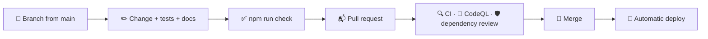

# 🤝 Contributing

## 🔄 Workflow



1. 🌿 Create a branch from `main`.
2. ✅ Make your changes, add tests and run `npm run check`.
3. 📬 Open a pull request and fill in the checklist from the template.
4. 🚀 Merge once everything is green — `main` deploys automatically.

Bugs and ideas go through the issue forms in `.github/ISSUE_TEMPLATE`; security problems are reported privately as described in the [security policy](../.github/SECURITY.md).

## 🧹 Code style

Formatting and linting are automated, so reviews can focus on behaviour.

- 🎨 **Oxfmt** formats TypeScript, SCSS, JSON, YAML, HTML and Markdown with a print width of 120 and sorts imports into groups. Run `npm run format`.
- 🧹 **Oxlint** enables the `correctness`, `suspicious` and `perf` categories together with type-aware TypeScript rules, React hooks and React Compiler rules, `jsx-a11y`, `import`, `unicorn` and `vitest` plugins, plus the layer rules described below. Run `npm run lint`.
- 🔷 **TypeScript** runs in strict mode with `noUncheckedIndexedAccess`, `verbatimModuleSyntax` and `erasableSyntaxOnly`.

### 🚫 No comments

The codebase contains no comments: names, small functions and types carry the intent instead. The rule is enforced by a custom Oxlint plugin in `lint/no-comments.js` (`local/no-comments`), which reports every comment in JavaScript and TypeScript files, including `eslint-disable`-style directives. Styles, configuration, workflow files and templates follow the same convention. If something needs explanation, prefer a better name, an extracted function or documentation in `docs/`.

### 🧭 Where code goes

| You are adding…                                    | Put it in                                             |
| -------------------------------------------------- | ----------------------------------------------------- |
| A reducer, selector, thunk or domain helper        | `src/features/<feature>/model/`                       |
| A component that reads or changes the store        | `src/features/<feature>/ui/<Component>/`              |
| A region composed of several features              | `src/widgets/<Widget>/`                               |
| A reusable component, hook or helper without state | `src/shared/ui`, `src/shared/hooks`, `src/shared/lib` |
| Startup, persistence or browser integration        | `src/app/`                                            |

Imports only point downwards — `app → widgets → features → shared`. Features and widgets may use `useAppDispatch`, `useAppSelector` and the store **types** from `@/app`, nothing else. Oxlint reports any other direction.

### 📐 Conventions

| Topic               | Convention                                                                                                                                       |
| ------------------- | ------------------------------------------------------------------------------------------------------------------------------------------------ |
| 🧩 Components       | One folder per component: `ComponentName/ComponentName.tsx` and `ComponentName.module.scss`, arrow functions, default export                     |
| 🪝 Hooks            | `useSomething.ts` next to the feature that owns it, or in `src/shared/hooks` when it is generic                                                  |
| 🗃️ Redux            | Past-tense action names (`todoAdded`), pure reducers, timestamps and ids in `prepare` callbacks, side effects in thunks                          |
| 🌍 Texts            | Never hard-code UI text. Add a key to `en.ts` and `uk.ts` and use `t()`; notifications store `{ key, params }` — see [Localization](./i18n.md)   |
| 🎨 Styles           | Tokens from `_tokens.scss`, the `glass()`, `hover`, `pressable` and `visually-hidden` mixins, logical properties (`inline-size`, `margin-block`) |
| 📥 Imports          | Use the `@/` alias for anything outside the current feature, relative paths inside it                                                            |
| 🏷️ State attributes | Use `data-*` attributes (`data-completed`, `data-leaving`, `data-swipe`) for visual states instead of extra class names                          |
| 🧪 Tests            | Next to the code as `*.test.ts(x)`; query by role and accessible name                                                                            |

### 🫧 Adding a glass surface

```tsx
const Panel = () => {
  const ref = useRef<HTMLDivElement>(null);
  useLiquidGlass(ref, { bezel: 18, scale: 40 });
  return <div ref={ref} className={styles.panel} data-glass-light="" />;
};
```

```scss
@use "@/shared/styles/mixins" as *;

.panel {
  @include glass(var(--radius-xl), $blur: var(--glass-blur-control));
}
```

`useLiquidGlass()` is optional: skip it for surfaces that repeat many times, such as list rows. `data-glass-light` enables the pointer highlight.

### ⌘ Adding a command to the palette

Commands are plain objects built in `CommandPalette.tsx`:

```ts
{
  id: "clear",
  group: "actions",
  label: t("actions.clearCompleted"),
  icon: "eraser",
  run: () => dispatch(clearCompleted()),
}
```

Give it a translated `label`, optional `keywords` for fuzzy matching and a `hint` for its keyboard shortcut. `rankCommands()` takes care of filtering, ordering and grouping.

## 📝 Commit messages

Commits follow [Conventional Commits](https://www.conventionalcommits.org/):

```text
feat(palette): add sort commands
fix(todos): keep undo positions after import
style: refine glass rim
ci: verify npm registry signatures
docs: describe the update flow
chore(deps): update vite to 8.4
```

| Type          | Use it for                         |
| ------------- | ---------------------------------- |
| ✨ `feat`     | A new feature                      |
| 🐛 `fix`      | A bug fix                          |
| ♻️ `refactor` | Code changes without new behaviour |
| 💄 `style`    | Visual and styling changes         |
| ✅ `test`     | Adding or updating tests           |
| 📝 `docs`     | Documentation                      |
| 👷 `ci`       | Pipeline and automation            |
| 🔧 `chore`    | Dependencies and maintenance       |

Notable changes are listed in [CHANGELOG.md](../CHANGELOG.md).
