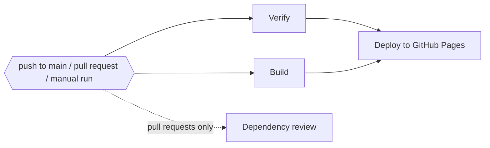

# 🚀 Deployment

The app is deployed to **GitHub Pages** at <https://sacrificed666.github.io/react-todo-app/> by the workflow in `.github/workflows/ci.yml`.

## 🔁 Pipeline



| Job                    | Runs on                       | What it does                                                                                                                  |
| ---------------------- | ----------------------------- | ----------------------------------------------------------------------------------------------------------------------------- |
| 🔍 `verify`            | every trigger                 | `npm ci`, Oxlint with GitHub annotations, Oxfmt check, TypeScript, Vitest with coverage, coverage summary and report artifact |
| 🛠️ `build`             | every trigger                 | Production build; on `main` it also uploads the `dist/` folder as the Pages artifact                                          |
| 🛡️ `dependency-review` | pull requests                 | Fails the pull request if it introduces dependencies with high-severity vulnerabilities                                       |
| 🚀 `deploy`            | `main` pushes and manual runs | Waits for `verify` and `build`, then publishes the artifact to the `github-pages` environment                                 |

Details:

- ⚡ `verify` and `build` run in parallel, so feedback arrives quickly while deployment still requires both to pass.
- 🛑 Pull request runs cancel superseded runs of the same branch; deployments are never cancelled halfway.
- 🔐 The default token is read-only. Only the `deploy` job receives `pages: write` and `id-token: write`.
- 🟢 Node.js is installed from `.nvmrc` and npm downloads are cached.

## ⚙️ One-time GitHub setup

1. Open **Settings → Pages** in the repository.
2. Set **Source** to **GitHub Actions**.
3. Push to `main` or start the workflow manually from the **Actions** tab.

The workflow creates the `github-pages` environment on its first run.

## 🧭 Base path

The site is served from a sub-path, configured in `vite.config.ts`:

```ts
base: "/react-todo-app/",
```

If the repository is renamed or the app is hosted at a domain root, update `base` and the PWA manifest `id` together.

## 📱 Progressive Web App

`vite-plugin-pwa` generates the manifest and a Workbox service worker during the build.

- 📦 **Precache** — HTML, JavaScript, CSS, icons and the AVIF backdrop, so the app starts offline after the first visit.
- 🖼️ **Runtime cache** — other images use a cache-first strategy (up to 32 entries for a year).
- 🔄 **Updates** — `registerType: "autoUpdate"` installs new versions in the background; outdated caches are cleaned automatically.
- 🧪 The service worker is not active during `npm run dev`. Use `npm run build && npm run preview` to test offline behaviour.

## 🤖 Dependency updates

`.github/dependabot.yml` checks for updates every Monday:

- 📦 npm minor and patch updates are grouped into one pull request for production and one for development dependencies; major updates arrive separately;
- ⚙️ GitHub Actions updates are grouped into a single pull request;
- 📝 commit messages follow the project convention (`chore(deps): …`, `ci(deps): …`).

Every Dependabot pull request goes through the same pipeline, including the dependency review.

## 🖐️ Manual deployment

Open **Actions → 🚀 React ToDo App | CI/CD → Run workflow** and choose `main`. Runs started on other branches verify and build but never deploy.
