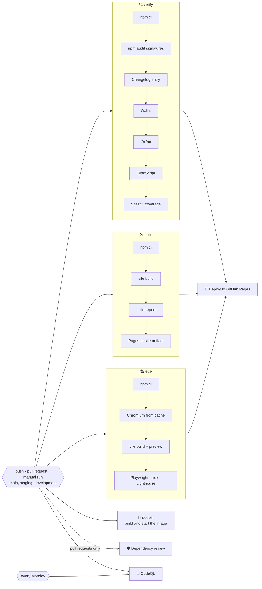
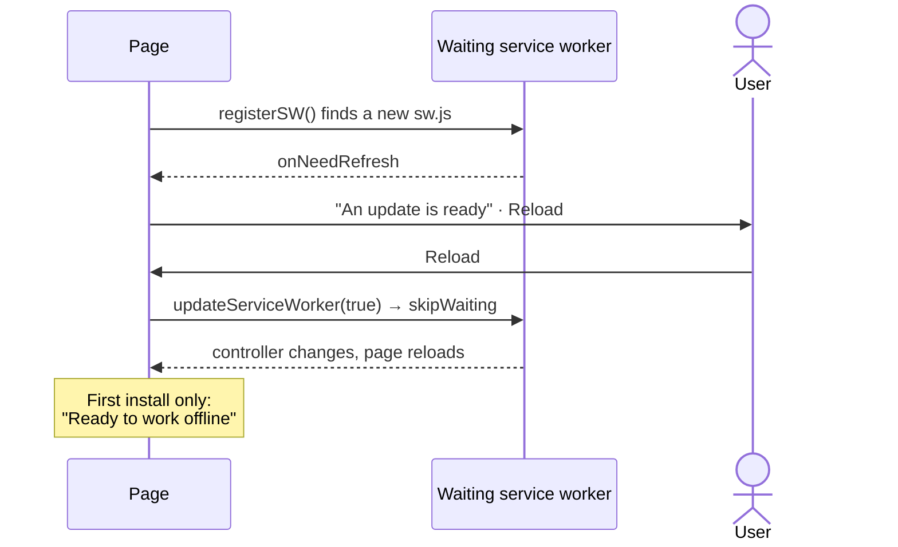

# 🚀 Deployment

Tasks is a static site: the production build in `dist/` is deployed to **GitHub Pages** at <https://sacrificed666.github.io/react-todo-app/> by `.github/workflows/ci.yml`, and the same build runs in Docker behind nginx. There is no server, no database and no configuration.

## 🔁 Pipeline



| Job                    | Runs on                       | What it does                                                                                                                                                                                                                  |
| ---------------------- | ----------------------------- | ----------------------------------------------------------------------------------------------------------------------------------------------------------------------------------------------------------------------------- |
| 🔍 `verify`            | every trigger                 | `npm ci`, `npm audit signatures`, a changelog section for the current version, Oxlint with GitHub annotations, Oxfmt check, TypeScript, Vitest with coverage, coverage summary and report                                     |
| 🛠️ `build`             | every trigger                 | Production build and `scripts/build-report.mjs`; on `main` it also uploads `dist/` as the Pages artifact, on `staging` and `development` as the `site-<branch>` artifact                                                      |
| 🎭 `e2e`               | every trigger                 | Chromium from a cache keyed by the Playwright version, the production build in `vite preview`, Playwright on desktop and phone, axe, offline, CSP, forced colours, reflow and the Lighthouse budget, with the report uploaded |
| 🐳 `docker`            | every trigger                 | Builds the staging image with nginx from `docker/Dockerfile`, starts it and waits until `/healthz` answers                                                                                                                    |
| 🛡️ `dependency-review` | pull requests                 | Fails the pull request if it introduces dependencies with high-severity vulnerabilities                                                                                                                                       |
| 🔬 `analyze` (CodeQL)  | pushes, pull requests, weekly | Scans TypeScript and the workflow files with the `security-extended` query suite                                                                                                                                              |
| 🚀 `deploy`            | `main` pushes and manual runs | Waits for `verify`, `build` and `e2e`, then publishes the artifact to the `github-pages` environment                                                                                                                          |
| 🏷️ `release`           | `v*.*.*` tags                 | Checks that the tag matches `package.json` and sits on `main`, then publishes the GitHub release with the notes from `CHANGELOG.md`, see [Releases](./releases.md)                                                            |

Details:

- ⚡ `verify`, `build`, `e2e` and `docker` run in parallel, so feedback arrives quickly; deployment requires `verify`, `build` and `e2e` to pass.
- 📏 The build report lists every file with its gzip size on the run's summary page and **fails** the job if the CSP, Trusted Types, the service worker, the manifest shortcuts or the share target are missing, or if an inline script appears.

> [!IMPORTANT]
> A failing end-to-end test, accessibility violation or Lighthouse budget blocks the deployment, so a broken page never reaches GitHub Pages.

- 🛑 Pull request runs cancel superseded runs of the same branch; deployments are never cancelled halfway.
- 🔐 The default token is read-only, checkouts use `persist-credentials: false`, and only the `deploy` job receives `pages: write` and `id-token: write`.
- 🟢 Node.js is installed from `.nvmrc` and npm downloads are cached.

## ⚙️ One-time GitHub setup

1. Open **Settings → Pages** and set **Source** to **GitHub Actions**.
2. Open **Settings → Code security** and enable **Private vulnerability reporting**, **Dependabot alerts** and **Code scanning** (CodeQL uploads its results there).
3. Create `development` and `staging`, make `development` the default branch and protect `main` and `staging` as described in [Releases](./releases.md#️-one-time-github-setup).
4. Push to `main` or start the workflow manually from the **Actions** tab.

> [!NOTE]
> The workflow creates the `github-pages` environment on its first run.

## ☁️ Hosting

### 📄 GitHub Pages

`main` deploys to GitHub Pages after every successful run; the `staging` and `development` builds are kept as `site-staging` and `site-development` artifacts, see [Environments](./releases.md#️-environments).

The site is served from a sub-path, configured once in `vite.config.ts`:

```ts
const base = "/react-todo-app/";
```

The same constant feeds the manifest `id`, `scope`, `start_url`, shortcuts and share target. To host the app at another path or at a domain root, change it there, in the absolute addresses of `index.html`, in `docker/nginx.conf` and in `playwright.config.ts`.

> [!NOTE]
> GitHub Pages serves a project site under the name of its repository. When the project moves to the `tasks` repository, the path becomes `/tasks/` in all of these places.

To deploy by hand, open **Actions → 🚀 Tasks | CI/CD → Run workflow** and choose `main`.

> [!WARNING]
> Runs started on other branches verify, build and test but never deploy.

### 🐳 Docker

The shared service lives in `compose.yaml` at the root, and everything else in `docker/`: one multi-stage `Dockerfile`, an overlay per environment and the nginx configuration. `.dockerignore` keeps `node_modules`, build output, docs and every `.env*` file out of the build context.

| File                      | What it adds                                                                                    |
| ------------------------- | ----------------------------------------------------------------------------------------------- |
| `compose.yaml`            | The `app` service: build context, `docker/Dockerfile` and an init process                       |
| `docker/Dockerfile`       | Stages `base`, `deps`, `development`, `build` and `runtime`, an unprivileged nginx with `dist/` |
| `docker/nginx.conf`       | Security headers, caching, compression, the `/react-todo-app/` base path and a `/healthz` check |
| `docker/development.yaml` | The Vite dev server with hot reload through Compose Watch, port 5173                            |
| `docker/staging.yaml`     | The production build with `APP_ENV=staging`, port 8081                                          |
| `docker/production.yaml`  | The production build with `APP_ENV=production`, port 8080                                       |

```bash
docker compose -f compose.yaml -f docker/development.yaml up --watch
docker compose -f compose.yaml -f docker/staging.yaml up --build -d
docker compose -f compose.yaml -f docker/production.yaml up --build -d
```

- 🌐 **The same addresses as on GitHub Pages.** The app lives under `/react-todo-app/`, the root redirects there, and unknown paths fall back to `index.html`.
- 🧭 **`APP_ENV` decides indexing.** nginx sends `X-Robots-Tag: noindex, nofollow` for every value except `production`.
- 🗃️ **Caching.** Hashed files in `assets/` are cached for a year as `immutable`; `index.html`, the service worker and the manifest are revalidated on every visit, so an update reaches everyone through the usual update prompt.
- 🛡️ **Headers.** `nosniff`, `DENY` framing, the referrer policy, `Cross-Origin-Opener-Policy` and the permissions policy join the Content Security Policy that ships in `index.html`; text files are compressed with gzip.
- 📦 **The runtime stage is small.** It is `nginxinc/nginx-unprivileged` with the build only (about 85 MB), runs without root on port 8080 and reports its health through `/healthz`.
- 🔢 **Ports** default to 8080 and 8081, so staging and production fit on one host; `APP_PORT` overrides them. Staging and production restart on failure and rotate their logs.

> [!TIP]
> `docker compose -f compose.yaml -f docker/staging.yaml config` prints the merged configuration of an environment before anything is built.

## 📱 Progressive Web App

`vite-plugin-pwa` generates the manifest and a Workbox service worker during the build; `app/pwa.ts` registers it in production builds.

| Manifest feature      | Value                                                                                      |
| --------------------- | ------------------------------------------------------------------------------------------ |
| 🪟 `display_override` | `window-controls-overlay`, then `standalone`                                               |
| 🚀 `shortcuts`        | **New task** (`?action=new`), **Today** (`?list=today`), **Important** (`?list=important`) |
| 📤 `share_target`     | `GET` with `title`, `text` and `url`, turned into a task by `app/launch.ts`                |
| 🏷️ `categories`       | `productivity`, `utilities`                                                                |
| 🖼️ Icons              | 64, 192 and 512 px PNGs plus a maskable 512 px icon                                        |
| 📸 `screenshots`      | A wide (1280 × 800) and a narrow (780 × 1688) screenshot for the richer install dialog     |

- 📦 **Precache**: HTML, JavaScript (including every language chunk), CSS, the Montserrat font files, icons and the backdrop artwork, so the app starts offline after the first visit.
- 🏳️ **Flags**: the language flags in `public/flags/` are precached with the rest of the app.
- 🖼️ **Runtime cache**: other images use a cache-first strategy (up to 32 entries for a year).
- 🧪 The service worker is not active during `npm run dev`. Use `npm run build && npm run preview` to test offline behaviour.

### 🔄 Update flow

Updates use the **prompt** strategy, so an update never replaces the running app while you work:



## 🤖 Dependency updates

`.github/dependabot.yml` checks for updates every Monday:

- 🌱 pull requests target `development`, so updates reach GitHub Pages with the next release;
- 📦 npm minor and patch updates are grouped into one pull request for production and one for development dependencies; major updates arrive separately;
- ⚙️ GitHub Actions updates are grouped into a single pull request;
- 🐳 the base images in `docker/Dockerfile` are updated one by one;
- 📝 commit messages follow the project convention (`chore(deps): …`, `ci(deps): …`, `build(deps): …`).

Every Dependabot pull request goes through the same pipeline, including the dependency review and CodeQL.

## 🖐️ Checking a build locally

```bash
npm run check
npm run build
npm run preview
```

Open `http://localhost:4173/react-todo-app/`, add a few tasks, switch the language and the theme, go offline in the developer tools and reload: the app keeps working from the service worker.

`npm run test:e2e` does the same automatically, including offline mode, the Content Security Policy, accessibility and the Lighthouse budget.
