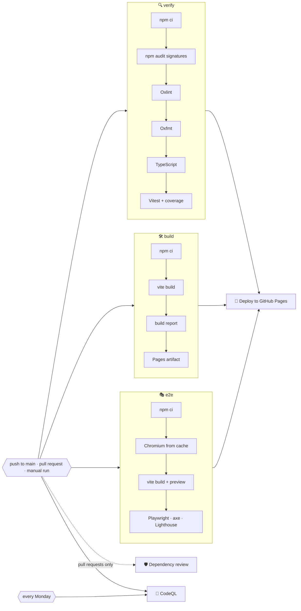
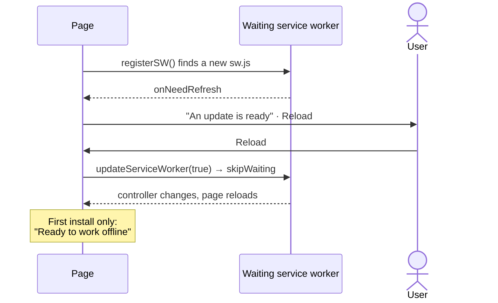

# 🚀 Deployment

The app is deployed to **GitHub Pages** at <https://sacrificed666.github.io/react-todo-app/> by `.github/workflows/ci.yml`. A second workflow, `.github/workflows/codeql.yml`, scans the code for vulnerabilities.

## 🔁 Pipeline



| Job                    | Runs on                       | What it does                                                                                                                                                                                                                  |
| ---------------------- | ----------------------------- | ----------------------------------------------------------------------------------------------------------------------------------------------------------------------------------------------------------------------------- |
| 🔍 `verify`            | every trigger                 | `npm ci`, `npm audit signatures`, Oxlint with GitHub annotations, Oxfmt check, TypeScript, Vitest with coverage, coverage summary and report                                                                                  |
| 🛠️ `build`             | every trigger                 | Production build and `scripts/build-report.mjs`; on `main` it also uploads `dist/` as the Pages artifact                                                                                                                      |
| 🎭 `e2e`               | every trigger                 | Chromium from a cache keyed by the Playwright version, the production build in `vite preview`, Playwright on desktop and phone, axe, offline, CSP, forced colours, reflow and the Lighthouse budget, with the report uploaded |
| 🛡️ `dependency-review` | pull requests                 | Fails the pull request if it introduces dependencies with high-severity vulnerabilities                                                                                                                                       |
| 🔬 `analyze` (CodeQL)  | pushes, pull requests, weekly | Scans TypeScript and the workflow files with the `security-extended` query suite                                                                                                                                              |
| 🚀 `deploy`            | `main` pushes and manual runs | Waits for `verify`, `build` and `e2e`, then publishes the artifact to the `github-pages` environment                                                                                                                          |

Details:

- ⚡ `verify`, `build` and `e2e` run in parallel, so feedback arrives quickly while deployment still requires all three to pass.
- 📏 The build report lists every file with its gzip size on the run's summary page and **fails** the job if the CSP, Trusted Types, the service worker, the manifest shortcuts or the share target are missing, or if an inline script appears.

> [!IMPORTANT]
> A failing end-to-end test, accessibility violation or Lighthouse budget blocks the deployment, so a broken page never reaches GitHub Pages.

- 🛑 Pull request runs cancel superseded runs of the same branch; deployments are never cancelled halfway.
- 🔐 The default token is read-only, checkouts use `persist-credentials: false`, and only the `deploy` job receives `pages: write` and `id-token: write`.
- 🟢 Node.js is installed from `.nvmrc` and npm downloads are cached.

## ⚙️ One-time GitHub setup

1. Open **Settings → Pages** and set **Source** to **GitHub Actions**.
2. Open **Settings → Code security** and enable **Private vulnerability reporting**, **Dependabot alerts** and **Code scanning** (CodeQL uploads its results there).
3. Push to `main` or start the workflow manually from the **Actions** tab.

> [!NOTE]
> The workflow creates the `github-pages` environment on its first run.

## 🧭 Base path

The site is served from a sub-path, configured once in `vite.config.ts`:

```ts
const base = "/react-todo-app/";
```

The same constant feeds the manifest `id`, `scope`, `start_url`, shortcuts and share target. If the repository is renamed or the app is hosted at a domain root, change it in this one place.

## 📱 Progressive Web App

`vite-plugin-pwa` generates the manifest and a Workbox service worker during the build; `app/pwa.ts` registers it in production builds.

| Manifest feature      | Value                                                                                      |
| --------------------- | ------------------------------------------------------------------------------------------ |
| 🪟 `display_override` | `window-controls-overlay`, then `standalone`                                               |
| 🚀 `shortcuts`        | **New task** (`?action=new`), **Today** (`?list=today`), **Important** (`?list=important`) |
| 📤 `share_target`     | `GET` with `title`, `text` and `url`, turned into a task by `app/launch.ts`                |
| 🏷️ `categories`       | `productivity`, `utilities`                                                                |
| 🖼️ Icons              | 64, 192 and 512 px PNGs plus a maskable 512 px icon                                        |
| 📸 `screenshots`      | A wide (1280 × 800) and a narrow (780 × 1688) screenshot for the richer install dialog     |

- 📦 **Precache**: HTML, JavaScript (including every language chunk), CSS, the Montserrat font files, icons and the backdrop artwork, so the app starts offline after the first visit.
- 🏳️ **Flags**: images from flagcdn.com are cached cache-first in a `flags` cache (opaque responses allowed, up to 16 entries for a year).
- 🖼️ **Runtime cache**: other images use a cache-first strategy (up to 32 entries for a year).
- 🧪 The service worker is not active during `npm run dev`. Use `npm run build && npm run preview` to test offline behaviour.

### 🔄 Update flow

Updates use the **prompt** strategy, so an update never replaces the running app while you work:



## 🔎 Search engines and sharing

`index.html` carries everything a crawler or a chat app needs before any JavaScript runs:

| Metadata                       | Purpose                                                                                   |
| ------------------------------ | ----------------------------------------------------------------------------------------- |
| 📰 `<title>` and `description` | A descriptive title and a 150-character summary for search results                        |
| 🔗 `canonical`                 | One address for the app, whatever query parameters a shortcut or share adds               |
| 🖼️ Open Graph and Twitter      | Title, description and a 1200 × 630 preview (`public/og-image.jpg`) with alternative text |
| 🌍 `og:locale`                 | English plus the seven other interface languages as alternates                            |
| 🧾 JSON-LD                     | A `WebApplication` description: category, price, languages, features, author and licence  |
| 🙈 `<noscript>`                | A heading and a summary for visitors and crawlers without JavaScript                      |

Inside the app, `useDocumentTitle()` names the tab after the open list in the interface language, and the main list keeps the descriptive title. The build report fails when the canonical link, the preview image, valid structured data or the manifest screenshots go missing.

## 🤖 Dependency updates

`.github/dependabot.yml` checks for updates every Monday:

- 📦 npm minor and patch updates are grouped into one pull request for production and one for development dependencies; major updates arrive separately;
- ⚙️ GitHub Actions updates are grouped into a single pull request;
- 📝 commit messages follow the project convention (`chore(deps): …`, `ci(deps): …`).

Every Dependabot pull request goes through the same pipeline, including the dependency review and CodeQL.

## 🖐️ Manual deployment

Open **Actions → 🚀 Todo App | CI/CD → Run workflow** and choose `main`.

> [!WARNING]
> Runs started on other branches verify, build and test but never deploy.
