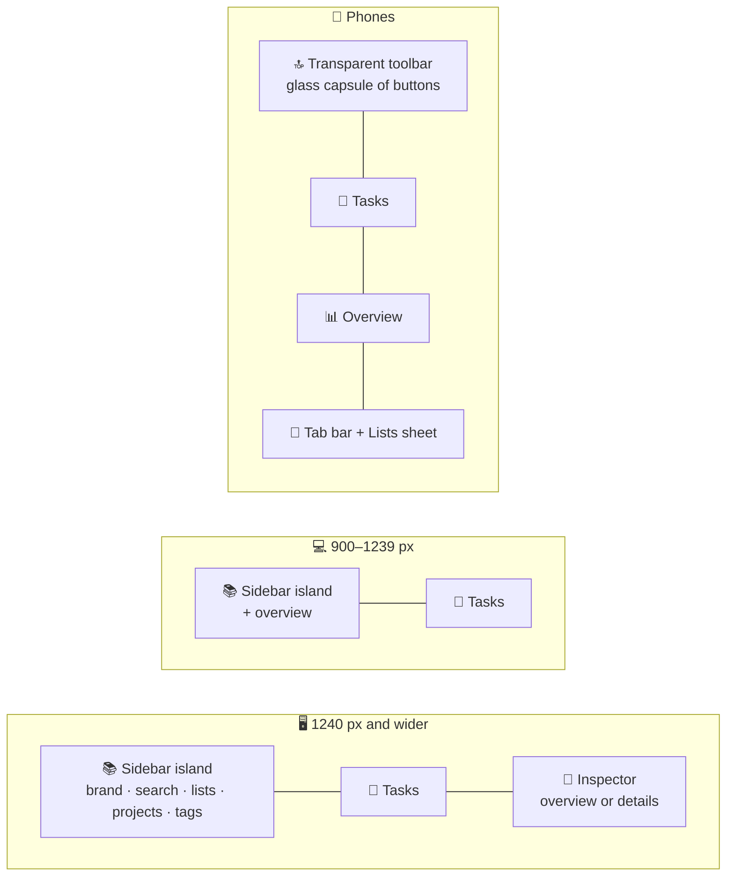
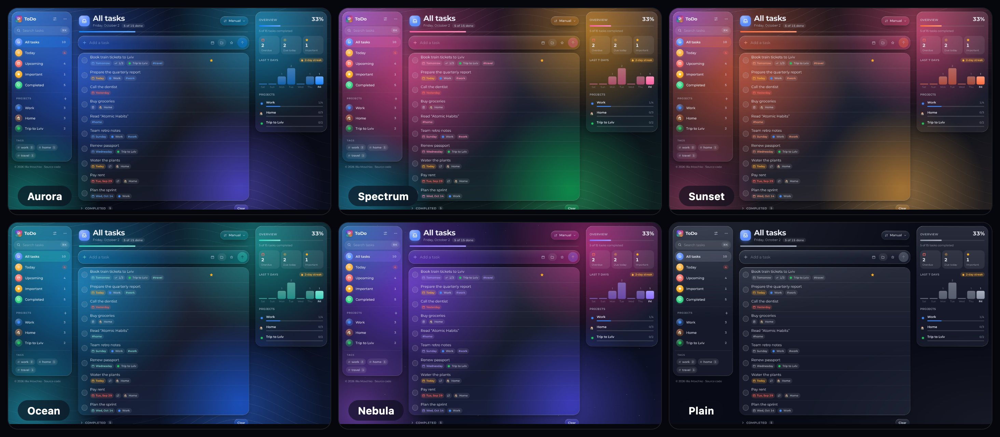

# 🎨 Design system

The interface follows the ideas behind Apple's **Liquid Glass**: controls are made of a translucent material that blurs, tints and bends the content behind it, catches light on its edges and reacts to touch with fluid, springy motion. Everything is built with standard CSS and a small amount of SVG; the refraction layer is a progressive enhancement.

## 💡 Principles

- 🫧 **Controls float, content flows.** There is no header or footer bar: the sidebar, the composer, the phone toolbar and every overlay are glass islands floating over the backdrop. Task rows are content: they sit together on one grouped glass panel instead of being glass themselves, which is both calmer to read and much cheaper to render.
- ⭕ **Concentric shapes.** Capsules for controls, rounded rectangles for rows, inner radii derived from outer radii minus padding.
- 💡 **Light, not borders.** Edges are drawn by a specular rim and inner highlights rather than solid strokes.
- 🌊 **Motion with mass.** Transitions use spring curves; nothing snaps unless the user asked for reduced motion.
- 🎨 **Personal, not noisy.** Ten accents, six backgrounds and two glass styles let everyone make the app their own without ever losing legibility.

## 🧭 App shell



| Part         | Treatment                                                                                                                                                                                                   |
| ------------ | ----------------------------------------------------------------------------------------------------------------------------------------------------------------------------------------------------------- |
| 📚 Sidebar   | One sticky glass panel that holds the app's chrome — brand, settings and **⋯** on top, the search field, smart lists, projects and tags. It scrolls on its own when it gets long                            |
| 🔝 Toolbar   | Phones only: a transparent strip with the logo and a glass capsule of 🔍, settings and **⋯**. After the large title scrolls away, a soft scroll-edge veil fades in and the title moves into the toolbar     |
| 📝 Tasks     | List header, the composer capsule — one row on phones until it is used, then a second row of chips — and the grouped list: one glass panel per section, rows separated by hairlines inset past the checkbox |
| 🧾 Inspector | On wide screens a third column shows the overview, or the details of the selected task as an inline glass panel; the selected row gets an accent tint and bar                                               |
| 📱 Tab bar   | Below 900 px a floating capsule at the bottom with four lists and a **Lists** tab that opens a bottom sheet with every list, project and tag                                                                |
| 🗔 Overlays   | Menus, pickers and the context menu are glass popovers; the palette, settings, project dialog and (below 1240 px) the details are modal glass dialogs that become bottom sheets on phones                   |

The container is 76 rem wide, and 92 rem on wide screens to make room for the inspector. A small credits line closes the sidebar, and on phones `--tabbar-offset` keeps notifications and the last rows clear of the tab bar. In an installed app with Window Controls Overlay, `--titlebar-height` pushes the islands below the window buttons and a transparent strip keeps the top edge draggable.

Within a list, **date groups** get small uppercase headings — _Overdue_ in red with a **Move to today** capsule, then _Today_, _Tomorrow_, weekdays and months — each with its own grouped panel.

## 🔤 Typography

The interface is set in **Montserrat**, a geometric sans-serif with generous proportions that suits the round glass shapes.

- 📦 It is self-hosted through `@fontsource-variable/montserrat`: one variable font file per script (Latin, Latin Extended for Polish, Cyrillic, Cyrillic Extended), each loaded only when a character from its range appears, precached for offline use and allowed by the `font-src 'self'` policy.
- ⚖️ Weights from 400 to 800 come from the same file; tabular figures keep counters and the calendar from jumping.
- 🧩 Headings use `text-wrap: balance`, stat labels use `hyphens: auto` with the page language, and narrow cards switch to row layouts through container queries instead of squeezing long translations.

## 🎨 Colour system

### 🌗 Appearance

Tokens are defined for a dark and a light appearance. `<html data-appearance>` selects **light**, **dark** or **system**; the system option follows `prefers-color-scheme` and switches live.

| Token group | Dark                                   | Light                                       |
| ----------- | -------------------------------------- | ------------------------------------------- |
| 🖋️ Text     | Cool white at 96 / 70 / 46 % opacity   | Ink `#0c1222` at 94 / 70 / 48 % opacity     |
| 🫧 Glass    | White tint at 6–15 %, 150 % saturation | White tint at 40–70 %, 180 % saturation     |
| 🌑 Base     | Deep navy gradient `#0b1122 → #060910` | Pale blue-grey gradient `#f5f8fd → #e6ecf6` |
| 🌫️ Shadows  | Black, strong                          | Navy at low opacity                         |

### 🎨 Accents

`<html data-accent>` selects one of ten accents. Each accent defines a colour for dark and light mode and five aurora colours; soft, bright and glow variants are derived with `color-mix()`. Amber and Mint are bright enough that buttons switch to dark text on them in dark mode.

| Accent           | Dark      | Light     | Aurora palette                  |
| ---------------- | --------- | --------- | ------------------------------- |
| 🔵 Ocean blue    | `#0a84ff` | `#007aff` | Blue, cyan, indigo, teal        |
| 🟦 Indigo        | `#6e6cf0` | `#5856d6` | Indigo, violet, blue, sky       |
| 🟣 Aurora violet | `#8b6cff` | `#7b5cf0` | Violet, rose, amber, teal, blue |
| 🌸 Blossom       | `#ff5fa2` | `#e0448a` | Pink, lilac, rose, purple       |
| 🌹 Rose          | `#ff4d6d` | `#e0334f` | Rose, coral, crimson, fuchsia   |
| 🟠 Sunset        | `#ff6b3d` | `#ef5a2a` | Tangerine, coral, apricot, plum |
| 🟡 Amber         | `#ffb020` | `#b06e00` | Amber, orange, gold, rose       |
| 🟢 Forest        | `#22b35e` | `#18914b` | Green, teal, lime, sky          |
| 🌿 Mint          | `#2dd4bf` | `#0d8a7c` | Mint, cyan, emerald, sky        |
| ⚪ Graphite      | `#8a93a6` | `#4b5566` | Slate greys                     |

The palettes live in one Sass map in `src/shared/styles/_palettes.scss`; `_tokens.scss` turns it into CSS rules and the settings previews use the same map, so a colour is defined exactly once.

### 📁 Project colours

Projects have their own ten colours — blue, indigo, violet, pink, red, orange, yellow, green, teal and grey — exposed as `--project-*` tokens. Any element with `data-project-color` gets a matching `--project-color`, which tints the project's icon, its active row in the sidebar, chips and progress bars.

### 🏷️ Semantic colours

- 📚 Every smart list has its own tone, used for its icon and the list title badge: 🔵 All tasks, 🟠 Today, 🔴 Upcoming, 🟡 Important, 🟢 Completed.
- 📅 Due labels use 🔴 danger for overdue, 🟠 warning for today and the accent for later dates.
- ⭐ Stars use a warm amber, and progress bars turn green when a list is finished.

## 🌌 Backgrounds

`widgets/Backdrop` paints a fixed, decorative layer behind the app. `<html data-backdrop>` selects one of six backgrounds:



| Background  | Orbs                                          | Extras                           |
| ----------- | --------------------------------------------- | -------------------------------- |
| 🌌 Aurora   | The accent's five aurora colours              | Flow lines, grain in Full        |
| 🌈 Spectrum | Pink, amber, green, sky and violet            | Flow lines, a tinted base        |
| 🌅 Sunset   | Tangerine, coral, apricot, raspberry and plum | Flow lines, a warm base          |
| 🌊 Ocean    | Sky, teal, royal blue, cyan and deep teal     | Flow lines, a cool base          |
| ✨ Nebula   | Violet, magenta, indigo, purple and cyan      | A tiled star field               |
| ⬜ Plain    | —                                             | A soft accent tint, nothing else |

The layer is built from the same parts for every background:

| Layer         | Implementation                                                                                                                                                                                |
| ------------- | --------------------------------------------------------------------------------------------------------------------------------------------------------------------------------------------- |
| 🌑 Base       | The appearance's base gradient, mixed with the first and third orb colour for the named backgrounds                                                                                           |
| 🌌 Orbs       | Five large radial-gradient orbs. Still by default; with **Full** effects they blend with `screen` in dark mode and drift on 38–50 s loops                                                     |
| 〰️ Flow lines | `src/shared/assets/waves.svg`: 30 smooth contour curves generated from layered sine waves, inverted to dark ink in light mode. Their crisp strokes make the refraction at glass edges visible |
| ✨ Stars      | Eight tiny radial gradients tiled across the screen, white in dark mode and ink in light mode (Nebula only)                                                                                   |
| 🎞️ Grain      | A tiny tiled `feTurbulence` noise blended with `overlay`, shown only with **Full** effects                                                                                                    |

The layer uses `contain: strict`. The orbs only animate `translate` and `scale`, and the animation stops completely when the user prefers reduced motion. **Plain** hides every moving part and is the lightest choice for slow computers.

## 🫧 Glass styles

`<html data-glass>` chooses how see-through the material is:

| Style     | Dark tint       | Light tint       | When to use                              |
| --------- | --------------- | ---------------- | ---------------------------------------- |
| 💧 Clear  | White at 6–15 % | White at 40–70 % | The default, closest to Liquid Glass     |
| 🌫️ Tinted | Navy at 52–82 % | White at 66–90 % | Bright backgrounds, sunlight, tired eyes |

Tinted glass only swaps the `--glass-tint*` tokens, so blur, refraction and light keep working. Reduced transparency and increased contrast preferences still win over both styles.

## ⚡ Effects and performance

Every glass surface uses `backdrop-filter`, and a browser has to recompute it whenever the pixels behind it change. An animated backdrop changes them on every frame, so all the glass on screen is re-blurred sixty times a second even when nothing moves in the interface — fast on Apple GPUs, but a common source of stutter on Windows and integrated graphics. The **Effects** setting chooses how much of that work the app asks for:

| Level      | Orbs     | Blend modes and grain | Refraction (Chromium) | Pointer light | Blur radius    |
| ---------- | -------- | --------------------- | --------------------- | ------------- | -------------- |
| ✨ Full    | Drifting | Yes                   | Yes                   | Yes           | 8 / 14 / 26 px |
| 🍃 Reduced | Still    | No                    | No                    | No            | 8 / 12 / 18 px |

**Auto** resolves to Full on Apple devices with at least eight cores and to Reduced everywhere else. The resolved level is written to `<html data-effects>` for the styles and to a tiny external store in `shared/lib/effects.ts` that `useLiquidGlass()` and `usePointerLight()` subscribe to.

Other changes that keep the frame budget:

- 🧱 **One blur per section** — rows are plain content on a grouped panel, so a list of 60 tasks costs two backdrop filters instead of sixty.
- 🪟 **No blur on content in Reduced** — task groups, the overview and empty states use a denser tint (`--glass-tint-content`) instead of `backdrop-filter` when the backdrop is still anyway. Bars and controls keep their blur.
- 🪞 **Off-screen rows are skipped** — rows use `content-visibility: auto`, so the browser lays out and paints only the ones near the viewport.
- 🖱️ **One pointer update per frame** — the pointer light is batched with `requestAnimationFrame` instead of running on every mouse event.
- 💤 **Lazy content** — menus and pickers render their content only while open, and translations other than English load on demand.
- ⏱️ **One timer** — every component that needs the current day shares a single minute timer.

Measured in headless Chrome without a GPU, with the CPU slowed down four times. With 60 tasks the app scrolls at 58–60 fps in Reduced, with 300 tasks at 59 fps. With 2000 tasks, before and after the rendering work of this version:

| Scenario (2000 tasks)        | Before     | After     |
| ---------------------------- | ---------- | --------- |
| 🚀 Reload to the first row   | 3.6–4.9 s  | 0.4 s     |
| ⌨️ A keystroke in the search | 380–420 ms | 30–50 ms  |
| ⭐ Starring a task           | 360 ms     | 60–70 ms  |
| 📂 Opening All tasks         | 760 ms     | 90–100 ms |
| 📜 Scrolling                 | 10 fps     | 44–52 fps |

The React side of these numbers is described in [Architecture](./architecture.md#️-rendering-performance).

## 🔬 Anatomy of the glass material

The `glass()` mixin in `src/shared/styles/_mixins.scss` builds every glass surface from the same layers:

1. 🎨 **Tint** — a translucent background colour (`--glass-tint`).
2. 🌫️ **Backdrop filter** — `blur()` → optional refraction → `saturate()` → `brightness()`.
3. ✨ **Specular rim** — a 1 px gradient ring drawn by `::before` with `mask-composite: exclude`.
4. 🔦 **Sheen and pointer light** — `::after` combines a soft top highlight with a radial light that follows the pointer (`--light-x`, `--light-y`, `--light-strength`, registered with `@property` so they animate smoothly).
5. 🌒 **Depth** — a two-part shadow plus inset highlights on the top and bottom edges.

```scss
.panel {
  @include glass(var(--radius-xl), var(--glass-tint-strong), var(--glass-blur-thick));
}
```

### 📏 Thickness levels

| Level      | Blur                          | Used for                                                           | Refraction |
| ---------- | ----------------------------- | ------------------------------------------------------------------ | ---------- |
| 🔘 Control | `--glass-blur-control` (8 px) | Sidebar, composer, segmented control                               | Yes        |
| 📄 Content | `--glass-blur` (14 px)        | Task groups, overview, empty states, buttons                       | No         |
| 🪟 Overlay | `--glass-blur-thick` (26 px)  | Popovers, menus, dialogs, the tab bar, the toolbar capsule, toasts | Yes        |

Thin glass keeps the refraction readable, content glass keeps text legible over a busy backdrop, and thick glass makes overlays stand apart from what they cover.

## 🔍 Refraction

With **Full** effects, `shared/lib/refraction.ts` and the `useLiquidGlass()` hook bend the backdrop near the edges of a surface, like light passing through the rounded rim of a glass lens.

1. The hook measures the element with a `ResizeObserver` and reads its corner radius.
2. `displacementAt()` computes, for every pixel, the signed distance to the rounded rectangle and the surface normal. Within the bezel (the outer 16–22 px) the displacement grows quadratically toward the edge and points inward.
3. The vectors are encoded into the red and green channels of a canvas image (128 means "no displacement"). Maps are cached by size, radius and bezel.
4. The map is plugged into an SVG `<filter>` with `feImage` and `feDisplacementMap` (`color-interpolation-filters="sRGB"` keeps the neutral value exact).
5. The element receives `--glass-refraction: url(#liquid-glass-N)`, which the mixin inserts into `backdrop-filter`.

Things worth knowing:

- 🌐 Only Chromium renders SVG filters inside `backdrop-filter`. The hook enables itself only there (and never when the user prefers reduced transparency); other browsers get the same glass without the lens.
- ⚠️ Chromium ignores `blur()` when it follows `url()` in a `backdrop-filter` chain, so the mixin always puts `blur()` first.
- 🧬 `--glass-refraction` is registered as a non-inherited custom property, so nested glass never picks up its parent's filter.
- 🎚️ Strength is tuned per component through `useLiquidGlass(ref, { bezel, scale })`, for example `{ bezel: 22, scale: 44 }` for the tab bar.

## 🎛️ Design tokens

Tokens live in `src/shared/styles/_tokens.scss` as CSS custom properties; accent and background palettes come from `_palettes.scss`.

| Group         | Tokens                                                                                                                                                                                       |
| ------------- | -------------------------------------------------------------------------------------------------------------------------------------------------------------------------------------------- |
| 🔤 Typography | `--font-sans`, `--font-display` — Montserrat Variable with a system fallback                                                                                                                 |
| 🖋️ Text       | `--color-text`, `--color-text-secondary`, `--color-text-tertiary`                                                                                                                            |
| 🎨 Accent     | `--color-accent` and derived `--color-accent-bright`, `--color-accent-soft`, `--color-accent-glow`, `--color-on-accent`                                                                      |
| 🚦 Semantic   | `--color-danger`, `--color-warning`, `--color-success`, `--color-star` and their `-soft` / `-glow` variants                                                                                  |
| 🏷️ Lists      | `--tone-all`, `--tone-today`, `--tone-upcoming`, `--tone-important`, `--tone-completed`                                                                                                      |
| 📁 Projects   | `--project-blue` … `--project-gray`, and `--project-color` on elements with `data-project-color`                                                                                             |
| 🧱 Surfaces   | `--color-surface`, `--color-fill`, `--color-fill-strong`, `--color-shade`, `--color-separator`, `--color-focus`                                                                              |
| 🫧 Glass      | `--glass-tint*` (incl. `--glass-tint-content`), `--glass-blur*`, `--glass-saturate`, `--glass-brightness`, `--glass-rim`, `--glass-sheen`, `--glass-edge`, `--glass-shadow*`, `--bar-shadow` |
| 🌌 Backdrop   | `--backdrop-base`, `--accent-orb-1` … `--accent-orb-5`, `--orb-1` … `--orb-5`, `--orb-opacity`, `--orb-blend`, `--waves-filter`, `--waves-opacity`, `--grain-opacity`, `--star-color`        |
| ⭕ Shape      | `--radius-sm` 12 px, `--radius-md` 16 px, `--radius-lg` 22 px, `--radius-xl` 28 px, `--radius-full`                                                                                          |
| 🌊 Motion     | `--ease-out`, `--ease-in-out`, `--ease-spring`, `--ease-bounce`, `--duration-fast`, `--duration-base`, `--duration-slow`                                                                     |
| 📐 Layout     | `--layout-width` (76 rem, 92 rem from 1240 px), `--sidebar-width` (16.75 rem), `--inspector-width` (20 rem), `--tabbar-offset` (0, or 76 px below 900 px), `--titlebar-height`               |

## 🌊 Motion

The two spring curves are sampled from a damped harmonic oscillator and expressed with the CSS `linear()` function:

| Token           | Damping ratio | Overshoot | Typical use                              |
| --------------- | ------------- | --------- | ---------------------------------------- |
| `--ease-spring` | 0.82          | ≈ 1 %     | Indicators, rows entering, notifications |
| `--ease-bounce` | 0.58          | ≈ 11 %    | Presses on buttons and checkboxes        |

Notable interactions:

- 💧 **Liquid segmented control** — the selected pill moves its leading edge first and its trailing edge 70 ms later, so it stretches like a droplet before settling.
- 🌱 **Entering rows** fade and scale in with `@starting-style`.
- 🍂 **Leaving rows** fade out while their grid track collapses from `1fr` to `0fr`, letting neighbours glide into place.
- 👆 **Glass presses** — glass buttons grow slightly and brighten when pressed, as the material "flexes".
- 📋 **Popovers and menus** — native popovers that scale in from their button or, for the context menu, from the corner closest to the pointer.
- ✋ **Dragging** — the dragged row fades to a placeholder while a slightly tilted glass copy follows the pointer; sidebar targets light up with an accent ring.
- 🗔 **Dialogs** — the palette drops in near the top of the screen, sheets rise from the bottom on phones; both fade the page behind a blurred backdrop.
- 👉 **Swipes** — rows follow the finger with rubber-band resistance past 132 px. A tinted layer underneath reveals ✓ or 🗑️, which grows and fills with colour once the action is armed; releasing springs the row back.
- 🧭 **Tab bar** — the selected tab's glass pill slides on `--ease-spring`, and the Today badge turns red when something is overdue.
- 🔝 **Condensing title** — on phones the toolbar's small title rises into place while the large one scrolls away.
- 🎊 **Confetti** — finishing a list releases particles in the accent and aurora colours from the checkbox, animated with the Web Animations API.

## ♿ Accessibility

| Preference                                | Adaptation                                                                        |
| ----------------------------------------- | --------------------------------------------------------------------------------- |
| 🐢 `prefers-reduced-motion: reduce`       | Durations drop to 1 ms, the orbs stop, completion and deletion are instant        |
| 🌫️ `prefers-reduced-transparency: reduce` | Surfaces become opaque, blur and refraction are disabled — even with Tinted glass |
| 🌗 `prefers-contrast: more`               | Stronger text, separators and rims, denser glass                                  |
| 🖍️ `forced-colors: active`                | Glass gains a real border and checkboxes use system colours                       |

Additionally:

- 🎯 focus is always visible through a 2 px ring, except for text fields that are the only control of their surface (the palette and search inputs), where the surface itself shows the state;
- ⏭️ a **Skip to tasks** link appears at the top-left on the first <kbd>Tab</kbd>;
- 👆 touch devices get 40 px hit targets for the row actions, a long press instead of hover menus and no text-selection callout on rows;
- 🔤 secondary text keeps at least 70 % opacity and passes WCAG AA contrast in both appearances, and every accent is tuned separately for light and dark.

## 🖼️ Iconography

Icons are inline SVG paths drawn on a 24 px grid with 2 px round strokes, in the spirit of SF Symbols (`shared/ui/Icon/icons.ts`). They inherit `currentColor` and scale with `font-size`. Projects may use an emoji instead, which is shown inside the same circle.

The app icon repeats the backdrop in miniature — aurora glow, flow lines and a glass disc with a check mark — and ships as an SVG favicon, a multi-size ICO, PWA icons and a maskable variant.

## 🧩 Surfaces at a glance

| Surface           | Material                       | Notes                                                                                    |
| ----------------- | ------------------------------ | ---------------------------------------------------------------------------------------- |
| 📚 Sidebar        | Control glass, refraction      | The app's chrome: brand, actions, search, lists, projects with icons, tags               |
| ⌘ Command palette | Overlay glass, refraction      | Search field on top, grouped results with icons and flags, keyboard hints in the footer  |
| 🖱️ Context menu   | Overlay glass                  | Quick date icons, actions, submenus for projects and the calendar                        |
| 📅 Calendar       | Inside pickers and menus       | Month grid, task dots, accent-filled selection, today in the accent colour               |
| ⚙️ Settings       | Overlay glass, refraction      | Sections for theme, language and performance; live background previews                   |
| 📁 Project dialog | Overlay glass, refraction      | Big icon preview, name, colour swatches, two-step delete                                 |
| 🗒️ Details sheet  | Overlay glass, refraction      | Title as large display text, chips for date, repeat, project, star and tags, checklist   |
| 📱 Tab bar        | Overlay glass, refraction      | Four lists and a Lists tab that shows the open project's icon                            |
| ✅ Task group     | Content glass, one per section | Rows separated by inset hairlines; chips for date, project, checklist, notes and tags    |
| 🧾 Details panel  | Overlay glass, refraction      | Inline in the inspector on wide screens                                                  |
| 🔔 Notification   | Overlay glass                  | Sparkle for success, warning sign for errors, an accent capsule for Undo, Show or Reload |
| ☑️ Checkbox       | Filled accent circle           | Shared `Checkbox` component in two sizes; the check is revealed with a clip-path wipe    |
