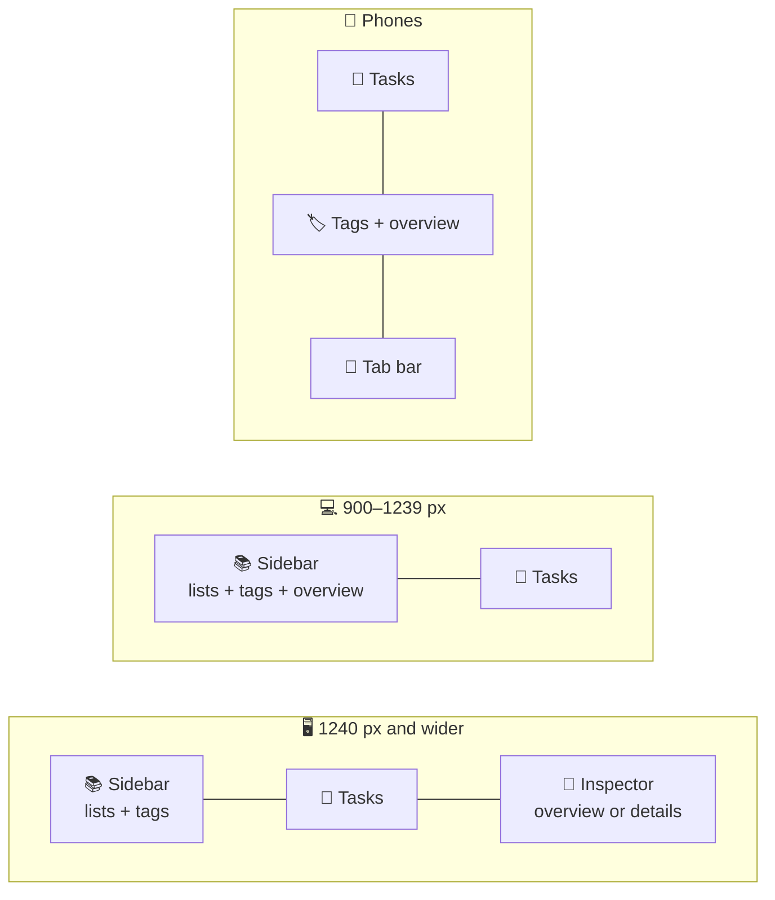

# 🎨 Design system

The interface follows the ideas behind Apple's **Liquid Glass**: controls are made of a translucent material that blurs, tints and bends the content behind it, catches light on its edges and reacts to touch with fluid, springy motion. Everything is built with standard CSS and a small amount of SVG; the refraction layer is a progressive enhancement.

## 💡 Principles

- 🫧 **Controls float, content flows.** The header, sidebar, composer, buttons and overlays are glass. Task rows are content: they sit together on one grouped glass panel instead of being glass themselves, which is both calmer to read and much cheaper to render.
- ⭕ **Concentric shapes.** Capsules for controls, rounded rectangles for rows, inner radii derived from outer radii minus padding.
- 💡 **Light, not borders.** Edges are drawn by a specular rim and inner highlights rather than solid strokes.
- 🌊 **Motion with mass.** Transitions use spring curves; nothing snaps unless the user asked for reduced motion.

## 🧭 App shell



| Part         | Treatment                                                                                                                                                         |
| ------------ | ----------------------------------------------------------------------------------------------------------------------------------------------------------------- |
| 🔝 Header    | A full-width, sticky glass bar (`glass-bar` mixin) with thick blur and a hairline shadow. Its columns line up with the sidebar, the tasks and the inspector below |
| 📚 Sidebar   | One glass panel with the smart lists and the tag cloud, sticky below the header                                                                                   |
| 📝 Tasks     | List header, the composer capsule and the grouped list: one glass panel per section, rows separated by hairlines inset past the checkbox                          |
| 🧾 Inspector | On wide screens a third column shows the overview, or the details of the selected task as an inline glass panel; the selected row gets an accent tint and bar     |
| 📱 Tab bar   | Below 900 px the lists move into a floating capsule at the bottom, like an iOS tab bar, with a glass indicator that slides between tabs on a spring               |
| 🗔 Overlays   | Menus are anchored glass popovers; the command palette and the details (below 1240 px) are modal glass dialogs, and the details become a bottom sheet on phones   |

The container is 76 rem wide, and 92 rem on wide screens to make room for the inspector. There is no footer bar: a small credits line closes the sidebar, and on phones `--tabbar-offset` keeps notifications and the last rows clear of the tab bar.

Within a list, **date groups** get small uppercase headings — _Overdue_ in red with a **Move to today** capsule, then _Today_, _Tomorrow_, weekdays and months — each with its own grouped panel.

## 🔤 Typography

The interface is set in **Montserrat**, a geometric sans-serif with generous proportions that suits the round glass shapes.

- 📦 It is self-hosted through `@fontsource-variable/montserrat`: one variable font file per script (Latin, Latin Extended for Polish, Cyrillic, Cyrillic Extended), each loaded only when a character from its range appears, precached for offline use and allowed by the `font-src 'self'` policy.
- ⚖️ Weights from 400 to 800 come from the same file; tabular figures keep counters from jumping.
- 🧩 Headings use `text-wrap: balance`, stat labels use `hyphens: auto` with the page language, and narrow cards switch to row layouts through container queries instead of squeezing long translations.

## 🎨 Colour system

### 🌗 Appearance

Tokens are defined for a dark and a light appearance. `<html data-appearance>` selects **light**, **dark** or **system**; the system option follows `prefers-color-scheme` and switches live.

| Token group | Dark                                   | Light                                       |
| ----------- | -------------------------------------- | ------------------------------------------- |
| 🖋️ Text     | Cool white at 96 / 70 / 46 % opacity   | Ink `#0c1222` at 94 / 70 / 48 % opacity     |
| 🫧 Glass    | White tint at 6–15 %, 150 % saturation | White tint at 40–70 %, 180 % saturation     |
| 🌑 Base     | Deep navy gradient `#0b1122 → #060910` | Pale blue-grey gradient `#f5f8fd → #e6ecf6` |
| 🌫️ Shadows  | Black, strong                          | Navy at low opacity                         |

### 🎨 Accents

`<html data-accent>` selects one of five accents. Each accent sets `--color-accent` and the five aurora colours of the backdrop; soft, bright and glow variants are derived with `color-mix()`.

| Accent           | Accent colour | Backdrop palette                     |
| ---------------- | ------------- | ------------------------------------ |
| 🔵 Ocean blue    | `#0a84ff`     | Blue, cyan, indigo, teal             |
| 🟣 Aurora violet | `#8b6cff`     | Violet, rose, amber, teal, blue      |
| 🟠 Sunset        | `#ff6b3d`     | Tangerine, coral, apricot, raspberry |
| 🟢 Forest        | `#22b35e`     | Green, teal, lime, sky               |
| ⚪ Graphite      | `#8a93a6`     | Slate greys                          |

### 🏷️ Semantic colours

- 📚 Every smart list has its own tone, used for its icon and the list title badge: 🔵 All tasks, 🟠 Today, 🔴 Upcoming, 🟡 Important, 🟢 Completed.
- 📅 Due labels use 🔴 danger for overdue, 🟠 warning for today and the accent for later dates.
- ⭐ Stars use a warm amber, and progress bars turn green when a list is finished.

## 🌌 Backdrop

`widgets/Backdrop` paints a fixed, decorative layer behind the app. It has four parts:

| Layer         | Implementation                                                                                                                                                                                |
| ------------- | --------------------------------------------------------------------------------------------------------------------------------------------------------------------------------------------- |
| 🌑 Base       | The appearance's base gradient                                                                                                                                                                |
| 🌌 Aurora     | Five large radial-gradient orbs in the accent palette. Still by default; with **Full** effects they blend with `screen` in dark mode and drift on 38–50 s loops                               |
| 〰️ Flow lines | `src/shared/assets/waves.svg`: 30 smooth contour curves generated from layered sine waves, inverted to dark ink in light mode. Their crisp strokes make the refraction at glass edges visible |
| 🎞️ Grain      | A tiny tiled `feTurbulence` noise blended with `overlay`, shown only with **Full** effects                                                                                                    |

The layer uses `contain: strict`. The orbs only animate `translate` and `scale`, and the animation stops completely when the user prefers reduced motion.

## ⚡ Effects and performance

Every glass surface uses `backdrop-filter`, and a browser has to recompute it whenever the pixels behind it change. An animated backdrop changes them on every frame, so all the glass on screen is re-blurred sixty times a second even when nothing moves in the interface — fast on Apple GPUs, but a common source of stutter on Windows and integrated graphics. The **Effects** setting chooses how much of that work the app asks for:

| Level      | Aurora   | Blend modes and grain | Refraction (Chromium) | Pointer light | Blur radius    |
| ---------- | -------- | --------------------- | --------------------- | ------------- | -------------- |
| ✨ Full    | Drifting | Yes                   | Yes                   | Yes           | 8 / 14 / 26 px |
| 🍃 Reduced | Still    | No                    | No                    | No            | 8 / 12 / 18 px |

**Auto** resolves to Full on Apple devices with at least eight cores and to Reduced everywhere else. The resolved level is written to `<html data-effects>` for the styles and to a tiny external store in `shared/lib/effects.ts` that `useLiquidGlass()` and `usePointerLight()` subscribe to.

Other changes that keep the frame budget:

- 🧱 **One blur per section** — rows are plain content on a grouped panel, so a list of 60 tasks costs two backdrop filters instead of sixty.
- 🪟 **No blur on content in Reduced** — task groups, the overview and empty states use a denser tint (`--glass-tint-content`) instead of `backdrop-filter` when the backdrop is still anyway, so even an Upcoming list with a dozen date groups scrolls smoothly. Bars and controls keep their blur.
- 🖱️ **One pointer update per frame** — the pointer light is batched with `requestAnimationFrame` instead of running on every mouse event.
- 💤 **Lazy content** — due date menus render their content only while open, and translations other than English load on demand.
- ⏱️ **One timer** — every component that needs the current day shares a single minute timer.

Measured in headless Chrome without a GPU, with the CPU slowed down four times and 60 tasks on screen:

| Scenario        | Before                    | Reduced (Windows default)                                         | Full   |
| --------------- | ------------------------- | ----------------------------------------------------------------- | ------ |
| 💤 Idle         | 28 fps                    | **60 fps**                                                        | 30 fps |
| 📜 Scrolling    | 25 fps, 40 % janky frames | **58–60 fps, 0 % janky** (Upcoming with 9 date groups: 51–60 fps) | 29 fps |
| 🖱️ Pointer move | 24 fps                    | **60 fps**                                                        | 31 fps |

## 🔬 Anatomy of the glass material

The `glass()` mixin in `src/shared/styles/_mixins.scss` builds every glass surface from the same layers:

1. 🎨 **Tint** — a translucent background colour (`--glass-tint`).
2. 🌫️ **Backdrop filter** — `blur()` → optional refraction → `saturate()` → `brightness()`.
3. ✨ **Specular rim** — a 1 px gradient ring drawn by `::before` with `mask-composite: exclude`.
4. 🔦 **Sheen and pointer light** — `::after` combines a soft top highlight with a radial light that follows the pointer (`--light-x`, `--light-y`, `--light-strength`, registered with `@property` so they animate smoothly).
5. 🌒 **Depth** — a two-part shadow plus inset highlights on the top and bottom edges.

```scss
.panel {
  @include glass(var(--radius-xl), var(--glass-tint-strong), var(--glass-blur-thick));
}
```

### 📏 Thickness levels

| Level      | Blur                          | Used for                                         | Refraction |
| ---------- | ----------------------------- | ------------------------------------------------ | ---------- |
| 🔘 Control | `--glass-blur-control` (8 px) | Composer, list navigation, segmented control     | Yes        |
| 📄 Content | `--glass-blur` (14 px)        | Task rows, overview, empty states, buttons       | No         |
| 🪟 Overlay | `--glass-blur-thick` (26 px)  | Popovers, dialogs, the tab bar and notifications | Yes        |
| 🔝 Bar     | `--glass-blur-thick` (26 px)  | The header (`glass-bar` mixin)                   | Yes        |

Thin glass keeps the refraction readable, content glass keeps text legible over a busy backdrop, and thick glass makes overlays stand apart from what they cover.

## 🔍 Refraction

With **Full** effects, `shared/lib/refraction.ts` and the `useLiquidGlass()` hook bend the backdrop near the edges of a surface, like light passing through the rounded rim of a glass lens.

1. The hook measures the element with a `ResizeObserver` and reads its corner radius.
2. `displacementAt()` computes, for every pixel, the signed distance to the rounded rectangle and the surface normal. Within the bezel (the outer 16–22 px) the displacement grows quadratically toward the edge and points inward.
3. The vectors are encoded into the red and green channels of a canvas image (128 means "no displacement"). Maps are cached by size, radius and bezel.
4. The map is plugged into an SVG `<filter>` with `feImage` and `feDisplacementMap` (`color-interpolation-filters="sRGB"` keeps the neutral value exact).
5. The element receives `--glass-refraction: url(#liquid-glass-N)`, which the mixin inserts into `backdrop-filter`.

Things worth knowing:

- 🌐 Only Chromium renders SVG filters inside `backdrop-filter`. The hook enables itself only there (and never when the user prefers reduced transparency); other browsers get the same glass without the lens.
- ⚠️ Chromium ignores `blur()` when it follows `url()` in a `backdrop-filter` chain, so the mixin always puts `blur()` first.
- 🧬 `--glass-refraction` is registered as a non-inherited custom property, so nested glass never picks up its parent's filter.
- 🎚️ Strength is tuned per component through `useLiquidGlass(ref, { bezel, scale })`, for example `{ bezel: 22, scale: 52 }` for the composer.

## 🎛️ Design tokens

Tokens live in `src/shared/styles/_tokens.scss` as CSS custom properties.

| Group         | Tokens                                                                                                                                                                                       |
| ------------- | -------------------------------------------------------------------------------------------------------------------------------------------------------------------------------------------- |
| 🔤 Typography | `--font-sans`, `--font-display` — Montserrat Variable with a system fallback                                                                                                                 |
| 🖋️ Text       | `--color-text`, `--color-text-secondary`, `--color-text-tertiary`                                                                                                                            |
| 🎨 Accent     | `--color-accent` and derived `--color-accent-bright`, `--color-accent-soft`, `--color-accent-glow`, `--color-on-accent`                                                                      |
| 🚦 Semantic   | `--color-danger`, `--color-warning`, `--color-success`, `--color-star` and their `-soft` / `-glow` variants (`--color-success-soft` tints swipe and checklist chips)                         |
| 🏷️ Lists      | `--tone-all`, `--tone-today`, `--tone-upcoming`, `--tone-important`, `--tone-completed`                                                                                                      |
| 🧱 Surfaces   | `--color-surface` (opaque rows while swiping or dragging), `--color-fill`, `--color-fill-strong`, `--color-shade`, `--color-separator`, `--color-focus`                                      |
| 🫧 Glass      | `--glass-tint*` (incl. `--glass-tint-content`), `--glass-blur*`, `--glass-saturate`, `--glass-brightness`, `--glass-rim`, `--glass-sheen`, `--glass-edge`, `--glass-shadow*`, `--bar-shadow` |
| 🌌 Backdrop   | `--backdrop-base`, `--orb-1` … `--orb-5`, `--orb-opacity`, `--orb-blend`, `--waves-filter`, `--waves-opacity`, `--grain-opacity`                                                             |
| ⭕ Shape      | `--radius-sm` 12 px, `--radius-md` 16 px, `--radius-lg` 22 px, `--radius-xl` 28 px, `--radius-full`                                                                                          |
| 🌊 Motion     | `--ease-out`, `--ease-in-out`, `--ease-spring`, `--ease-bounce`, `--duration-fast`, `--duration-base`, `--duration-slow`                                                                     |
| 📐 Layout     | `--layout-width` (76 rem, 92 rem from 1240 px), `--sidebar-width` (16.75 rem), `--inspector-width` (20 rem), `--header-height` (64 px), `--tabbar-offset` (0, or 76 px below 900 px)         |

## 🌊 Motion

The two spring curves are sampled from a damped harmonic oscillator and expressed with the CSS `linear()` function:

| Token           | Damping ratio | Overshoot | Typical use                              |
| --------------- | ------------- | --------- | ---------------------------------------- |
| `--ease-spring` | 0.82          | ≈ 1 %     | Indicators, rows entering, notifications |
| `--ease-bounce` | 0.58          | ≈ 11 %    | Presses on buttons and checkboxes        |

Notable interactions:

- 💧 **Liquid segmented control** — the selected pill moves its leading edge first and its trailing edge 70 ms later, so it stretches like a droplet before settling.
- 🌱 **Entering rows** fade and scale in with `@starting-style`.
- 🍂 **Leaving rows** fade out while their grid track collapses from `1fr` to `0fr`, letting neighbours glide into place.
- 👆 **Glass presses** — glass buttons grow slightly and brighten when pressed, as the material "flexes".
- 📋 **Popovers** — native `<dialog popover>` panels positioned with CSS anchor positioning (with a JavaScript fallback) that scale in from their button.
- 🗔 **Dialogs** — the palette drops in near the top of the screen, the details sheet rises from the bottom on phones; both fade the page behind a blurred backdrop.
- 👉 **Swipes** — rows follow the finger with rubber-band resistance past 132 px. A tinted layer underneath reveals ✓ or 🗑️, which grows and fills with colour once the action is armed; releasing springs the row back.
- 🧭 **Tab bar** — the selected tab's glass pill slides on `--ease-spring`, and the Today badge turns red when something is overdue.
- 🎊 **Confetti** — finishing a list releases particles in the accent and aurora colours from the checkbox, animated with the Web Animations API.

## ♿ Accessibility

| Preference                                | Adaptation                                                                    |
| ----------------------------------------- | ----------------------------------------------------------------------------- |
| 🐢 `prefers-reduced-motion: reduce`       | Durations drop to 1 ms, the aurora stops, completion and deletion are instant |
| 🌫️ `prefers-reduced-transparency: reduce` | Surfaces become opaque, blur and refraction are disabled                      |
| 🌗 `prefers-contrast: more`               | Stronger text, separators and rims, denser glass                              |
| 🖍️ `forced-colors: active`                | Glass gains a real border and checkboxes use system colours                   |

Additionally:

- 🎯 focus is always visible through a 2 px ring, except for text fields that are the only control of their surface (the palette and search inputs), where the surface itself shows the state;
- ⏭️ a **Skip to tasks** link appears at the top-left on the first <kbd>Tab</kbd>;
- 👆 touch devices get 40 px hit targets for the row actions and always-visible controls, and narrow rows hide secondary actions instead of shrinking them;
- 🔤 secondary text keeps at least 70 % opacity in both appearances, and the accent colour of each theme is tuned separately for light and dark.

## 🖼️ Iconography

Icons are inline SVG paths drawn on a 24 px grid with 2 px round strokes, in the spirit of SF Symbols (`shared/ui/Icon/icons.ts`). They inherit `currentColor` and scale with `font-size`.

The app icon repeats the backdrop in miniature — aurora glow, flow lines and a glass disc with a check mark — and ships as an SVG favicon, a multi-size ICO, PWA icons and a maskable variant.

## 🧩 Surfaces at a glance

| Surface           | Material                       | Notes                                                                                 |
| ----------------- | ------------------------------ | ------------------------------------------------------------------------------------- |
| ⌘ Command palette | Overlay glass, refraction      | Search field on top, grouped results, keyboard hints in the footer (hidden on touch)  |
| 🗒️ Details sheet  | Overlay glass, refraction      | Title as large display text, chips for date, star and tags, notes, live checklist     |
| 📱 Tab bar        | Overlay glass, refraction      | Five tabs with tone-coloured icons; only the active star is filled                    |
| ✅ Task group     | Content glass, one per section | Rows separated by inset hairlines; chips for date, checklist progress, notes and tags |
| 🧾 Details panel  | Overlay glass, refraction      | Inline in the inspector on wide screens, slides in from the side                      |
| 🏳️ Language grid  | Inside the settings popover    | Two columns of flags from flagcdn with the languages' own names                       |
| 🔔 Notification   | Overlay glass                  | Sparkle for success, warning sign for errors, an accent capsule for Undo or Reload    |
| ☑️ Checkbox       | Filled accent circle           | Shared `Checkbox` component in two sizes; the check is revealed with a clip-path wipe |
