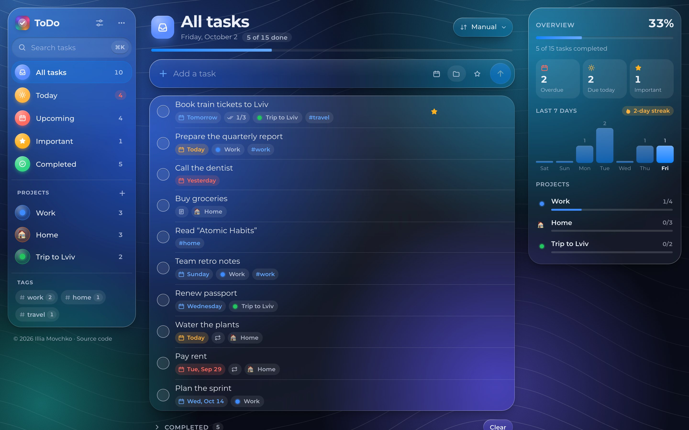
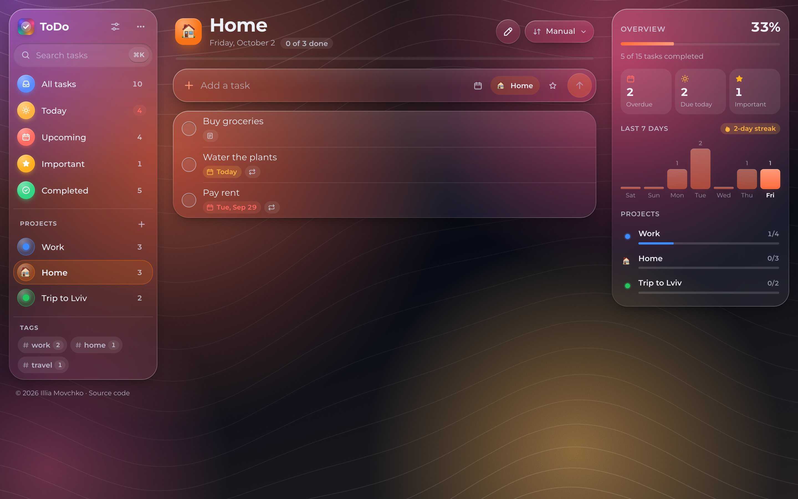
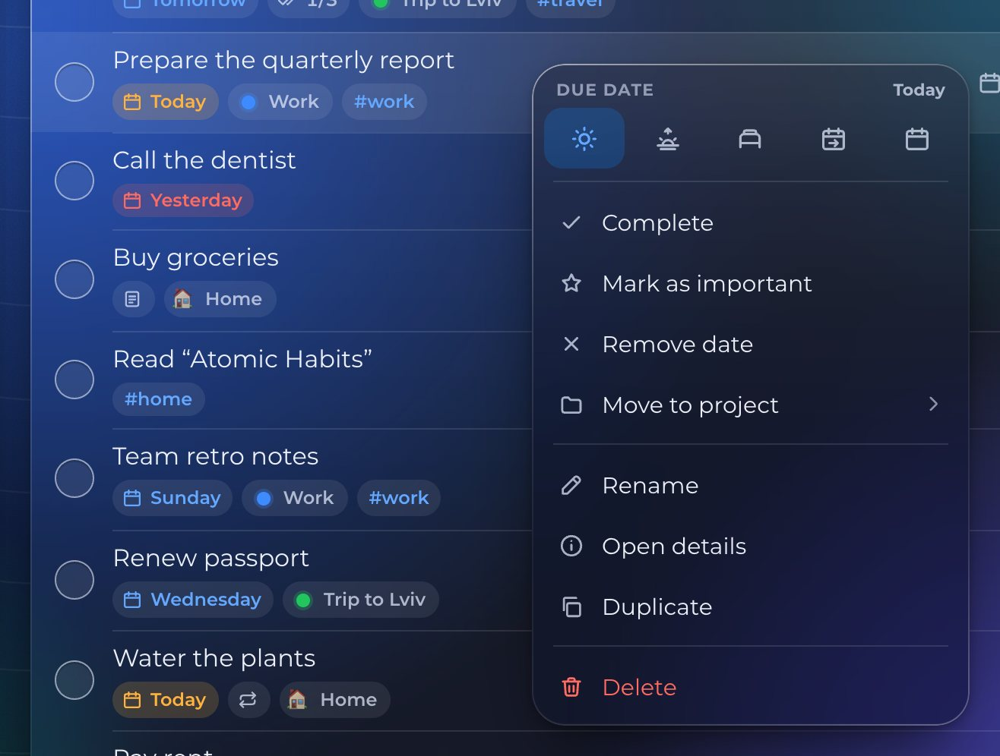
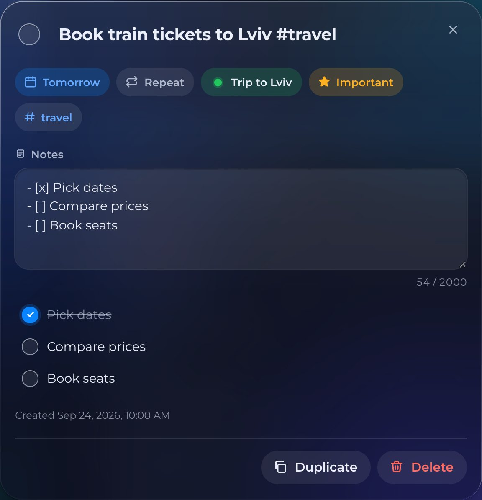
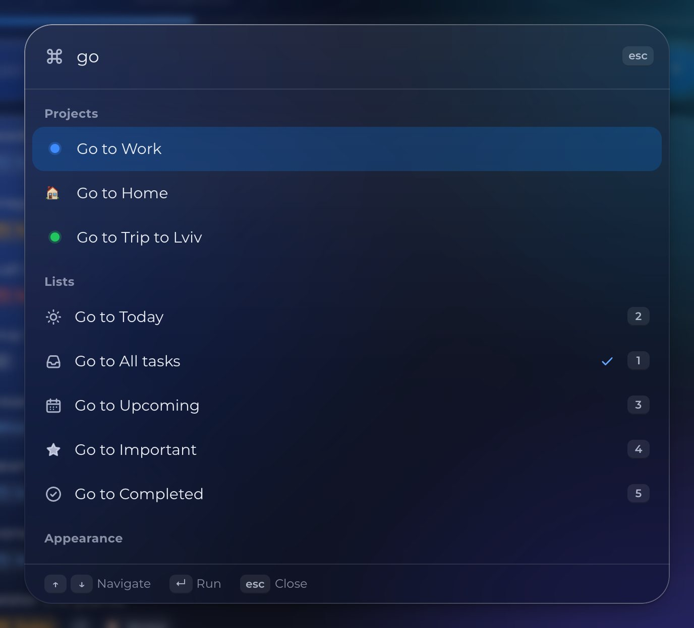
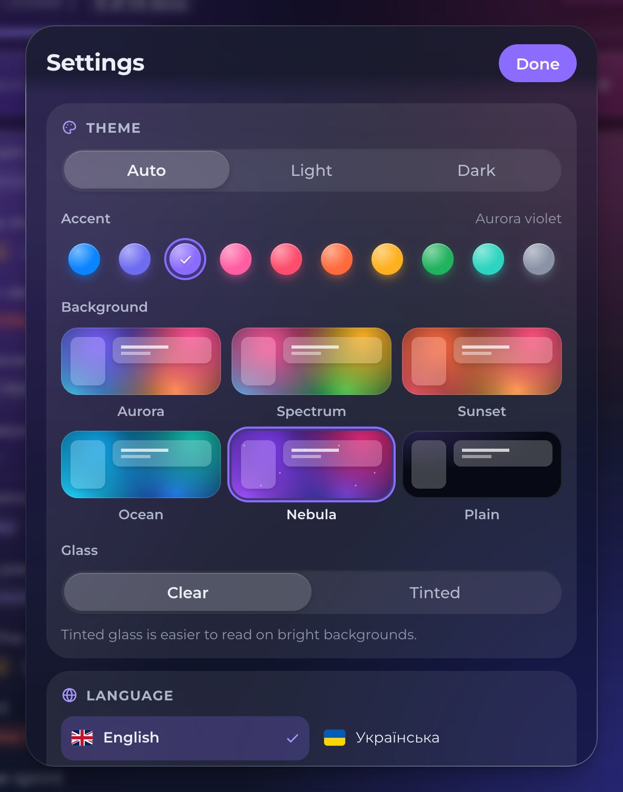
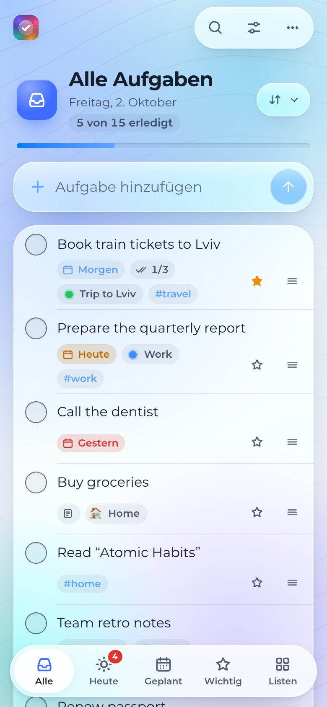
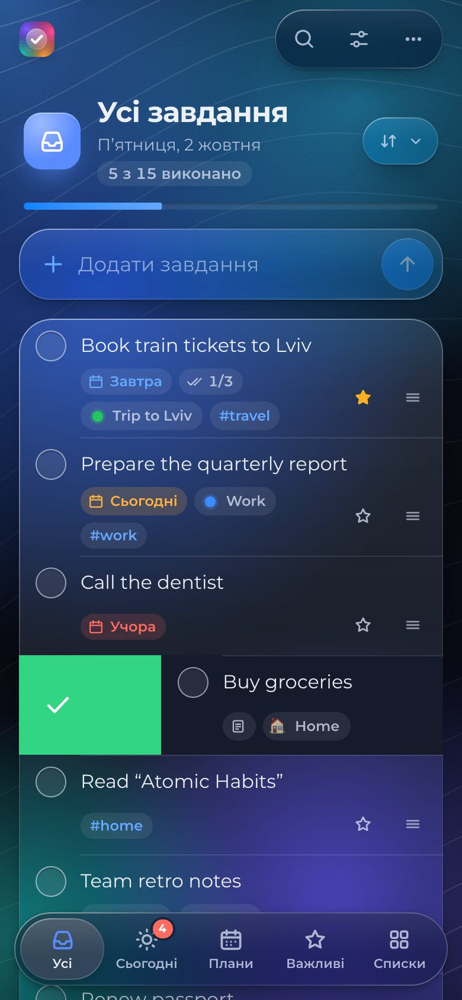
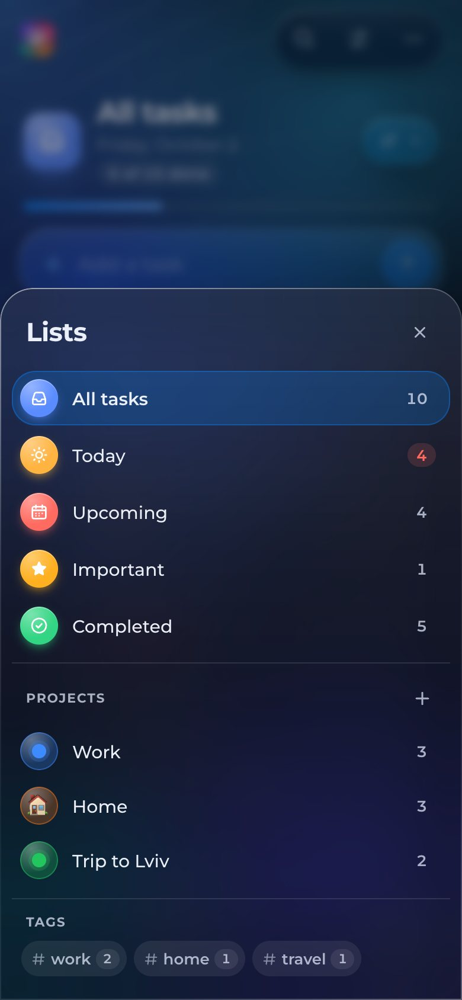

# ✨ Features

## 🧭 Layout

There is no header bar. Controls float as glass islands over the backdrop, like the toolbars of macOS and iOS 26.

| Area           | Wide screens (1240 px and more)                                                                                       | Laptops and tablets (900–1239 px) | Phones (narrower than 900 px)                                                          |
| -------------- | --------------------------------------------------------------------------------------------------------------------- | --------------------------------- | -------------------------------------------------------------------------------------- |
| 📚 Sidebar     | One glass panel: logo, settings and **⋯** on top, search with **⌘K**, the smart lists, your **projects** and **tags** | Same, with the overview below it  | Replaced by a floating **tab bar** and a **Lists** sheet                               |
| 📝 Main column | List or project title with today's date and progress, sort and edit buttons, composer and the grouped task list       | Same                              | A transparent toolbar with 🔍, settings and **⋯**; the title shrinks into it on scroll |
| 🧾 Inspector   | A third column with the **overview**, replaced by the **task details** when one is open                               | Details open as a dialog          | Details open as a bottom sheet                                                         |

The sidebar ends with a small credits line — author and source code. The sidebar and the inspector stay in place while the list scrolls.



## 📚 Smart lists

| List         | Shows                                                        | Shortcut     |
| ------------ | ------------------------------------------------------------ | ------------ |
| 📥 All tasks | Every task, with completed ones in a collapsible section     | <kbd>1</kbd> |
| ☀️ Today     | Tasks due today or overdue, plus the ones you finished today | <kbd>2</kbd> |
| 📅 Upcoming  | Tasks due after today                                        | <kbd>3</kbd> |
| ⭐ Important | Starred tasks                                                | <kbd>4</kbd> |
| ✅ Completed | Everything you have finished                                 | <kbd>5</kbd> |

- 🔢 Counters show how many active tasks each list holds and disappear when a list is empty; the **Today** counter turns red when something is overdue. Installed apps also show the Today count as an **app badge** on the icon.
- 🎯 New tasks inherit the context of the list: in **Today** they are due today, in **Upcoming** tomorrow, in **Important** they are starred, in a project they belong to it.
- 📍 If a new task belongs somewhere else — say you type `Call mom in 3 days` in **Today** — you stay where you are and a notification says where it went, with a **Show** button that jumps there and focuses the task.
- 🗂️ **Today** separates **Overdue** tasks, in red, from the ones due today. **Move to today** reschedules every overdue task in one step, which a single <kbd>⌘</kbd>/<kbd>Ctrl</kbd>+<kbd>Z</kbd> or the notification's **Undo** reverts.
- 📆 **Upcoming** is grouped by day for the next week — **Tomorrow**, **Sunday**, **Wednesday** — and by month after that. Rows in a day group skip the date chip, because the heading already says it.
- 💾 The selected list or project is remembered between visits.

## 📁 Projects

Projects group tasks by area — work, home, a trip — next to the smart lists, which keep working across all of them.



- ➕ **Create** a project with **+** next to **Projects** in the sidebar, in the **Lists** sheet on phones or with **New project** in the command palette. Give it a name and one of ten colours.
- 😀 **Emoji icons** — start the name with an emoji, like `🏠 Home`, and it becomes the project's icon; otherwise a dot in the project's colour is used.
- 🧭 **Open** a project from the sidebar, the palette (`Go to Home`), the overview or the project chip on any of its tasks. Its tasks are shown with the same groups, sorting and completed section as **All tasks**.
- ✍️ **Assign** tasks with `@name` anywhere in the quick add text, with the 📁 chip in the composer, with **Project** in the details, from the task's context menu or by dragging the task onto the project in the sidebar.
- 🏷️ Tasks outside their project's view show a small chip with the project's icon and name.
- ✏️ **Edit** a project with the ✎ button next to its title: rename it, change its colour or delete it. Deleting asks once more, removes the project together with its tasks and can be undone like any other change.
- ↕️ **Reorder** projects with <kbd>Alt</kbd>+<kbd>↑</kbd>/<kbd>↓</kbd> on a focused project.
- 📊 The overview shows each project's progress with a bar in its colour.

## ✅ Tasks

| Action      | How                                                                                                                                                                         |
| ----------- | --------------------------------------------------------------------------------------------------------------------------------------------------------------------------- |
| ➕ Add      | Type in **Add a task** and press <kbd>Enter</kbd>. Pick a date with the calendar chip, a project with the 📁 chip and star it with ☆, or let [quick add](#-quick-add) do it |
| ✅ Complete | Click the circle or swipe the row to the right. The check appears instantly and the task moves after a short pause — click again to undo it                                 |
| ✏️ Edit     | Click the title. <kbd>Enter</kbd> saves, <kbd>Esc</kbd> cancels, clicking elsewhere saves. An empty title keeps the original. On phones a tap opens the details             |
| ⭐ Star     | Press ☆ on a task. Starred tasks keep a filled star and appear in **Important**                                                                                             |
| 📅 Schedule | Press the calendar button and choose **Today**, **Tomorrow**, **This weekend**, **Next week**, a day in the [calendar](#-calendar) or **Remove date**                       |
| 🔁 Repeat   | Open the details and choose **Every day**, **Every weekday**, **Every week**, **Every month** or **Every year** — or type it in [quick add](#-quick-add)                    |
| 📁 Move     | Choose a project in the details or the context menu, or drag the task onto a project                                                                                        |
| ℹ️ Details  | Press ⓘ to open the [details](#️-details-notes-and-checklists) with notes, a checklist, dates, **Duplicate** and **Delete**                                                  |
| 🗑️ Delete   | Press the trash button or swipe the row to the left. The task can be restored from the notification                                                                         |
| ↕️ Reorder  | Drag the handle, or press <kbd>Alt</kbd>+<kbd>↑</kbd>/<kbd>↓</kbd>. Reordering is available with the **Manual** sort order                                                  |

Due dates are shown as friendly labels — **Today**, **Tomorrow**, **Yesterday**, a weekday for the next few days or a short date — and are coloured: 🔴 overdue, 🟠 today, 🔵 later. Rows also show chips for 📁 the project, 🏷️ tags, ☑️ checklist progress (`2/5`) and 🗒️ notes.

On narrow screens the calendar and trash buttons are hidden from the rows to leave room for the title; scheduling and deleting are then done from the context menu, the details sheet or with swipes. The composer is a single field there until you tap it — the date, project and star chips then appear in a row below it and fold away again when you leave the field empty.

## 🖱️ Context menu

Right-click a task, press <kbd>⇧</kbd>+<kbd>F10</kbd> or the menu key on a focused task, or press and hold it on a touch screen.



- 📅 A row of quick dates — **Today**, **Tomorrow**, **This weekend**, **Next week** — and a button that opens the full calendar inside the menu.
- ✅ **Complete** or **Mark as not done**, ⭐ **Mark as important** or **Not important**, ✖️ **Remove date**.
- 📁 **Move to project** opens a list of projects with **No project** at the top.
- ✏️ **Rename**, ℹ️ **Open details**, 📄 **Duplicate** and 🗑️ **Delete**.

Use <kbd>↑</kbd>/<kbd>↓</kbd>, <kbd>Home</kbd> and <kbd>End</kbd> to move, <kbd>Enter</kbd> to run, <kbd>←</kbd> to go back from a submenu and <kbd>Esc</kbd> to close. Focus returns to the task afterwards. On touch screens the finger that opened the menu cannot pick an item by accident when it is lifted.

## 📅 Calendar

The date picker and the context menu share a glass month calendar instead of the browser's date field.

- 🗓️ The week starts on the right day for your language and region — Monday in Ukraine and Germany, Sunday in the United States.
- • Days with tasks carry a dot, a longer one when there are three or more; screen readers hear the number of tasks.
- ⌨️ <kbd>←</kbd>/<kbd>→</kbd> move by a day, <kbd>↑</kbd>/<kbd>↓</kbd> by a week, <kbd>Home</kbd>/<kbd>End</kbd> to the start or end of the week, <kbd>Page Up</kbd>/<kbd>Page Down</kbd> by a month and <kbd>⇧</kbd>+<kbd>Page Up</kbd>/<kbd>Page Down</kbd> by a year.
- 🎯 Today is highlighted, past days are dimmed and the chosen day is filled with the accent colour.

## ✋ Drag and drop

Drag a task by its handle to reorder it, or drop it on the sidebar:

| Drop on      | Result                                     |
| ------------ | ------------------------------------------ |
| ☀️ Today     | Due today                                  |
| 📅 Upcoming  | Due tomorrow, unless it is already planned |
| ⭐ Important | Starred                                    |
| ✅ Completed | Completed                                  |
| 📁 A project | Moved to the project                       |

The target lights up while the task is over it, a glass copy of the task follows the pointer and a notification with **Undo** confirms the drop. Screen readers hear where the task is and where it was dropped.

## ⚡ Quick add

The composer understands a few words at the **end** of the title in all eight languages, whatever language the interface uses, and `@project` anywhere. A ✨ chip shows what it recognised before you press <kbd>Enter</kbd>.

| You type                       | You get                                              |
| ------------------------------ | ---------------------------------------------------- |
| `Call mom tomorrow`            | **Call mom**, due tomorrow                           |
| `Pay rent in 3 days !`         | **Pay rent**, due in three days, ⭐ important        |
| `Send slides @work friday`     | **Send slides** in **Work**, due on Friday           |
| `Team sync next friday #work`  | **Team sync #work**, due next Friday                 |
| `Купити квіти через 2 дні`     | **Купити квіти**, due in two days                    |
| `Teammeeting am Freitag !!`    | **Teammeeting**, due on Friday, ⭐ important         |
| `Reunión el próximo lunes`     | **Reunión**, due next Monday                         |
| `Rapport la semaine prochaine` | **Rapport**, due in a week                           |
| `Spotkanie w piątek`           | **Spotkanie**, due on Friday                         |
| `Urlaub 24.12.`                | **Urlaub**, due on 24 December (next year if passed) |

| Kind             | Examples                                                                                                                                                                                                                                                                                                                    |
| ---------------- | --------------------------------------------------------------------------------------------------------------------------------------------------------------------------------------------------------------------------------------------------------------------------------------------------------------------------- |
| 📅 Relative days | `today` `tomorrow` `day after tomorrow` · `сьогодні` `завтра` · `heute` `morgen` `übermorgen` · `hoy` `mañana` · `aujourd’hui` `demain` · `oggi` `domani` · `vandaag` `overmorgen` · `dziś` `jutro` `pojutrze`                                                                                                              |
| 🗓️ Weeks         | `next week` · `наступного тижня` · `nächste Woche` · `la próxima semana` · `la semaine prochaine` · `la prossima settimana` · `volgende week` · `w przyszłym tygodniu`                                                                                                                                                      |
| 🔢 In N days     | `in 5 days` · `через 5 днів` · `in 5 Tagen` · `en 5 días` · `dans 5 jours` · `tra 5 giorni` · `over 5 dagen` · `za 5 dni`                                                                                                                                                                                                   |
| 📆 Weekdays      | Any weekday name, alone or with words like `on`, `next`, `this`, `у`, `наступного`, `am`, `nächsten`, `el próximo`, `prochain`, `prossimo`, `op`, `volgende`, `w`, `przyszły`                                                                                                                                               |
| 🔁 Repeats       | `every day` `daily` `every weekday` `weekly` `every month` `every friday` · `щодня` `щотижня` `щопонеділка` · `täglich` `jeden Montag` `montags` · `cada día` `todos los lunes` · `tous les jours` `tous les lundis` · `ogni giorno` `ogni lunedì` · `elke dag` `elke maandag` · `codziennie` `co tydzień` `w każdy piątek` |
| 🧮 Exact dates   | `2026-10-20`, `20.10`, `20.10.`, `20.10.2026`                                                                                                                                                                                                                                                                               |
| ⭐ Importance    | `!`, `!!` or `!!!` at the end                                                                                                                                                                                                                                                                                               |
| 📁 Projects      | `@work`, `@Home`, `@trip to lviv` — the name of an existing project, with or without its emoji, in any letter case                                                                                                                                                                                                          |
| 🏷️ Tags          | `#tags` at the end are kept in the title                                                                                                                                                                                                                                                                                    |

Phrases are matched without diacritics (`mercoledi` works like `mercoledì`), Ukrainian weekdays in the nominative, accusative and genitive case, and both `'` and `’` count as the apostrophe. Endings that mean _in the morning_ — `por la mañana`, `am Morgen` — are not mistaken for tomorrow. An `@` that does not match a project — an e-mail address or a mention like `@olena` — stays in the title.

The recognised date and project override the composer chips only while they are in the text, and the title always keeps at least one word, so `Tomorrow` alone is a task called “Tomorrow”.

## 🔁 Repeating tasks

A task can repeat every day, every weekday, every week, every month or every year.

- ✅ Completing a repeating task keeps it in **Completed** and creates the next occurrence right below it, so your history and activity chart stay accurate.
- 📅 The next date is counted from the due date; a task finished late jumps to the first date after today, so a daily task done three days late is due tomorrow, not three days ago.
- 📏 Monthly and yearly repeats remember the day the series started: rent due on the 31st is due on 28 February and on 31 March again, and a birthday on 29 February comes back on leap years.
- ✍️ Choosing a new date by hand moves the series to that day; **Move to today** only moves the current occurrence.
- 🔁 Rows show a 🔁 chip, and removing the due date also stops the repetition.
- ✍️ Quick add understands phrases like `every friday`, `щотижня` or `tous les lundis`; weekly phrases with a weekday start on that weekday, today included.

## 🗒️ Details, notes and checklists

The ⓘ button, the <kbd>I</kbd> key, a tap on the title on phones or a task found in the command palette opens the task's **details**. On wide screens they appear in the inspector column next to the list, with the task highlighted; on smaller screens they open as a centred dialog or, on phones, as a bottom sheet. <kbd>Esc</kbd> closes them and returns focus to the task.



- ✏️ **Title** — edit it inline; <kbd>Enter</kbd> or leaving the field saves it.
- ✅ **Completed**, ⭐ **Important**, 📅 **Due date**, 🔁 **Repeat** and 📁 **Project** — the same controls as in the list.
- 🗒️ **Notes** — up to 2000 characters, saved when you leave the field. Notes are included in the search.
- ☑️ **Checklist** — lines written as `- [ ] item` or `- [x] item` appear as checkboxes under the notes. Ticking one updates the notes, and the row in the list shows the progress, for example `1/3`.
- 🏷️ **Tags** — tap a tag to close the sheet and search for it.
- 🕒 **Dates** — when the task was created, last updated and completed, in your language's format.
- 📄 **Duplicate** creates an active copy right after the original; 🗑️ **Delete** removes the task with an undo notification.

## 🏷️ Tags

Any `#word` in a title is a tag. Tags are shown as chips instead of being repeated in the title, and work in any script — `#дім`, `#travel`, `#q4`.

- 🧭 The sidebar lists every tag of your active tasks with a counter, most used first.
- 🔎 Clicking a tag — in the sidebar, on a task or in the details — searches every list for it; clicking the highlighted tag in the sidebar clears the search.

## 🔀 Sorting

The sort button next to the list title offers:

| Order           | Rule                                                      |
| --------------- | --------------------------------------------------------- |
| ✋ Manual       | Your own order, changed by drag and drop                  |
| 📅 Due date     | Earliest due date first, tasks without a date last        |
| ⭐ Importance   | Starred tasks first, the rest keep their manual order     |
| 🆕 Newest first | Most recently created first                               |
| 🔤 Title A–Z    | Alphabetical, ignoring case and sorting numbers naturally |

The chosen order applies to every list and project and is remembered.

## 🔎 Search

- 🔎 Search from the top of the sidebar, the 🔍 button on phones or press <kbd>/</kbd>.
- 🌐 Search looks through **every** list and project, not only the open one. The title changes to **Search** with the number of results, and choosing a list in the sidebar ends the search.
- 🔤 Matching covers titles and notes and ignores letter case and diacritics, so `cafe` finds “Café”.
- ⌫ <kbd>Esc</kbd> clears the query, a second <kbd>Esc</kbd> leaves the field. On phones **Cancel** does both.
- ⚡ The list updates in the background while you type, so typing never stutters, even with thousands of tasks.

## ⌘ Command palette

Press <kbd>⌘</kbd>/<kbd>Ctrl</kbd>+<kbd>K</kbd> or the **⌘K** button at the end of the search field.



- 🧭 **Lists** and 📁 **Projects** — jump to any smart list or project.
- ⚡ **Actions** — new task, new project, undo and redo (with a description of the step), complete all or mark all as active, clear completed and export.
- ✅ **Tasks** — type to find tasks by title or notes; <kbd>Enter</kbd> opens their details.
- 🔀 **Sort**, 🎨 **Appearance** and 🌍 **Language** — change the sort order, colour scheme, accent, background, glass, effects and language without opening the settings, or **Open settings**. Languages show their flags, projects their icons, and the current choice is marked with ✓.
- 🔎 **Search for “…”** — the last option always searches for the typed text.

Matching is fuzzy: `gtt` finds **Go to Today** and `srt` finds **Sort by**. Use <kbd>↑</kbd>/<kbd>↓</kbd> to move, <kbd>Enter</kbd> to run and <kbd>Esc</kbd> to close.

## ↩️ Undo and redo

Every change to your tasks and projects can be undone — completing, renaming, starring, scheduling, moving, editing notes, reordering, deleting, importing, creating and deleting projects.

- ↩️ <kbd>⌘</kbd>/<kbd>Ctrl</kbd>+<kbd>Z</kbd> undoes and <kbd>⇧</kbd>+<kbd>⌘</kbd>/<kbd>Ctrl</kbd>+<kbd>Z</kbd> or <kbd>Ctrl</kbd>+<kbd>Y</kbd> redoes the last 50 changes. A notification names the step, for example “Undone: rename “Buy milk””.
- 🧰 The **⋯** menu and the command palette show the same commands with the step they would undo.
- 🗑️ Deleting, clearing, moving and dropping show a notification with **Undo** for six seconds; the timer pauses while the pointer or focus is on it.
- ✍️ Inside text fields the shortcuts keep their usual meaning.

## 🎉 Progress and motivation

- 📈 The list header shows how many tasks of the current list or project are done, with a progress bar that turns green when the list is finished.
- 📊 **Overview** sums up the whole collection, draws a bar chart of the tasks you completed on each of the last seven days and shows the progress of every project.
- 🔥 A **streak** counts the consecutive days with at least one completed task.
- 🎊 Completing the last active task of a list or project shows “Everything in Today is done!” and a burst of confetti in your accent colours (skipped with reduced motion).

## 🎨 Appearance, 🌍 language and ⚡ effects

The sliders button opens the **Settings** dialog — a bottom sheet on phones.



- 🌗 **Auto**, **Light** or **Dark** colour scheme — Auto follows the operating system and switches live.
- 🎨 Ten accents — Ocean blue, Indigo, Aurora violet, Blossom, Rose, Sunset, Amber, Forest, Mint and Graphite. The accent tints checkboxes, buttons, progress bars and the **Aurora** background; bright accents switch to dark text on buttons.
- 🌄 Six backgrounds, each with a live preview:

  

  | Background  | Look                                                                  |
  | ----------- | --------------------------------------------------------------------- |
  | 🌌 Aurora   | Drifting light in your accent colours and flowing lines — the default |
  | 🌈 Spectrum | A rainbow of pink, amber, green, sky and violet                       |
  | 🌅 Sunset   | Warm orange, coral and plum                                           |
  | 🌊 Ocean    | Deep blue and teal                                                    |
  | ✨ Nebula   | Violet and magenta clouds with a field of stars                       |
  | ⬜ Plain    | A calm tint of the accent colour without moving parts — the lightest  |

- 🫧 **Glass** — **Clear** keeps the panels see-through; **Tinted** makes them denser and easier to read on bright backgrounds.
- 🌍 Eight languages with flags — 🇬🇧 English, 🇺🇦 Українська, 🇩🇪 Deutsch, 🇪🇸 Español, 🇫🇷 Français, 🇮🇹 Italiano, 🇳🇱 Nederlands and 🇵🇱 Polski. The whole interface, dates, plurals, notifications and quick add switch instantly; on the first visit the language follows your browser. See [Localization](./i18n.md).
- ⚡ **Performance** — **Auto**, **Full** or **Reduced** effects:
  - **Full** adds the drifting aurora, edge refraction, the pointer light and grain;
  - **Reduced** keeps the glass but makes the backdrop still and lightens the blur, for smooth scrolling on any computer;
  - **Auto** picks Full on recent Macs and iPads and Reduced everywhere else — the settings show which one is in use.
- 💾 All choices are saved and applied before the first paint, so the app never flashes the wrong theme.

## 🧰 More actions menu

The **⋯** button opens a menu with:

- ↩️ **Undo** and ↪️ **Redo** with the name of the step
- ✅ **Complete all** or **Mark all as active**, depending on the current state
- 🧹 **Clear completed**
- 📤 **Export tasks** — downloads `todos-YYYY-MM-DD.json` with your tasks and projects
- 📥 **Import tasks** — merges tasks and projects from a JSON file (up to 2 MB and 5000 tasks)
- ⌨️ A cheat sheet of keyboard shortcuts (hidden on touch-only devices)

## 🔄 Import and export

Exported files look like this:

```json
{
  "app": "react-todo-app",
  "exportedAt": "2026-10-02T10:00:00.000Z",
  "todos": [
    {
      "id": "V1StGXR8_Z5jdHi6B-myT",
      "title": "Book train tickets to Lviv #travel",
      "completed": false,
      "important": true,
      "dueDate": "2026-10-03",
      "repeat": null,
      "repeatAnchor": null,
      "projectId": "trip",
      "notes": "- [x] Check the timetable\n- [ ] Pick seats",
      "createdAt": 1790841600000,
      "updatedAt": 1790841600000,
      "completedAt": null
    }
  ],
  "projects": [
    {
      "id": "trip",
      "name": "🚆 Trip to Lviv",
      "color": "green",
      "createdAt": 1790841600000,
      "updatedAt": 1790841600000
    }
  ]
}
```

Importing never deletes anything:

- 🔁 tasks and projects whose `id` already exists are skipped, new ones are appended;
- 🔗 links to projects that are missing from the file are dropped, so a task never points to nothing;
- 📄 a plain array of tasks is accepted as well as the full export;
- 🕰️ older files — without projects, repeats, notes, importance or dates, or in the first `{ "id", "text", "isCompleted" }` format — are converted automatically;
- 🚫 invalid entries, dates, colours and ids are ignored or replaced, and broken or oversized files are reported in a notification.

## 💾 Persistence and sync

- 💾 Tasks, projects, the selected list, sort order, the completed section state, appearance, language and effects are saved to `localStorage` after every change.
- 🔄 Changes made in another tab of the same browser appear immediately.
- 🕰️ Data saved in an older format is migrated to the current one on first launch.
- 🔒 Your tasks never leave your device: there is no account, no server and no analytics. The only outside request is for the language flags, made when you open the language list.

## 📱 Install, offline and app integration

ToDo App is a Progressive Web App:

- 📲 **Install** it from the browser menu; it then opens in its own window. On desktop Chromium the window controls float over the app and the top edge of the window stays draggable (Window Controls Overlay).
- ⬅️ **Back button** — on phones and in the installed app, **Back** closes an open sheet, dialog or the palette instead of leaving the app.
- ✈️ **Offline** — after the first visit everything works without a network connection. An **Offline** badge appears next to the settings while you are disconnected, and a notification confirms when the app is ready to work offline.
- 🔄 **Updates** — when an update is downloaded, a notification offers **Reload**. Nothing changes under your feet while you work.
- 🚀 **Shortcuts** — the installed app's icon menu offers **New task**, **Today** and **Important**.
- 📤 **Share target** — share a page or text from another app to ToDo (where supported) and it becomes a task with the link in its notes.
- 🔴 **Badge** — the number of tasks due today appears on the app icon.

## ⌨️ Keyboard shortcuts

| Shortcut                                                                                   | Action                                      |
| ------------------------------------------------------------------------------------------ | ------------------------------------------- |
| <kbd>⌘</kbd>/<kbd>Ctrl</kbd> + <kbd>K</kbd>                                                | Open or close the command palette           |
| <kbd>N</kbd>                                                                               | Focus the new task field                    |
| <kbd>/</kbd>                                                                               | Focus search                                |
| <kbd>1</kbd> – <kbd>5</kbd>                                                                | Switch between smart lists                  |
| <kbd>⌘</kbd>/<kbd>Ctrl</kbd> + <kbd>Z</kbd>                                                | Undo                                        |
| <kbd>⇧</kbd> + <kbd>⌘</kbd>/<kbd>Ctrl</kbd> + <kbd>Z</kbd>, <kbd>Ctrl</kbd> + <kbd>Y</kbd> | Redo                                        |
| <kbd>↑</kbd> / <kbd>↓</kbd>                                                                | Move to the previous or next task           |
| <kbd>Alt</kbd> + <kbd>↑</kbd> / <kbd>↓</kbd>                                               | Move the focused task or project up or down |
| <kbd>Space</kbd>                                                                           | Complete the focused task                   |
| <kbd>S</kbd> / <kbd>D</kbd> / <kbd>E</kbd> / <kbd>I</kbd>                                  | Star, schedule, edit or open details        |
| <kbd>⇧</kbd> + <kbd>F10</kbd>, menu key                                                    | Open the context menu of the focused task   |
| <kbd>Delete</kbd> / <kbd>Backspace</kbd>                                                   | Delete the focused task                     |
| <kbd>Enter</kbd> / <kbd>Esc</kbd>                                                          | Save / cancel while editing                 |
| <kbd>Esc</kbd>                                                                             | Clear, then leave the search; close dialogs |
| <kbd>Space</kbd> + arrows                                                                  | Reorder with the drag handle                |

Global shortcuts are ignored while you type in a text field. Task commands work when focus is anywhere inside a task row.

## 👆 Touch gestures



| Gesture              | Action                                            |
| -------------------- | ------------------------------------------------- |
| 👆 Tap a title       | Open the task's details                           |
| ✋ Press and hold    | Open the context menu                             |
| 👉 Swipe a row right | Complete (or reopen) the task — a green ✓ appears |
| 👈 Swipe a row left  | Delete the task with undo — a red 🗑️ appears      |
| ✋ Drag the ≡ handle | Reorder tasks in the Manual sort order            |
| ⬅️ Back              | Close the open sheet or dialog                    |

Swipes and the long press confirm themselves with a short vibration; releasing a swipe early cancels it. Vertical scrolling never triggers a swipe or the menu.

<p align="center">
  
  
</p>

## ♿ Accessibility

- ⌨️ Every control is reachable and operable with the keyboard, with a visible focus ring, and a **Skip to tasks** link is the first stop for keyboard users.
- 🎯 Focus moves to a sensible place after completing, deleting, editing or restoring a task, and dialogs and menus return focus to the place they were opened from.
- 🏷️ List and project buttons announce their counters, the current one is marked with `aria-current`, toggles expose `aria-pressed`, the palette follows the ARIA combobox pattern and the context menu the menu pattern with `menuitem` and `menuitemradio` roles.
- 🔊 Notifications, search and palette result counts and drag and drop steps — including drops on the sidebar — are announced through live regions.
- 🗺️ Landmarks match the layout: the sidebar is the page's banner with a search landmark and three navigations, the task list is the main region, the inspector is complementary and the credits are the footer. Every dialog and the task details have a heading.
- 🏷️ The browser tab is named after what is open — **Today · ToDo**, **Search · ToDo**, a project's name — in the interface language, so tabs, history and screen readers always say where you are.
- 🔤 Text on the glass panels meets the WCAG AA contrast ratio of 4.5:1, including small captions and placeholders.
- 🖍️ In Windows high contrast mode every selected list, option, colour and day keeps a system highlight ring, colour swatches keep their colours and only completed tasks are struck through.
- 🌗 The interface respects reduced motion, reduced transparency, increased contrast and forced colours preferences — see [Design system](./design.md#-accessibility).
- ✅ Automated axe audits of the main screens, dialogs, menus, search results and the phone layout report no violations, and Lighthouse scores 100 for accessibility, best practices and SEO.
