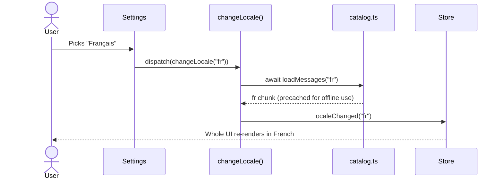
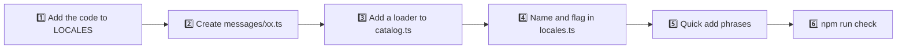

# 🌍 Localization

ToDo App speaks eight languages: 🇬🇧 **English**, 🇺🇦 **Українська**, 🇩🇪 **Deutsch**, 🇪🇸 **Español**, 🇫🇷 **Français**, 🇮🇹 **Italiano**, 🇳🇱 **Nederlands** and 🇵🇱 **Polski**. Everything the user sees — labels, notifications, plurals, dates, screen reader announcements and the quick add phrases — follows the selected language and switches instantly, without a reload.

## 🧭 How the language is chosen


- 🔎 `detectLocale()` walks `navigator.languages` in order and picks the first language whose primary subtag is supported, so `["pt-BR", "es-419"]` becomes Spanish and `["de-AT"]` German.
- ⚙️ The user can switch the language in **Settings** — a grid of flags with the languages' own names — or with the command palette (`Language: …`).
- 💾 The choice is stored with the other preferences under `react-todo-app/preferences`.
- 🏷️ `<html lang>` is updated together with the theme, so screen readers, hyphenation and the error screen use the right language.

## 🗂️ Where the texts live

| File                                     | Role                                                                                 |
| ---------------------------------------- | ------------------------------------------------------------------------------------ |
| `src/features/i18n/model/messages/en.ts` | 📖 The source of truth. Its keys define the `MessageKey` type. Bundled with the app  |
| `src/features/i18n/model/messages/*.ts`  | 🌐 One file per language, typed as `Messages`, so a missing key fails the build      |
| `src/features/i18n/model/catalog.ts`     | 📦 Lazy loading: `loadMessages()`, `getMessages()` and an English fallback           |
| `src/features/i18n/model/translate.ts`   | 🔧 `LOCALES`, `translate()`, `createTranslator()`, `detectLocale()` and plural rules |
| `src/features/i18n/model/locales.ts`     | 🏳️ Native language names and flag codes                                              |
| `src/features/i18n/ui/LocaleFlag`        | 🖼️ The flag image used by the settings and the palette                               |
| `src/features/i18n/model/useI18n.ts`     | 🪝 `const { t, locale } = useI18n()` for components                                  |

Keys are grouped by the place they appear in: `lists.*`, `composer.*`, `todo.*`, `details.*`, `palette.*`, `toast.*`, `history.*`, `effects.*`, `error.*` and so on.

```tsx
const ListTitle = () => {
  const { t } = useI18n();
  return <h1>{t("lists.today")}</h1>;
};
```

## 📦 Lazy loading

Only English is part of the main bundle. Every other dictionary is its own small chunk:



- 🚀 On startup `main.tsx` awaits the saved language before the first render, so nobody ever sees a flash of English.
- ✈️ The service worker precaches every language chunk, so switching works offline.
- 🧯 If a chunk cannot be loaded, the language stays as it was and a notification explains why (`toast.languageFailed`).
- 🧪 Tests preload all dictionaries in `src/test/setup.ts`.

## 🏳️ Flags

Flags come from [flagcdn](https://flagcdn.com) as small SVG images (`https://flagcdn.com/{code}.svg`). English uses the 🇬🇧 flag and Ukrainian the 🇺🇦 one.

- 🧱 The Content Security Policy allows images from `https://flagcdn.com` and nothing else from that origin.
- 💤 Flags use `loading="lazy"` inside closed menus, so the first request happens only when the settings or the language commands of the palette are opened.
- 🕵️ Requests are sent with `referrerpolicy="no-referrer"`, and the service worker keeps them in a `flags` cache for offline use.

## 🔣 Parameters

Placeholders in braces are replaced by parameters. Unknown placeholders are left as they are, which makes a typo easy to spot in the UI.

```ts
t("todo.delete", { title: "Buy milk" });
```

## 🔢 Plurals

A message can be an object with `Intl.PluralRules` categories instead of a string. The category is chosen from the `count` parameter, and a language may use a plain string where its grammar does not change (Italian `"eliminazione di {count} attività"`).

| Language       | Categories                    | Example (`palette.results`)                 |
| -------------- | ----------------------------- | ------------------------------------------- |
| 🇬🇧 🇩🇪 🇳🇱 🇪🇸 🇮🇹 | `one`, `other`                | 1 result · 3 results                        |
| 🇫🇷 French      | `one` (0 and 1), `other`      | 0 résultat · 2 résultats                    |
| 🇺🇦 Ukrainian   | `one`, `few`, `many`, `other` | 21 результат · 3 результати · 5 результатів |
| 🇵🇱 Polish      | `one`, `few`, `many`, `other` | 1 wynik · 3 wyniki · 12 wyników · 22 wyniki |

`other` is always required. A test checks that every language spells out every category its plural rules produce for counts up to 200.

## 🔔 Notifications and history

Notifications are stored in Redux as **message keys with parameters**, not as finished strings:

```ts
{ key: "toast.undone", params: { action: { key: "history.renamed", params: { title: "Buy milk" } } } }
```

`formatMessage()` translates nested messages recursively, so a notification that is already on screen changes language together with the rest of the interface.

## 📅 Dates

Dates never use hard-coded month or weekday names. `shared/lib/date.ts` wraps `Intl.DateTimeFormat` and `Intl.RelativeTimeFormat` and caches the formatters per locale, so every language gets its own order, abbreviations and capitalisation — `Thursday, October 1`, `Donnerstag, 1. Oktober`, `Jeudi 1 octobre`, `Czwartek, 1 października`.

## ✍️ Typography

| Language     | Quotes | Notes                                                                     |
| ------------ | ------ | ------------------------------------------------------------------------- |
| 🇬🇧 English   | “…”    | ’ as the apostrophe                                                       |
| 🇺🇦 Ukrainian | «…»    | ’ in з’являться, п’ятниця                                                 |
| 🇩🇪 German    | „…“    |                                                                           |
| 🇪🇸 Spanish   | «…»    | ¡…! for exclamations                                                      |
| 🇫🇷 French    | « … »  | No-break spaces inside the quotes and before `:`; a narrow one before `!` |
| 🇮🇹 Italian   | «…»    | ’ in un’attività                                                          |
| 🇳🇱 Dutch     | “…”    |                                                                           |
| 🇵🇱 Polish    | „…”    |                                                                           |

## ⚡ Quick add phrases

`features/todos/model/quickAdd.ts` recognises dates and repeats (`every friday`, `щотижня`, `tous les lundis`) in all eight languages at the same time, so a Polish speaker can type `Zadzwonić do mamy jutro` even with the English interface. Phrases are compared without diacritics, so `mercoledi` and `miércoles` work as well as `mercoledì` and `miercoles`. The supported phrases are listed in [Features](./features.md#-quick-add).

## ➕ Adding a language



1. Add the language code to `LOCALES` in `translate.ts`. `detectLocale()` picks it up automatically.
2. Copy `messages/en.ts` to `messages/xx.ts`, type it as `Messages` and translate every value. TypeScript reports any key you missed.
3. Add `xx: async () => (await import("./messages/xx")).xx` to the loaders in `catalog.ts`.
4. Add the language's own name to `LOCALE_NAMES` and its [flagcdn country code](https://flagcdn.com/en/codes.json) to `FLAG_CODES` in `locales.ts`.
5. Add the relative days, weekday names, modifiers and the "in N days" words to `quickAdd.ts`, with a few tests.
6. Run `npm run check` — the translation tests verify the keys and plural forms of the new language.
