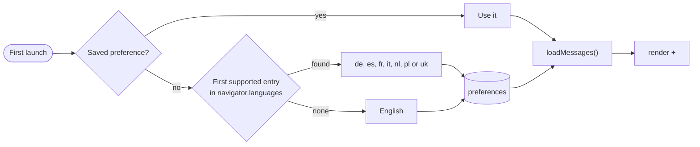
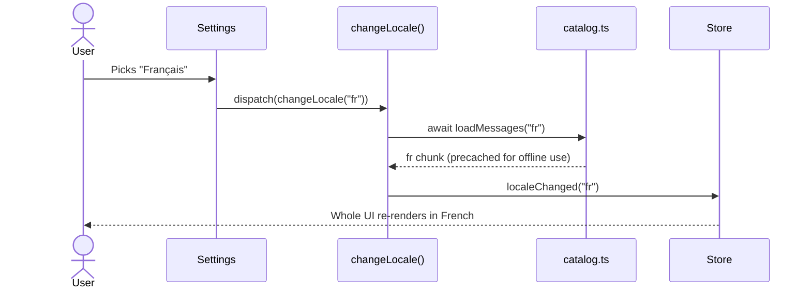
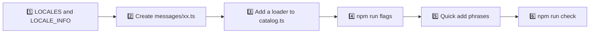

# 🌍 Localization

The app speaks ten languages: 🇬🇧 **English**, 🇺🇦 **Українська**, 🇨🇿 **Čeština**, 🇩🇪 **Deutsch**, 🇪🇸 **Español**, 🇫🇷 **Français**, 🇮🇹 **Italiano**, 🇳🇱 **Nederlands**, 🇵🇱 **Polski** and 🇵🇹 **Português**. Everything the user sees (labels, notifications, plurals, dates, screen reader announcements and the quick add phrases) follows the selected language and switches instantly, without a reload.

## 🧭 How the language is chosen



- 🔎 `detectLocale()` walks `navigator.languages` in order and picks the first language whose primary subtag is supported, so `["pt-BR", "es-419"]` becomes Spanish and `["de-AT"]` German.
- ⚙️ The user can switch the language in **Settings**: a grid of flags with the languages' own names, or with the command palette (`Language: …`).
- 💾 The choice is stored with the other preferences under `react-todo-app/preferences`.
- 🏷️ `<html lang>` is updated together with the theme, so screen readers, hyphenation and the error screen use the right language.
- 🪪 The browser tab title follows the language too: `app.title` on the main list, the list or project name elsewhere.

## 🗂️ Where the texts live

| File                                      | Role                                                                                 |
| ----------------------------------------- | ------------------------------------------------------------------------------------ |
| `src/features/i18n/model/messages/en.ts`  | 📖 The source of truth. Its keys define the `MessageKey` type. Bundled with the app  |
| `src/features/i18n/model/messages/*.ts`   | 🌐 One file per language, typed as `Messages`, so a missing key fails the build      |
| `src/features/i18n/model/catalog.ts`      | 📦 Lazy loading: `loadMessages()`, `getMessages()` and an English fallback           |
| `src/features/i18n/model/translate.ts`    | 🔧 `LOCALES`, `translate()`, `createTranslator()`, `detectLocale()` and plural rules |
| `src/features/i18n/model/locales.ts`      | 🏳️ Native language names and flag codes                                              |
| `src/features/i18n/ui/LocaleFlag`         | 🖼️ The flag image used by the settings and the palette                               |
| `src/features/i18n/model/useI18n.ts`      | 🪝 `const { t, locale } = useI18n()` for components                                  |
| `src/features/i18n/model/useWeekStart.ts` | 📆 The first day of the week for the language and region                             |

Keys are grouped by the place they appear in: `lists.*`, `projects.*` and `project.*`, `composer.*`, `todo.*`, `menu.*`, `calendar.*`, `details.*`, `palette.*`, `settings.*`, `background.*`, `glass.*`, `toast.*`, `history.*`, `error.*` and so on.

```tsx
const ListTitle = () => {
  const { t } = useI18n();
  return <h1>{t("lists.today")}</h1>;
};
```

## 📦 Lazy loading

Only English is part of the main bundle. Every other dictionary is its own small chunk:



- 🚀 On startup `main.tsx` awaits the saved language before the first render, so nobody ever sees a flash of English.
- ✈️ The service worker precaches every language chunk, so switching works offline.
- 🧯 If a chunk cannot be loaded, the language stays as it was and a notification explains why (`toast.languageFailed`).
- 🧪 Tests preload all dictionaries in `src/test/setup.ts`.

## 🏳️ Flags

Flags are small 3:2 SVG files in `public/flags/`, copied from [country-flag-icons](https://gitlab.com/catamphetamine/country-flag-icons) by `npm run flags` (`scripts/sync-flags.mjs`) for the flag code of every language in `LOCALE_INFO`. English uses the 🇬🇧 flag, Ukrainian the 🇺🇦 one and Portuguese the 🇵🇹 one.

- 🏠 They come from the app itself, so the Content Security Policy allows images from `'self'` only and no other site learns that the settings were opened.
- 💤 Flags use `loading="lazy"` inside closed menus, so they load only when the settings or the language commands of the palette are opened.
- ✈️ The service worker precaches them with the rest of the app, so the language picker works offline.

## 🔣 Parameters

Placeholders in braces are replaced by parameters. Unknown placeholders are left as they are, which makes a typo easy to spot in the UI.

```ts
t("todo.delete", { title: "Buy milk" });
```

## 🔢 Plurals

A message can be an object with `Intl.PluralRules` categories instead of a string. The category is chosen from the `count` parameter, and a language may use a plain string where its grammar does not change (Italian `"eliminazione di {count} attività"`).

| Language          | Categories                    | Example (`palette.results`)                 |
| ----------------- | ----------------------------- | ------------------------------------------- |
| 🇬🇧 🇩🇪 🇳🇱 🇪🇸 🇮🇹 🇵🇹 | `one`, `other`                | 1 result · 3 results                        |
| 🇫🇷 French         | `one` (0 and 1), `other`      | 0 résultat · 2 résultats                    |
| 🇨🇿 Czech          | `one`, `few`, `other`         | 1 výsledek · 3 výsledky · 12 výsledků       |
| 🇺🇦 Ukrainian      | `one`, `few`, `many`, `other` | 21 результат · 3 результати · 5 результатів |
| 🇵🇱 Polish         | `one`, `few`, `many`, `other` | 1 wynik · 3 wyniki · 12 wyników · 22 wyniki |

Plural rules come from the regional tag of the language in `LOCALE_INFO` (`pt-PT`, `cs-CZ`), so Portuguese says `0 resultados` as in Portugal, not `0 resultado` as in Brazil.

> [!IMPORTANT]
> `other` is always required.

Tests check that every language spells out every category its plural rules produce for counts up to 200 and keeps the placeholders of the English text.

## 🔔 Notifications and history

Notifications are stored in Redux as **message keys with parameters**, not as finished strings:

```ts
{ key: "toast.undone", params: { action: { key: "history.renamed", params: { title: "Buy milk" } } } }
```

`formatMessage()` translates nested messages recursively, so a notification that is already on screen changes language together with the rest of the interface. Names the user typed, like the project in “Added “Slides” to 🏠 Home”, are passed as plain strings and never translated.

## 📅 Dates

Dates never use hard-coded month or weekday names. `shared/lib/date.ts` wraps `Intl.DateTimeFormat` and `Intl.RelativeTimeFormat` and caches the formatters per locale. Components pass the regional tag from `useI18n().intlLocale` (`en-GB`, `cs-CZ`, `pt-PT`), so every language gets its own order, abbreviations and capitalisation: `Thursday 1 October`, `Donnerstag, 1. Oktober`, `Čtvrtek 1. října`, `Quinta-feira, 1 de outubro`.

## 📆 Week start

The calendar starts the week where people expect it. `useWeekStart()` looks for the user's regional variant of the interface language in `navigator.languages` (`en-US`, `en-GB`, `de-AT`) and asks `Intl.Locale` for its week info:

| Interface     | Browser languages | Week starts on |
| ------------- | ----------------- | -------------- |
| 🇬🇧 English    | `en-US`           | Sunday         |
| 🇬🇧 English    | `en-GB`           | Monday         |
| 🇺🇦 Українська | `uk-UA`           | Monday         |
| 🇨🇿 Čeština    | `cs-CZ`           | Monday         |
| 🇵🇹 Português  | `pt-PT`           | Sunday         |

Without a regional variant in the browser, the regional tag of the interface language from `LOCALE_INFO` decides. Browsers without `getWeekInfo()` fall back to Sunday for plain or US English and Monday for everything else. Weekday initials, month names and the long dates that screen readers hear come from `Intl.DateTimeFormat` in the same language.

## ✍️ Typography

| Language      | Quotes | Notes                                                                     |
| ------------- | ------ | ------------------------------------------------------------------------- |
| 🇬🇧 English    | “…”    | ’ as the apostrophe                                                       |
| 🇺🇦 Ukrainian  | «…»    | ’ in з’являться, п’ятниця                                                 |
| 🇨🇿 Czech      | „…“    |                                                                           |
| 🇩🇪 German     | „…“    |                                                                           |
| 🇪🇸 Spanish    | «…»    | ¡…! for exclamations                                                      |
| 🇫🇷 French     | « … »  | No-break spaces inside the quotes and before `:`; a narrow one before `!` |
| 🇮🇹 Italian    | «…»    | ’ in un’attività                                                          |
| 🇳🇱 Dutch      | “…”    |                                                                           |
| 🇵🇱 Polish     | „…”    |                                                                           |
| 🇵🇹 Portuguese | «…»    | European Portuguese: `guardar`, `definições`, `ficheiro`                  |

## ⚡ Quick add phrases

`features/todos/model/quickAdd.ts` recognises dates and repeats (`every friday`, `щотижня`, `tous les lundis`, `každou středu`, `às segundas`) in all ten languages at the same time, so a Polish speaker can type `Zadzwonić do mamy jutro` even with the English interface. Portuguese weekdays without `-feira` (`sexta`, `quinta`) also mean ordinals, so they count as dates only after a word such as `na`, `próxima` or `nesta`: `Reunião na sexta` gets a date, `Ler a quinta` does not. Phrases are compared without diacritics, so `mercoledi` and `miércoles` work as well as `mercoledì` and `miercoles`. Project mentions such as `@робота` or `@Zuhause` are names, so they work in any script and ignore letter case and accents. The supported phrases are listed in [Features](./features.md#-quick-add).

## ➕ Adding a language



1. Add the language code to `LOCALES` and its native name, flag code and regional `Intl` tag to `LOCALE_INFO` in `locales.ts`, for example `sv: { name: "Svenska", flag: "SE", intl: "sv-SE" }`. `detectLocale()` picks it up automatically.
2. Copy `messages/en.ts` to `messages/xx.ts`, type it as `Messages` and translate every value.
3. Add `xx: async () => (await import("./messages/xx")).xx` to the loaders in `catalog.ts`.
4. Run `npm run flags` to copy its flag into `public/flags/`.
5. Add the relative days, weekday names, modifiers and the "in N days" words to `quickAdd.ts`, with a few tests.
6. Run `npm run check`: the translation tests verify the keys, placeholders and plural forms of the new language.

> [!TIP]
> TypeScript reports every key you missed as soon as the new catalog is typed as `Messages`, long before the tests run.
