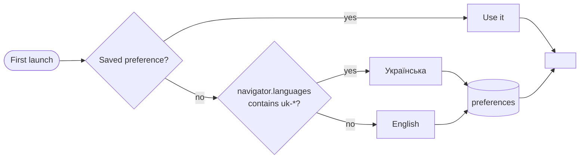
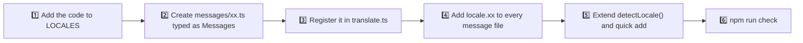

# 🌍 Localization

ToDo App speaks 🇬🇧 **English** and 🇺🇦 **Українська**. Everything the user sees — labels, notifications, plurals, dates, screen reader announcements and even the quick add phrases — follows the selected language and switches instantly, without a reload.

## 🧭 How the language is chosen



- ⚙️ The user can switch the language in **Settings** or with the command palette (`Language: …`).
- 💾 The choice is stored with the other preferences under `react-todo-app/preferences`.
- 🏷️ `<html lang>` is updated together with the theme, so screen readers, hyphenation and the error screen use the right language.

## 🗂️ Where the texts live

| File                                     | Role                                                                   |
| ---------------------------------------- | ---------------------------------------------------------------------- |
| `src/features/i18n/model/messages/en.ts` | 📖 The source of truth. Its keys define the `MessageKey` type          |
| `src/features/i18n/model/messages/uk.ts` | 🇺🇦 Typed as `Messages`, so a missing or misspelled key fails the build |
| `src/features/i18n/model/translate.ts`   | 🔧 `translate()`, `createTranslator()`, locale detection and plurals   |
| `src/features/i18n/model/useI18n.ts`     | 🪝 `const { t, locale } = useI18n()` for components                    |

Keys are grouped by the place they appear in: `lists.*`, `composer.*`, `todo.*`, `details.*`, `palette.*`, `toast.*`, `history.*`, `error.*` and so on.

```tsx
const ListTitle = () => {
  const { t } = useI18n();
  return <h1>{t("lists.today")}</h1>;
};
```

## 🔣 Parameters

Placeholders in braces are replaced by parameters. Unknown placeholders are left as they are, which makes a typo easy to spot in the UI.

```ts
t("todo.delete", { title: "Buy milk" });
```

| Language  | Message              | Result              |
| --------- | -------------------- | ------------------- |
| English   | `Delete “{title}”`   | Delete “Buy milk”   |
| Ukrainian | `Видалити «{title}»` | Видалити «Buy milk» |

## 🔢 Plurals

A message can be an object with `Intl.PluralRules` categories instead of a string. The category is chosen from the `count` parameter.

```ts
"toast.deletedMany": {
  one: "Видалено {count} завдання",
  few: "Видалено {count} завдання",
  many: "Видалено {count} завдань",
  other: "Видалено {count} завдання",
},
```

| Category | English examples | Ukrainian examples   |
| -------- | ---------------- | -------------------- |
| `one`    | 1                | 1, 21, 31, 101       |
| `few`    | —                | 2–4, 22–24, 32–34    |
| `many`   | —                | 0, 5–20, 25–30, 111  |
| `other`  | 0, 2, 3, …       | 1.5, 2.5 (fractions) |

`other` is always required; missing categories fall back to it.

## 🔔 Notifications and history

Notifications are stored in Redux as **message keys with parameters**, not as finished strings:

```ts
{ key: "toast.undone", params: { action: { key: "history.renamed", params: { title: "Buy milk" } } } }
```

`formatMessage()` translates nested messages recursively, so a notification that is already on screen changes language together with the rest of the interface, and the undo history can describe any step in either language.

## 📅 Dates

Dates never use hard-coded month or weekday names. `shared/lib/date.ts` wraps `Intl` and caches the formatters per locale:

| Helper                 | English                              | Українська                             |
| ---------------------- | ------------------------------------ | -------------------------------------- |
| `formatHeadline()`     | Thursday, October 1                  | Четвер, 1 жовтня                       |
| `formatWeekdayShort()` | Thu                                  | Чт                                     |
| `describeDueDate()`    | Today, Tomorrow, Sunday, Tue, Oct 20 | Сьогодні, Завтра, Неділя, Вт, 20 жовт. |
| `formatDateTime()`     | Sep 26, 2026, 10:40 AM               | 26 вер. 2026 р., 10:40                 |

Relative labels come from `Intl.RelativeTimeFormat` with `numeric: "auto"`, and every label is capitalised with the locale's own rules.

## ✍️ Typography

| Rule       | English        | Українська                       |
| ---------- | -------------- | -------------------------------- |
| Quotes     | “curly quotes” | «ялинки»                         |
| Apostrophe | ’ (U+2019)     | ’ (U+2019): з’являться, п’ятниця |
| Ranges     | 1–5 (en dash)  | 1–5                              |
| Ellipsis   | … (U+2026)     | …                                |

## ⚡ Quick add phrases

`features/todos/model/quickAdd.ts` recognises dates in both languages at the same time, so a Ukrainian speaker can type `Купити квіти завтра` even with the English interface. The supported phrases are listed in [Features](./features.md#-quick-add).

## ➕ Adding a language



1. Add the language code to `LOCALES` in `translate.ts`.
2. Copy `messages/en.ts` to `messages/xx.ts`, type it as `Messages` and translate every value. TypeScript reports any key you missed.
3. Register the dictionary next to `en` and `uk` in `translate.ts`.
4. Add a `locale.xx` entry with the language's own name (for example `Deutsch`) to **every** dictionary, so the language picker can show it.
5. Teach `detectLocale()` to pick the language from `navigator.languages`, and add date phrases and weekday names to `quickAdd.ts` if you want quick add to understand them.
6. Run `npm run check`; add a test like the language switch in `App.test.tsx`.
