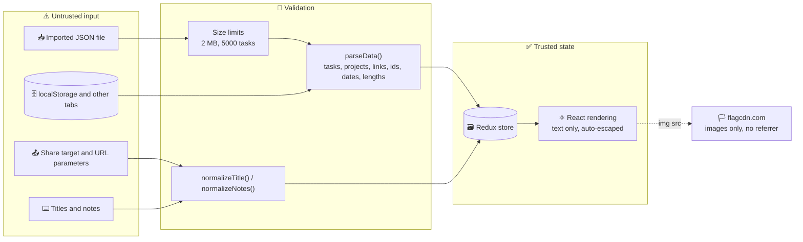
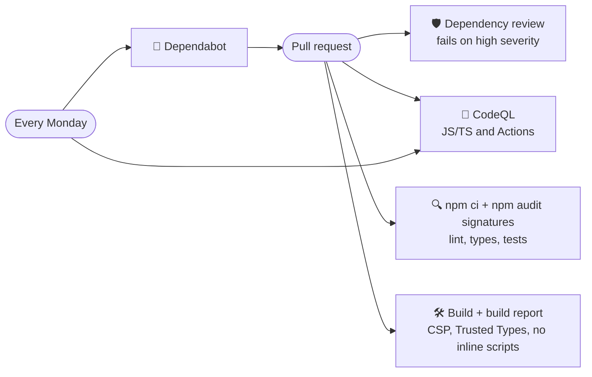

# 🛡️ Security

ToDo App is a static, local-first web app: no backend, no accounts, no cookies and no analytics. The only request to another origin is for language flag images from flagcdn.com. That removes whole classes of problems, but the browser still handles untrusted data — imported files, shared content, URL parameters and data written by other tabs — so the app treats all of it as hostile until validated.

To report a vulnerability, follow the [security policy](../.github/SECURITY.md).

## 🗺️ Trust boundaries



## 🧱 Content Security Policy

GitHub Pages cannot send custom headers, so the production build injects a CSP `<meta>` tag as the very first element of `<head>` (the `security-headers` plugin in `vite.config.ts`). The development server stays without it because Vite's hot reload relies on inline scripts.

| Directive                                               | Value                                    | Why                                                                                   |
| ------------------------------------------------------- | ---------------------------------------- | ------------------------------------------------------------------------------------- |
| `default-src`                                           | `'self'`                                 | 🔒 Nothing is loaded from other origins                                               |
| `script-src`                                            | `'self'`                                 | 🚫 No inline scripts, no `eval`, no third-party code                                  |
| `style-src`                                             | `'self'`                                 | 🎨 Only the bundled stylesheet; dynamic values use the CSSOM                          |
| `img-src`                                               | `'self' data: blob: https://flagcdn.com` | 🖼️ Icons, SVG masks, the refraction maps generated on a canvas and the language flags |
| `connect-src`, `font-src`, `manifest-src`, `worker-src` | `'self'`                                 | 📡 Only the app's own files and service worker                                        |
| `object-src`                                            | `'none'`                                 | 🧩 No plugins                                                                         |
| `base-uri`, `form-action`                               | `'self'`                                 | 🧭 Prevents base tag and form hijacking                                               |
| `require-trusted-types-for`                             | `'script'`                               | 🛂 DOM XSS sinks only accept Trusted Types                                            |
| `trusted-types`                                         | `default`                                | 📜 Only the app's own policy may create them                                          |
| `upgrade-insecure-requests`                             | —                                        | 🔐 Any accidental `http:` URL is upgraded                                             |

A `referrer` meta tag sets `strict-origin-when-cross-origin`, and external links use `rel="noreferrer"`.

## 🛂 Trusted Types

With Trusted Types enforced, assigning a string to a dangerous DOM sink — `innerHTML`, `script.src`, `ServiceWorkerContainer.register()` and others — throws. The app never needs HTML strings: React renders every title and note as text.

The only sink in use is the service worker registration. `shared/lib/trustedTypes.ts` installs a `default` policy that allows exactly one URL — the app's own `sw.js` on the same origin — and rejects everything else:

```ts
installScriptUrlPolicy([`${import.meta.env.BASE_URL}sw.js`]);
```

`scripts/build-report.mjs` checks on every CI run that the built `index.html` still contains the policy, enforces Trusted Types and has no inline scripts.

## ✅ Input validation

| Input                      | Protection                                                                                                                                                                         |
| -------------------------- | ---------------------------------------------------------------------------------------------------------------------------------------------------------------------------------- |
| 📥 Imported files          | Rejected above 2 MB, parsed with `JSON.parse` in a `try`, limited to 5000 tasks and 200 projects, validated by `parseData()`                                                       |
| 🗄️ Stored data, other tabs | Read through `readJson()` and `parseData()`; corrupted data falls back to defaults instead of crashing                                                                             |
| 📁 Projects                | Names normalized and cut to 40 characters, colours checked against the fixed list, duplicates dropped                                                                              |
| 🔗 Links                   | A task's `projectId` must be a valid id of a project in the same document, otherwise the task keeps no project                                                                     |
| 🆔 Ids                     | Must match `[A-Za-z0-9_-]{1,64}`; anything else, or a duplicate, is replaced with a fresh `nanoid()`                                                                               |
| 📝 Titles and notes        | Whitespace-normalized and cut to 200 and 2000 characters, counted in Unicode code points                                                                                           |
| 📅 Dates                   | Only real calendar dates in `YYYY-MM-DD`; `2026-02-30` is dropped                                                                                                                  |
| 🔗 URL parameters          | Only `list`, `action`, `title`, `text` and `url` are read; they become plain text and are removed from the address bar                                                             |
| 🎨 Preferences             | Every value is checked against the allowed appearances, accents, backgrounds, glass styles, languages, effects and sort orders; a saved project view must name an existing project |

Objects are rebuilt field by field, so unknown properties — including `__proto__` — never reach the store.

## 🏳️ Flag images

The language picker shows flags from `https://flagcdn.com`, the only third-party origin the app talks to.

- 🖼️ They are plain `` elements — an SVG loaded as an image cannot run scripts or reach the page — and the CSP allows nothing else from that origin.
- 🕵️ `referrerpolicy="no-referrer"` keeps the app's address out of the requests, and nothing about your tasks is ever sent.
- 💤 `loading="lazy"` inside closed menus means no request is made until the settings or the palette's language commands are opened; the service worker then serves them from its `flags` cache.

## 🗄️ Data on the device

- 💾 Tasks, projects and preferences live in `localStorage` of the site's origin and never leave the device.
- ⬅️ The history entries that let **Back** close sheets carry only a random marker — never task data — and are removed when the sheet closes.
- 🧹 Clearing the site data in the browser removes everything; the error screen offers **Download a backup** first.
- 🔄 The service worker only caches the app's own files and asks before activating an update.

## 🔗 Supply chain and CI



- 📦 `npm ci` installs exactly what `package-lock.json` describes, and `npm audit signatures` verifies the registry signatures and provenance attestations of every package.
- 🛡️ The dependency review action blocks pull requests that add dependencies with high-severity advisories.
- 🔬 CodeQL scans the TypeScript code and the workflow files with the `security-extended` queries on every push, pull request and weekly.
- 🔐 Workflows run with a read-only token, checkouts do not persist credentials, and only the deploy job may write to Pages.
- 🤖 Dependabot proposes npm and GitHub Actions updates every week.

## ☑️ Checklist for contributors

- [ ] Never render user content with `dangerouslySetInnerHTML` or assign HTML strings to the DOM.
- [ ] Route every new kind of input through a parser that rebuilds the data and caps its size.
- [ ] Do not add requests to other origins; if one is unavoidable, extend the CSP as narrowly as possible (like `https://flagcdn.com` for images only) and explain why in the pull request.
- [ ] Keep workflow permissions minimal and pass `persist-credentials: false` to new checkouts.
