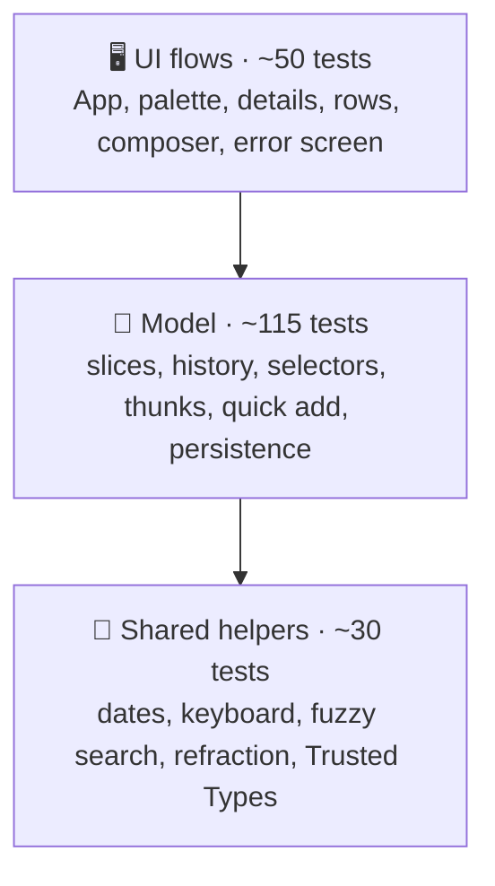

# 🧪 Testing

## 🧰 Stack

| Tool                            | Role                                                  |
| ------------------------------- | ----------------------------------------------------- |
| ⚡ Vitest 5                     | Test runner, configured in `vite.config.ts`           |
| 🌐 jsdom 30                     | Browser-like environment                              |
| 🐙 Testing Library + user-event | Rendering components and simulating real interactions |
| 🧩 jest-dom                     | Readable DOM assertions such as `toHaveFocus()`       |
| 📊 `@vitest/coverage-v8`        | Coverage reports and thresholds                       |

## ▶️ Running tests

| Command                 | Mode                                    |
| ----------------------- | --------------------------------------- |
| `npm test`              | Watch mode                              |
| `npm run test:run`      | Single run                              |
| `npm run test:coverage` | Single run with coverage and thresholds |

The HTML coverage report is written to `coverage/index.html`.

## 🔺 Shape of the suite

Most behaviour is pinned down by fast unit tests of pure functions and reducers; UI tests render the whole `App` and drive it like a user.

## 📁 Where tests live

Tests sit next to the code they cover as `*.test.ts(x)`:

| Area                           | Files                                                                                       | Covers                                                                                                                               |
| ------------------------------ | ------------------------------------------------------------------------------------------- | ------------------------------------------------------------------------------------------------------------------------------------ |
| 🚀 App                         | `app/App.test.tsx`                                                                          | Shell, smart lists, tab bar on phones, language switch, skip link, composer, editing, undo, sorting, search, menu, import and export |
|                                | `app/persistence.test.ts`, `app/launch.test.ts`, `app/ErrorBoundary.test.tsx`               | Loading, migrations, language detection, cross-tab sync, URL shortcuts, share target, recovery screen                                |
| ✅ Todos model                 | `todo`, `todosSlice`, `history`, `selectors`, `thunks`, `quickAdd`, `checklist`, `transfer` | Parsing and validation, every reducer, undo and redo, counters and activity, quick add grammar, checklists, import limits            |
| ✅ Todos UI                    | `TodoItem`, `TodoDetails`, `TodoComposer`                                                   | Keyboard commands, swipes, tags and chips, the details sheet, quick add recognition                                                  |
| ⌘ Palette                      | `rank.test.ts`, `CommandPalette.test.tsx`                                                   | Ranking and grouping, shortcut, arrow keys, running commands, finding tasks                                                          |
| 📚 Lists, 🎨 settings, 🌍 i18n | `lists`, `sort`, `theme`, `translate`                                                       | Smart list rules, sort orders, theme validation, plurals and interpolation                                                           |
| 🧰 Shared                      | `date`, `keyboard`, `motion`, `refraction`, `text`, `trustedTypes`                          | Date keys and labels, shortcut matchers, transitions, displacement maths, fuzzy search, the URL policy                               |

## 🌐 Test environment

`src/test/setup.ts` prepares jsdom for the app:

- 🐢 **`matchMedia`** is mocked to report `prefers-reduced-motion: reduce`. The app then skips its delays, transitions and confetti, so tests never wait for animations. Individual tests can override it, for example to render the phone layout with the tab bar.
- 🪟 **Popover API** — jsdom hides `[popover]` elements but cannot open them. `src/test/popover.ts` adds `showPopover()`, `hidePopover()`, `togglePopover()` and `popovertarget` handling.
- 🗔 **Dialogs** — jsdom has no `showModal()`. `src/test/dialog.ts` implements `show()`, `showModal()` and `close()` with focus on the first control, focus restoration, the `close` event and <kbd>Esc</kbd> handling.
- 👆 **Pointer capture and scrolling** — `setPointerCapture()`, `releasePointerCapture()` and `scrollIntoView()` are stubbed, so swipe and palette tests run unchanged.
- 🧹 **Cleanup** — the DOM is unmounted and `localStorage` is cleared after every test.

## 🛠️ Helpers

| Helper                                     | File                    | Purpose                                                              |
| ------------------------------------------ | ----------------------- | -------------------------------------------------------------------- |
| `renderWithStore(ui, { preloadedState })`  | `src/test/render.tsx`   | Renders with a fresh store and returns `{ store, user, ...queries }` |
| `renderApp(todos, list)`                   | `src/test/render.tsx`   | Renders the whole app with the given todos and selected list         |
| `openPopover(user, trigger)`               | `src/test/render.tsx`   | Clicks a popover trigger and returns queries scoped to the panel     |
| `section(name)`, `itemTitles(region)`      | `src/test/render.tsx`   | Finds a task section and lists the titles in it                      |
| `makeTodo()`, `makeState()`, `sampleTodos` | `src/test/factories.ts` | Consistent fixtures                                                  |
| `todayKey()`, `dayFromToday(offset)`       | `src/test/factories.ts` | Due dates relative to the current day                                |

## 📐 Conventions

- 🎯 Query by role and accessible name (`getByRole("button", { name: "Delete “Buy milk”" })`). If an element is hard to find this way, it is probably hard to use with a screen reader too.
- 🖱️ Drive the UI with `userEvent`. Use `fireEvent` only for low-level input that user-event cannot express, such as touch swipes.
- 👀 Test behaviour, not implementation: assert on what the user sees or on the store, never on component state.
- 🌍 Assert translated text through `formatMessage(createTranslator(locale), message)` in model tests, so both languages are checked without rendering.
- 🫥 Popover content is in the DOM even while closed; scope queries with `openPopover()` or ignore it with `{ ignore: "[popover] *" }`.
- 🌐 Browser-only effects (refraction, pointer light, the aurora, real CSP enforcement) are verified in Chrome; their pure logic is unit tested.

## 📊 Coverage thresholds

`npm run test:coverage` fails when coverage drops below:

| Metric     | Threshold |
| ---------- | --------- |
| Statements | 88 %      |
| Branches   | 85 %      |
| Functions  | 85 %      |
| Lines      | 88 %      |

The CI pipeline runs the same command and publishes a coverage table on the workflow summary page.
