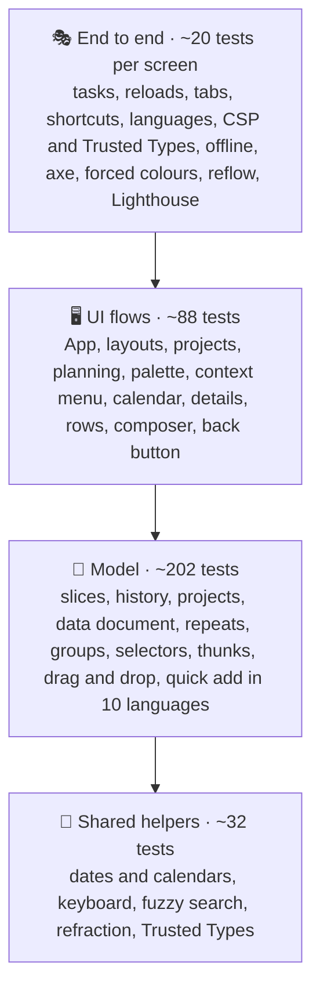
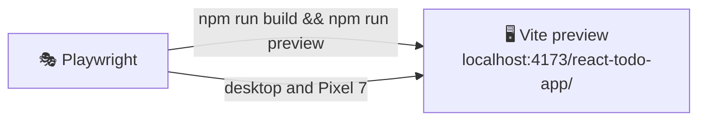

# 🧪 Testing

## 🧰 Stack

| Tool                            | Role                                                      |
| ------------------------------- | --------------------------------------------------------- |
| ⚡ Vitest 5                     | Test runner, configured in `vite.config.ts`               |
| 🌐 jsdom 30                     | Browser-like environment                                  |
| 🐙 Testing Library + user-event | Rendering components and simulating real interactions     |
| 🧩 jest-dom                     | Readable DOM assertions such as `toHaveFocus()`           |
| 📊 `@vitest/coverage-v8`        | Coverage reports and thresholds                           |
| 🎭 Playwright                   | End-to-end tests in Chromium on desktop and phone screens |
| ♿ axe-core                     | Accessibility checks inside the end-to-end tests          |
| 🚦 Lighthouse                   | Performance, accessibility, best practices and SEO budget |

## ▶️ Running tests

| Command                 | Mode                                                                 |
| ----------------------- | -------------------------------------------------------------------- |
| `npm test`              | 👁️ Unit tests in watch mode                                          |
| `npm run test:run`      | 🧪 Unit tests, single run                                            |
| `npm run test:coverage` | 📊 Unit tests with coverage and thresholds                           |
| `npm run test:e2e`      | 🎭 Production build and preview, then Playwright, axe and Lighthouse |

The HTML coverage report is written to `coverage/index.html`, the Playwright report to `playwright-report/`; open the latter with `npx playwright show-report`.

> [!IMPORTANT]
> Install the browser for the end-to-end tests once with `npx playwright install chromium`.

## 🔺 Shape of the suite

Most behaviour is pinned down by fast unit tests of pure functions and reducers; UI tests render the whole `App` and drive it like a user. The end-to-end tests check what only a real browser can: the production build with its service worker, storage across reloads and tabs, the Content Security Policy, Trusted Types and the finished pages' accessibility.

## 📁 Where tests live

Tests sit next to the code they cover as `*.test.ts(x)`:

| Area                                     | Files                                                                                    | Covers                                                                                                                                                              |
| ---------------------------------------- | ---------------------------------------------------------------------------------------- | ------------------------------------------------------------------------------------------------------------------------------------------------------------------- |
| 🚀 App                                   | `app/App.test.tsx`                                                                       | Shell without a header, smart lists, projects, the phone toolbar, tab bar and Lists sheet, settings, global search, back button, planning, menus, import, export    |
|                                          | `app/persistence.test.ts`, `app/launch.test.ts`, `app/ErrorBoundary.test.tsx`            | Loading, migrations, missing projects, language detection, cross-tab sync, URL shortcuts, share target, recovery screen                                             |
| ✅ Todos model                           | `todo`, `todosSlice`, `repeat`, `selectors`, `thunks`, `quickAdd`, `checklist`           | Parsing and validation, every reducer, anchored repeats, counters and tags, drops on the sidebar, quick add grammar with repeats and `@project` mentions            |
| ✅ Todos UI                              | `TodoItem`, `TaskDetailsDialog`, `TodoComposer`, `TaskDnd/dnd`                           | Keyboard commands, completions saved when the page closes mid-animation, the context menu with long press, swipes, chips, the details dialog, quick add, drop rules |
| 📁 Projects                              | `project.test.ts`, `projects/thunks.test.ts`                                             | Names and emoji icons, colours, parsing, creating and deleting with undo                                                                                            |
| 💾 Data                                  | `document`, `history`, `transfer`, `data/thunks`                                         | The stored document and its links, undo and redo of tasks and projects, import limits, export, merging imports                                                      |
| ⌘ Commands                               | `rank.test.ts`, `CommandPalette.test.tsx`                                                | Ranking and grouping, shortcut, arrow keys, running commands, projects, finding tasks                                                                               |
| 📚 Lists, 📊 stats, 🎨 settings, 🌍 i18n | `lists`, `groups`, `sort`, `stats/selectors`, `theme`, `settings`, `thunks`, `translate` | Smart lists and project views, date groups, sort orders, activity, streaks and project progress, backgrounds and glass, language switching, plurals                 |
| 🧰 Shared                                | `date`, `keyboard`, `motion`, `refraction`, `text`, `trustedTypes`, `Calendar`           | Date keys, labels and week starts, shortcut matchers, transitions, displacement maths, fuzzy search, the URL policy, calendar keyboard navigation                   |

## 🌐 Test environment

`src/test/setup.ts` prepares jsdom for the app:

- 🐢 **`matchMedia`** is mocked to report `prefers-reduced-motion: reduce`. The app then skips its delays, transitions and confetti, so tests never wait for animations. Individual tests can override it, for example to render the phone layout with the tab bar.
- 🪟 **Popover API**: jsdom hides `[popover]` elements but cannot open them. `src/test/popover.ts` adds `showPopover()`, `hidePopover()`, `togglePopover()` and `popovertarget` handling, and fires `beforetoggle` and `toggle` events like a browser, so menus that render their content lazily work in tests.
- 🌍 **Translations**: the setup preloads every language with `loadMessages()`, so tests can switch languages synchronously.
- 🗔 **Dialogs**: jsdom has no `showModal()`. `src/test/dialog.ts` implements `show()`, `showModal()` and `close()` with focus on the first control, focus restoration, the `close` event and <kbd>Esc</kbd> handling.
- 👆 **Pointer capture and scrolling**: `setPointerCapture()`, `releasePointerCapture()` and `scrollIntoView()` are stubbed, so swipe and palette tests run unchanged.
- 🧹 **Cleanup**: the DOM is unmounted and `localStorage` is cleared after every test.

## 🛠️ Helpers

| Helper                                                      | File                    | Purpose                                                              |
| ----------------------------------------------------------- | ----------------------- | -------------------------------------------------------------------- |
| `renderWithStore(ui, { preloadedState })`                   | `src/test/render.tsx`   | Renders with a fresh store and returns `{ store, user, ...queries }` |
| `renderApp(todos, list, projects)`                          | `src/test/render.tsx`   | Renders the whole app with the given todos, view and projects        |
| `openPopover(user, trigger)`                                | `src/test/render.tsx`   | Clicks a popover trigger and returns queries scoped to the panel     |
| `section(name)`, `itemTitles(region)`                       | `src/test/render.tsx`   | Finds a task section and lists the titles in it                      |
| `makeTodo()`, `makeProject()`, `makeState()`, `sampleTodos` | `src/test/factories.ts` | Consistent fixtures                                                  |
| `todayKey()`, `dayFromToday(offset)`                        | `src/test/factories.ts` | Due dates relative to the current day                                |

## 📐 Conventions

- 🎯 Query by role and accessible name (`getByRole("button", { name: "Delete “Buy milk”" })`). If an element is hard to find this way, it is probably hard to use with a screen reader too.
- 🖱️ Drive the UI with `userEvent`. Use `fireEvent` only for low-level input that user-event cannot express, such as touch swipes.
- 👀 Test behaviour, not implementation: assert on what the user sees or on the store, never on component state.
- 🌍 Assert translated text through `formatMessage(createTranslator(locale), message)` in model tests, so both languages are checked without rendering.
- 🫥 Popover content is in the DOM even while closed; scope queries with `openPopover()` or ignore it with `{ ignore: "[popover] *" }`.
- ⏱️ Long presses and other timers use `vi.useFakeTimers()` with `act()`, and real timers are restored at the end of the test.
- 🔢 Pure logic that a component needs, such as drop rules or collision detection, lives in a plain module next to it (`TaskDnd/dnd.ts`) so it can be tested without a browser.
- 🌐 Browser-only behaviour that cannot be asserted automatically (refraction, pointer light, the backgrounds, dragging onto the sidebar and rendering speed) is verified in Chrome; its pure logic is unit tested.
- 🎭 In Playwright, choose styled radio buttons through their label with `option(page, name)`, seed tasks with `seed(page)` and run palette commands with `runCommand(page, name)` from `e2e/helpers.ts`.

## 🎭 End-to-end tests

`playwright.config.ts` builds the app and serves it with `vite preview` under the real base path, so the tests see the same files as GitHub Pages, with the injected Content Security Policy and the service worker.

> [!TIP]
> Locally the preview server is reused when it is already running, so after the first run a repeated `npx playwright test e2e/accessibility.spec.ts` takes seconds. Rebuild with `npm run build` after changing the app.

| Spec                       | Checks                                                                                                                                              |
| -------------------------- | --------------------------------------------------------------------------------------------------------------------------------------------------- |
| ✅ `tasks.spec.ts`         | Quick add, tasks kept after a reload, completing with undo, a completion saved while it is still animating, tab sync, app shortcuts and shared text |
| 🌍 `languages.spec.ts`     | Starting in the browser's language (Ukrainian and Czech, with a Czech quick add), switching in the settings and keeping it after a reload           |
| 🛡️ `security.spec.ts`      | No console errors or CSP violations during a session, the policy in place and Trusted Types blocking `innerHTML`                                    |
| ✈️ `offline.spec.ts`       | The service worker takes over, and the app reloads and accepts new tasks without a network                                                          |
| ♿ `accessibility.spec.ts` | axe on the main views, dialogs and the palette in both appearances and in Ukrainian, forced colours and reflow at 320 px                            |
| 🚦 `lighthouse.spec.ts`    | The Lighthouse budget below                                                                                                                         |

Every spec except Lighthouse runs twice: in **Desktop Chrome** and on a **Pixel 7** screen. Service workers are blocked except in the offline spec, so a cached build never hides a change, and flag images are answered by a local stub, so the tests never depend on another site.

### 🚦 Lighthouse budget

| Page              | Form factor | Performance | Accessibility | Best practices | SEO | Page weight |
| ----------------- | ----------- | ----------: | ------------: | -------------: | --: | ----------: |
| 📥 `/`            | 🖥️ Desktop  |      ≥ 0.90 |             1 |              1 |   1 |    ≤ 300 KB |
| 📥 `/`            | 📱 Mobile   |      ≥ 0.80 |             1 |              1 |   1 |    ≤ 300 KB |
| ☀️ `/?list=today` | 🖥️ Desktop  |      ≥ 0.90 |             1 |              1 |   1 |    ≤ 300 KB |

Every audit of the accessibility category must pass as well, including the ones Lighthouse does not weigh into the score. Each run attaches the full Lighthouse HTML report to its test in the Playwright report.

> [!NOTE]
> Locally the app scores 1 on desktop and 0.97 for performance on mobile, with 231 KB transferred; the thresholds leave room for slower CI machines.

## 📊 Coverage thresholds

`npm run test:coverage` fails when coverage drops below:

| Metric        | Threshold |
| ------------- | --------: |
| 📄 Statements |      90 % |
| 🔀 Branches   |      85 % |
| 🧩 Functions  |      90 % |
| 📏 Lines      |      90 % |

The suite currently covers about 92 % of statements and 89 % of branches. The CI pipeline runs the same command, publishes a coverage table on the workflow summary page and uploads the HTML coverage and Playwright reports.
